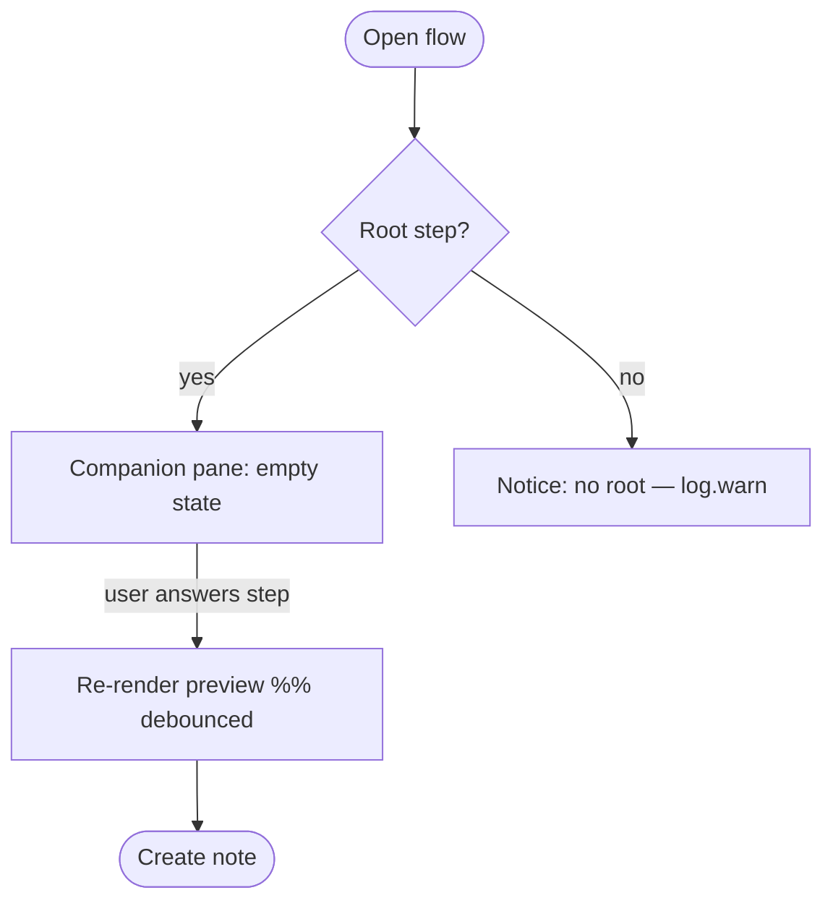
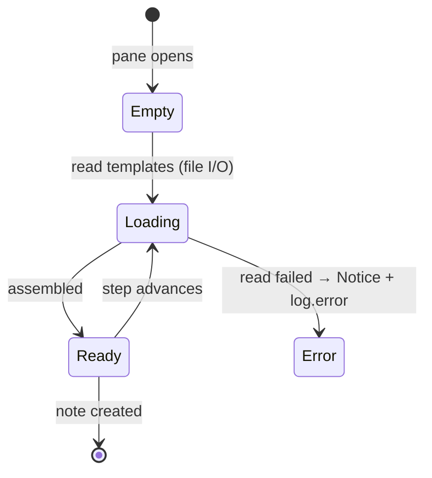
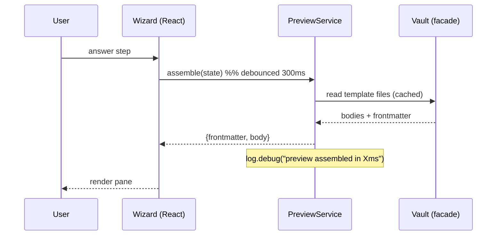

# Diagrams in SDD issues (Mermaid)

Every non-trivial SDD issue body **must include at least one Mermaid diagram**. Diagrams make the
spec legible at a glance, force the author to think about flow/state, and give reviewers and
implementers a shared mental model. GitHub renders Mermaid natively in issue and PR markdown.

## When to include which diagram

| The change is about… | Use | Why |
|---|---|---|
| A user journey / wizard / multi-step flow | `flowchart` (top-down) | shows the steps and branches the user walks |
| A new/opened modal, view or pane and its states | `stateDiagram-v2` | shows empty / loading / ready / error states (UX-first) |
| A sequence of calls across services (facade → service → vault) | `sequenceDiagram` | shows the runtime order and where observability hooks fire |
| Data assembled/transformed (DTOs, note build) | `flowchart` LR | shows the pipeline transform, input → output |
| A new data shape / settings block | `classDiagram` or a fenced type block | shows fields and relations |

Prefer **one focused diagram per concern** over one giant diagram. 2–3 small diagrams beat a wall.

## House rules (keep them consistent across issues)

1. Fence with ` ```mermaid `. Never rely on inline styling/colors — GitHub themes vary (light/dark).
   Keep node labels short; put detail in the surrounding prose, not the diagram.
2. **Label the diagram** with a bold caption line above it (e.g. `**Flow — note builder companion pane**`).
3. Reflect the three project priorities explicitly where relevant:
   - **UX first:** always show the empty/loading/error states, not just the happy path.
   - **Performance:** annotate expensive edges (file reads, network, indexing) — e.g. `-->|debounced 300ms| B` or a note `%% cached`.
   - **Observability:** mark where a `log.*` / progress event / Notice fires — e.g. a node `log.info("…")` or a `Note over` in sequence diagrams.
4. Keep IDs ASCII and quote labels with spaces: `A["Read template files"]`.
5. If a diagram would leak solution design into a *spec* (stage 1), keep it at the level of
   user-observable flow/state. Save call-level sequence diagrams for the **plan** comment (stage 2).

## Minimal templates

**Flow (wizard / user journey):**



**State (modal / pane UX states):**



**Sequence (plan stage — service calls + observability):**



Put diagrams in the issue body under a `## Diagrams` section (spec) and inline in the plan comment
where they clarify the call flow.
