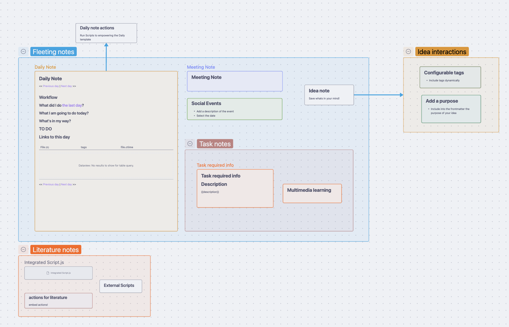
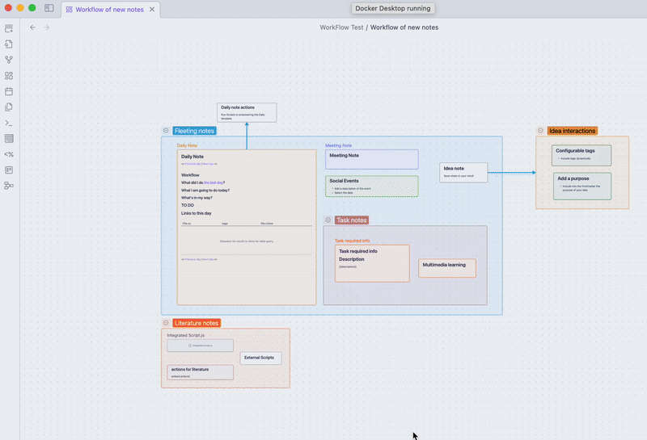
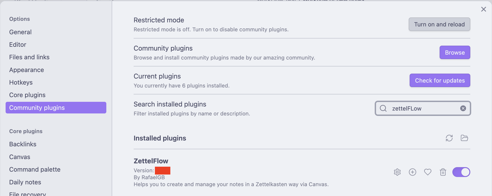
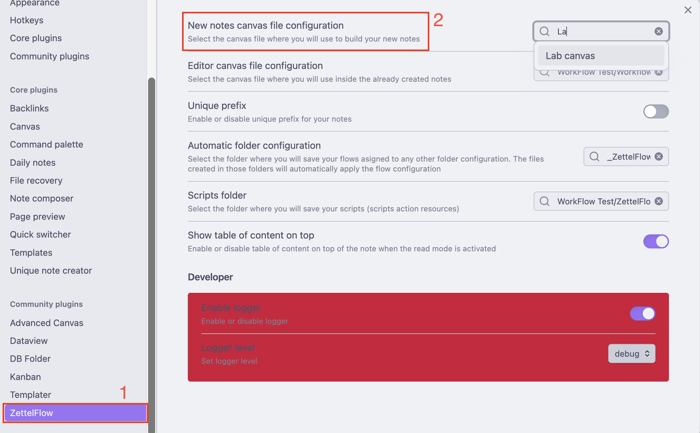

# Obsidian-ZettelFlow

- [Documentation](https://rafaelgb.github.io/Obsidian-ZettelFlow/)
- [Roadmap](https://github.com/users/RafaelGB/projects/9/views/1)
- [Examples](https://github.com/RafaelGB/Obsidian-ZettelFlow/tree/main/WorkFlow%20Test)

# ZettelFlow: Unlock the Power of Custom Note Flows in Obsidian

Welcome to **ZettelFlow**, the ultimate plugin for Obsidian that empowers you to design and navigate your own personalized workflows for creating and editing notes. Whether you're a fan of the Zettelkasten methodology or simply seeking a flexible way to structure your ideas, ZettelFlow adapts to your needs and puts creativity in your hands.

---

## **What is ZettelFlow?**

ZettelFlow transforms Obsidian into a dynamic space for note-taking and knowledge management by using **canvas drawings** to create flows. These flows guide you through **step-by-step processes**, where each step can be a note, a group, or a card on the canvas, interconnected with arrows that represent their relationships.

ZettelFlow encourages you to:

- Embrace the **[Zettelkasten philosophy](https://zettelkasten.de/overview/)** while tailoring it to your unique workflow.
- Design **custom flows** that resonate with how you think and organize.
- Dive deeper into your notes, crafting them in a structured yet flexible way.

---

## **How Does It Work?**

### **1. Root Notes**
Every flow begins with a **Root Note**. These are the starting points that appear when you initiate a new workflow. Think of them as entry points into your creative process.

### **2. Steps**
A **flow** consists of multiple **steps**, which can be:
- **Notes**: Standard Obsidian notes.
- **Groups**: Collections of related items.
- **Canvas Cards**: Visual representations within the Obsidian canvas.

These steps are linked with arrows, creating a clear visual representation of how your ideas connect and progress.

### **3. Actions**
Within each step, you can add **Actions** to enhance your notes. Actions are interactive elements that:
- Modify your final note.
- Edit existing notes dynamically. 

> [!IMPORTANT]  
> The canvas editor flow is different from the canvas creation flow. It should be configured independently in the plugin settings.

#### **Available Actions**
ZettelFlow provides a wide array of actions, including:

- **[Prompt](https://rafaelgb.github.io/Obsidian-ZettelFlow/actions/Prompt/)**: Input custom text.
- **[Number](https://rafaelgb.github.io/Obsidian-ZettelFlow/actions/Number/)**: Add numeric values.
- **[Checkbox](https://rafaelgb.github.io/Obsidian-ZettelFlow/actions/Checkbox/)**: Include checkboxes for tasks.
- **[Calendar](https://rafaelgb.github.io/Obsidian-ZettelFlow/actions/Calendar/)**: Pick dates.
- **[Selector](https://rafaelgb.github.io/Obsidian-ZettelFlow/actions/Selector/)**: Choose from a predefined list.
- **[Dynamic Selector](https://rafaelgb.github.io/Obsidian-ZettelFlow/actions/DynamicSelector/)**: Generate lists dynamically.
- **[Tags](https://rafaelgb.github.io/Obsidian-ZettelFlow/actions/Tags/)**: Add or manage tags.
- **[Backlink](https://rafaelgb.github.io/Obsidian-ZettelFlow/actions/Backlink/)**: Create backlinks to other notes.
- **[CssClasses](https://rafaelgb.github.io/Obsidian-ZettelFlow/actions/CssClasses/)**: Apply CSS classes for styling.
- **[Task Management](https://rafaelgb.github.io/Obsidian-ZettelFlow/actions/TaskManagement/)**: Manage tasks directly.
- **[Script](https://rafaelgb.github.io/Obsidian-ZettelFlow/actions/Script/)**: Run custom scripts for advanced users.

---

## **Why Use ZettelFlow?**

- **Freedom to Customize**: ZettelFlow adapts to your way of working, not the other way around.

- **Visual Clarity**: Flows on the canvas provide an intuitive overview of your thought process.
- **Deep Integration**: Seamlessly integrates with Obsidian, enhancing your existing workflow.
- **Powerful Actions**: Automate and enrich your notes with a variety of built-in actions.

---

## **Getting Started**

1. **Install the Plugin**
   - Download and install ZettelFlow from the Obsidian plugin marketplace.

2. **Create Your First Flow**
   - Create a new Canvas file in Obsidian.
   - Configure it as the principal Flow file in the plugin settings.

   

   - Open a canvas and start designing your flow by adding steps and connecting them with arrows.

3. **Add Actions**
   - Select a step and incorporate actions to modify or enhance your notes.

4. **Explore Examples**
   - Check the [official documentation](https://rafaelgb.github.io/Obsidian-ZettelFlow/) for example flows and action guides.

---

## **Learn More**

For detailed instructions, descriptions of each action, and tips for creating advanced flows, visit the [ZettelFlow Documentation](https://rafaelgb.github.io/Obsidian-ZettelFlow/).

If you have any questions or feedback, feel free to reach out via the Obsidian community forums or GitHub issues.

---

Unleash the full potential of your notes with ZettelFlow. **Your ideas, your flow, your rules.**

## Support
If you enjoy ZettelFlow, consider [buy me a coffee](https://www.buymeacoffee.com/5tsytn22v9Z) or [sponsor me](https://github.com/sponsors/RafaelGB) to support my work. Thank you!

