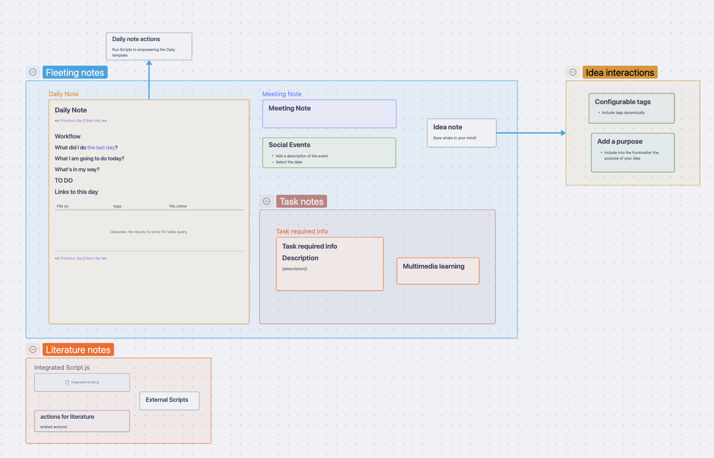
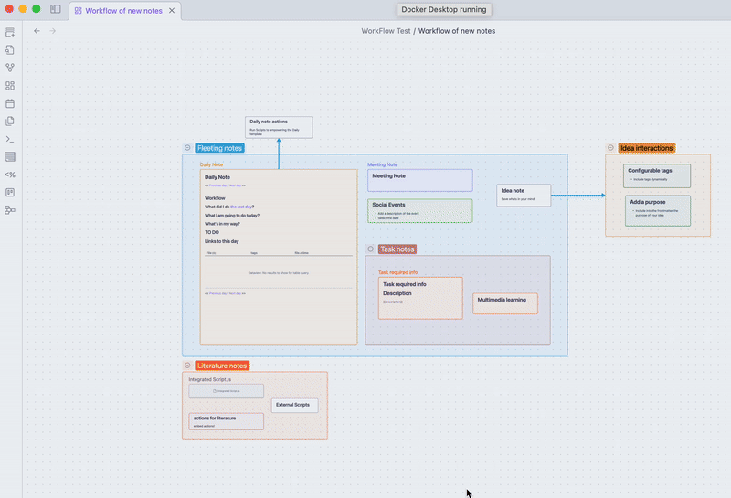
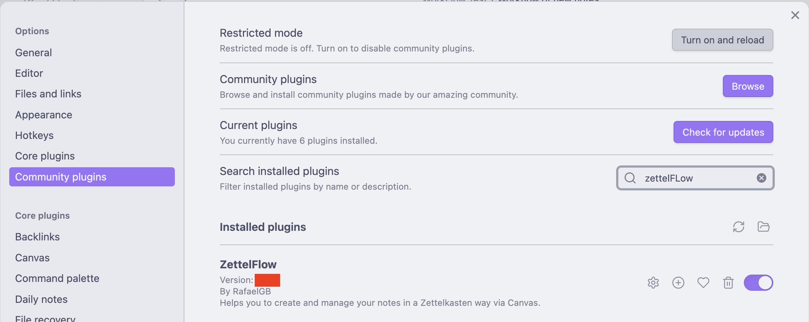

# ZettelFlow

[](https://github.com/RafaelGB/Obsidian-ZettelFlow/releases/latest)
[](https://github.com/RafaelGB/Obsidian-ZettelFlow/releases)
[](https://github.com/sponsors/RafaelGB)

**ZettelFlow turns an Obsidian Canvas into a guided note-creation wizard.** Draw your workflow as a graph — steps as nodes, order as arrows — and the plugin walks you through it every time you create a note, filling in frontmatter, body content, dates, selectors, and more without you touching a template manually.

> **[Full documentation →](https://rafaelgb.github.io/Obsidian-ZettelFlow/)**

---

## Zettelkasten toolkit

ZettelFlow is more than a note templater — it is a full **Zettelkasten workflow**. Beyond the
canvas wizard, it ships a set of tools that grow and maintain your slip-box:

- **📝 Note-builder companion pane** — a live preview of the note as you build it, plus
  suggested connections to existing notes so you can link before you file.
- **🔑 Zettel ID action** — stamp every note with a stable unique identifier (sortable
  timestamp or Luhmann-style **Folgezettel** branching like `21 → 21a → 21a1`).
- **🩺 Slip-box health dashboard** — a sidebar that surfaces **orphan** and **dead-end** notes,
  plus a **Knowledge Debt score** (0–100) with a severity bar and a per-category drill-down
  (unreferenced · dangling · unsourced · open questions), each item one click from a fix — so
  knowledge-debt never piles up unseen.
- **🚀 Starter flows** — one-click, ready-made flows for the four classic note types
  (fleeting, literature, permanent, structure/MOC), plus a **Literature → Permanent** composed
  showcase that chains the cognitive actions (extract claims → find related → suggest connections →
  identify contradictions → promote) into one runnable, fully-editable flow.
- **🗺️ Map-of-content builder** — gather notes by tag/folder into a MOC and refresh it safely;
  re-runs never touch your own prose.
- **✨ Connection resurfacing** — "talk to your slip-box": for the note you're reading, see
  older, related notes worth revisiting, plus a daily spark of forgotten ideas.
- **🗓️ Second-brain review** — one command generates a weekly **review note**: ideas created,
  orphans, forgotten ideas, and important-but-unreviewed notes over the last 7 days — each a click
  from a fix.
- **✂️ Atomicity split assist** — turn a multi-topic note into linked atomic notes in one
  command, leaving the source as a hub.
- **🌱 Note lifecycle states** — give every note a **state** (🌱 fleeting → 📝 literature →
  💡 permanent → 🔬 developing → 📚 evergreen → 🪦 archived) and move it with a validated
  **Change note state** command; the state lives in plain, configurable frontmatter.
- **🧭 Knowledge phases for steps** — tag each step in a flow with the stage of knowledge work it
  advances (Capture → Classify → Process → Connect → Develop → Review → Consolidate); the step
  builder groups your flow by phase, so a workflow reads as an arc of thinking. Distinct from a
  note's lifecycle *state*: a step has a **phase**, a note has a **state**.
- **⚡ Event-driven workflows** — let a flow **react** to vault events (a note created, a property
  or tag change) instead of only running on demand. Opt-in and **off by default**, throttled, and
  loop-guarded so a flow can never retrigger itself; an optional `zf` condition gates each trigger.
- **🧩 Visual workflow language (WHEN / IF / ACTION / WAIT)** — compose a reactive flow on the canvas
  as a readable program: **WHEN** a vault event happens, **IF** a condition holds, run an **ACTION**,
  then **WAIT** for your confirmation. WAIT is a human-in-the-loop pause; the blocks are annotated on
  the canvas so a flow reads as an arc of thinking.
- **🧠 Knowledge actions** — actions that *reason about* your slip-box, not just write to a note:
  detect an **orphan**, **calculate maturity** (0–100 from state, links, sources and age), **find
  contradictions**, **find unanswered questions**, and **suggest the next move** (a concrete
  to-do: add a source, connect it, add an example, develop it) — deterministic, offline, over the
  knowledge model. They feed the knowledge-health layer.
- **🔗 Relation actions** — actions that turn connection-making into a workflow step: **find
  related** and **suggest link** rank notes worth linking by shared graph context (co-citation +
  coupling), and **create semantic relation** writes a typed edge (supports, contradicts, …) to a
  target note. Graph-structural, deterministic, offline.
- **🔍 Research actions** — actions that make sourcing and claim-checking part of the workflow:
  **extract claims**, **compare claims** (surface notes that agree with or contradict yours),
  **find sources** (suggest existing vault sources for an under-sourced note), and **attach
  source**. Over the claims-and-sources model, deterministic and offline.
- **🤖 AI actions — optional, off by default** — AI is *one action category, never the core*: the
  whole plugin works fully with AI disabled. Opt in with your own OpenAI-compatible provider
  (endpoint + key + model — OpenAI, OpenRouter, LM Studio, Ollama…) to **summarize**, **classify**,
  and **generate questions**. No bundled key, no telemetry; the note content is sent only to the
  endpoint you configure. See [AI provider setup](https://rafaelgb.github.io/Obsidian-ZettelFlow/development/ai-provider-setup/).

> New here? Run **Install Zettelkasten starter flows** from the command palette, or open
> **Settings → ZettelFlow** to launch these tools.

---

## How it works

```
Canvas file  ──►  ZettelFlow wizard  ──►  Note in your vault
(your workflow)   (step-by-step UI)      (frontmatter + body merged)
```

1. **Design** — Create a `.canvas` file. Each node is a step; arrows define the order. Mark one node as the root.
2. **Configure** — Right-click any canvas node → *Edit ZettelFlow step* to add actions (prompt, calendar, selector, tags…).
3. **Run** — Click the ribbon icon (or use the command) to open the wizard. ZettelFlow walks the canvas graph and builds the note.




---

## Get started in 5 minutes

**Fastest path:**

1. Install **ZettelFlow** from the Obsidian community plugin browser.
2. Click the ZettelFlow ribbon icon (or run *Open ZettelFlow* from the command palette).
3. On the welcome screen, click **Create example flow** — ZettelFlow creates a sample canvas, sets it as your flow canvas, and opens it.
4. Click the ribbon icon again to run your first wizard.

**Manual path (build your own flow):**

1. Create a `.canvas` file (e.g. `flows/daily-note.canvas`).
2. In **Settings → ZettelFlow**, set that canvas as the "new notes canvas".
3. Add a note file to the canvas, right-click it → *Create managed step*, enable **Root**.
4. Click the ribbon icon — your first wizard run.

Stuck? Read the [Getting started guide](https://rafaelgb.github.io/Obsidian-ZettelFlow/) or open a [Discussion](https://github.com/RafaelGB/Obsidian-ZettelFlow/discussions).



---

## Features

| Feature | Description |
|---|---|
| **Canvas-based flows** | Use Obsidian's native canvas as the workflow engine — no custom DSL to learn. |
| **27 built-in actions** | Prompt, Number, Checkbox, Calendar, Selector, Dynamic selector, Tags, Backlink, CSS classes, Task management, Script, Zettel ID, 🧠 knowledge actions — detect orphan, calculate maturity, find contradiction, find unanswered question, suggest next move — 🔗 relation actions — find related, suggest link, create semantic relation — 🔍 research actions — extract claims, compare claims, find sources, attach source — and 🤖 optional AI actions (off by default) — summarize, classify, generate questions. |
| **Conditional edges** | Label a canvas arrow `if: frontmatter.type === "meeting"` to branch the workflow at runtime. |
| **Dynamic templates** | Use `{{title}}`, `{{date}}`, `{{frontmatter.key}}`, `{{canvas.name}}` in step body templates. |
| **Live body preview** | See the rendered note body while editing a step's template (desktop). |
| **Companion pane** | Live note preview + connection suggestions while the wizard runs — link before you file. |
| **Zettel ID action** | Stable unique IDs per note: sortable timestamp or Folgezettel branching (`21 → 21a → 21a1`). |
| **Slip-box health** | Sidebar dashboard surfacing orphan (no outgoing links) and dead-end (no backlinks) notes, plus a **Knowledge Debt score** (unreferenced · dangling · unsourced · open questions) with a drill-down and one-click fixes. |
| **Second-brain review** | A command that generates a weekly review note — ideas created, orphans, forgotten ideas, important-but-unreviewed — each with a next action. |
| **Zettelkasten starter flows** | One-click install of ready-made flows for fleeting, literature, permanent and MOC notes, plus a **Literature → Permanent** composed showcase that chains the cognitive actions. |
| **Map-of-content builder** | Gather notes by tag/folder into a MOC; re-runs update a managed region and keep your prose. |
| **Connection resurfacing** | Ranked older/related notes for the active note, with a daily-spark serendipity surface. |
| **Atomicity split** | Split a multi-topic note into linked atomic notes, leaving the source as an index/hub. |
| **Note lifecycle states** | Classify notes by phase (fleeting → … → archived) and change state with a validated command; state lives in configurable frontmatter (no lock-in). |
| **Vault hooks** | Trigger flows automatically on folder creation events or frontmatter property changes. |
| **Event-driven workflows** | Let a flow react to vault events (note created/modified, a property or tag change) instead of only running on demand — off by default, throttled, and loop-guarded. |
| **Visual workflow language** | Compose a reactive flow on the canvas: WHEN a vault event happens, IF a condition holds, run an ACTION, then WAIT for your confirmation — human-in-the-loop pauses, off by default and loop-guarded. |
| **Action picker by capability** | The action picker groups actions by cognitive capability (Manipulation · Relations · Knowledge · Research · AI) instead of a flat list. |
| **Community templates** | Browse, install, and share flows, steps, and actions from the community browser. |
| **.zftemplate export/import** | Bundle a canvas and its step files into a single portable file to share with others. |
| **Notes history** | Sidebar leaf showing recently built notes with quick-open links. |
| **Mobile support** | Works on iOS and Android (`isDesktopOnly: false`). |

---

## Capabilities & privacy

ZettelFlow collects **no telemetry** and sends **no personal data or vault contents** anywhere. The plugin uses these capabilities:

- **File system (vault).** Reads canvas flow files and creates/edits notes (e.g. the **Change note state** command writes a single lifecycle property to the active note). All access goes through Obsidian's `Vault` / `FrontmatterService` API — never a hardcoded path. Works on desktop and mobile.
- **Network — optional, community feature only.** If (and only if) you open the community templates browser, ZettelFlow fetches example flows from the ZettelFlow community source. Nothing is sent unless you use this feature.
- **Script execution.** The Script action and JavaScript step files run **JavaScript you write** as part of a flow. This code runs with the plugin's access to your vault — only run scripts you trust.

See [Capabilities & privacy](https://rafaelgb.github.io/Obsidian-ZettelFlow/development/capabilities-and-privacy/) for full details.

---

## Contributing

- **Bug?** → [Open a bug report](https://github.com/RafaelGB/Obsidian-ZettelFlow/issues/new?template=bug_report.yaml)
- **Idea?** → [Open a feature request](https://github.com/RafaelGB/Obsidian-ZettelFlow/issues/new?template=feature_request.yaml)
- **Question?** → [Start a discussion](https://github.com/RafaelGB/Obsidian-ZettelFlow/discussions)
- **Code?** → Read [Contributing & conventions](https://rafaelgb.github.io/Obsidian-ZettelFlow/development/contributing-and-conventions/) and open a PR.

---

## Support

If ZettelFlow saves you time, consider supporting development:

[](https://www.buymeacoffee.com/5tsytn22v9Z)
