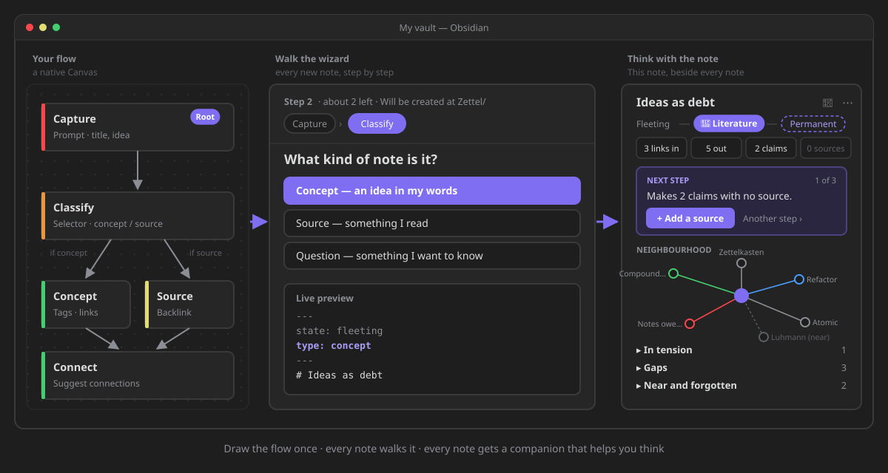
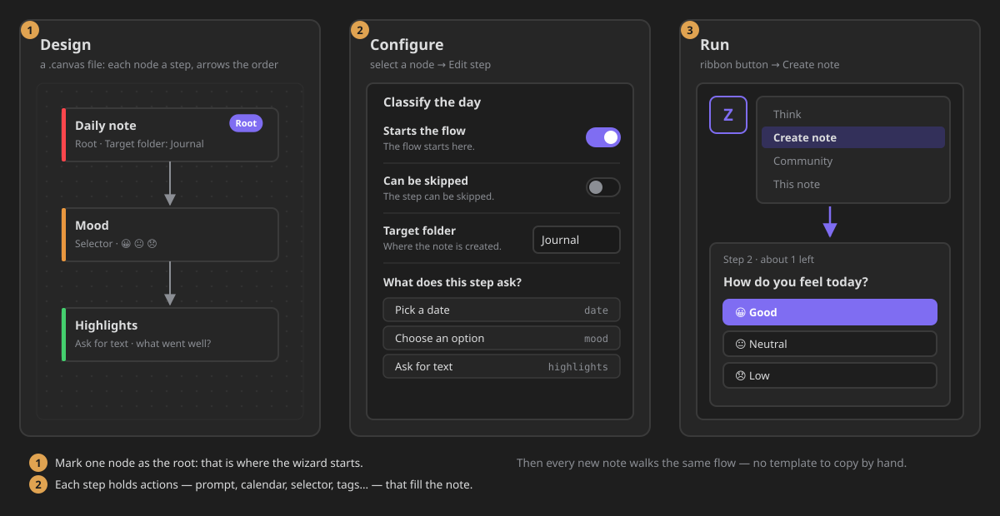
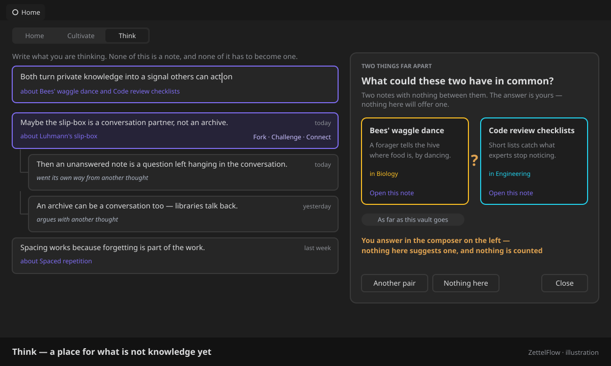
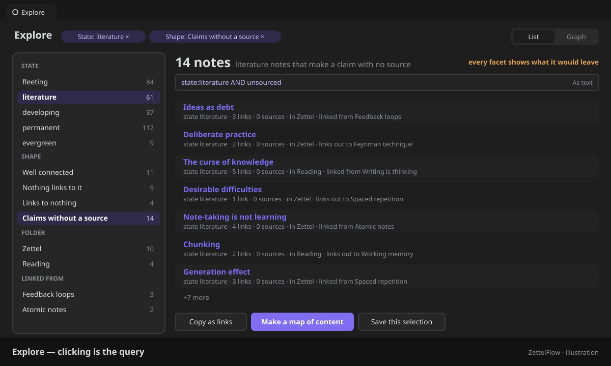
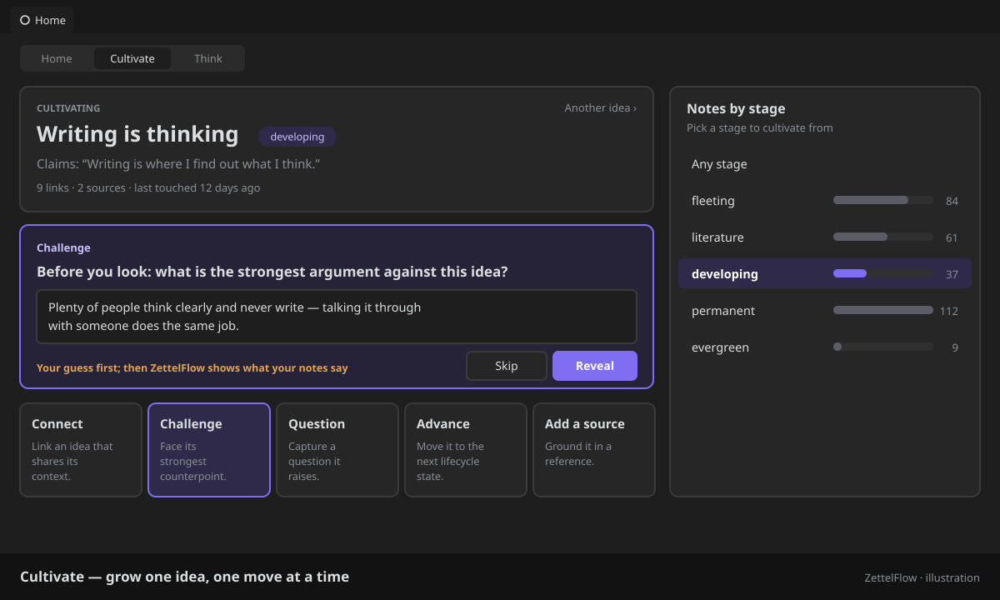
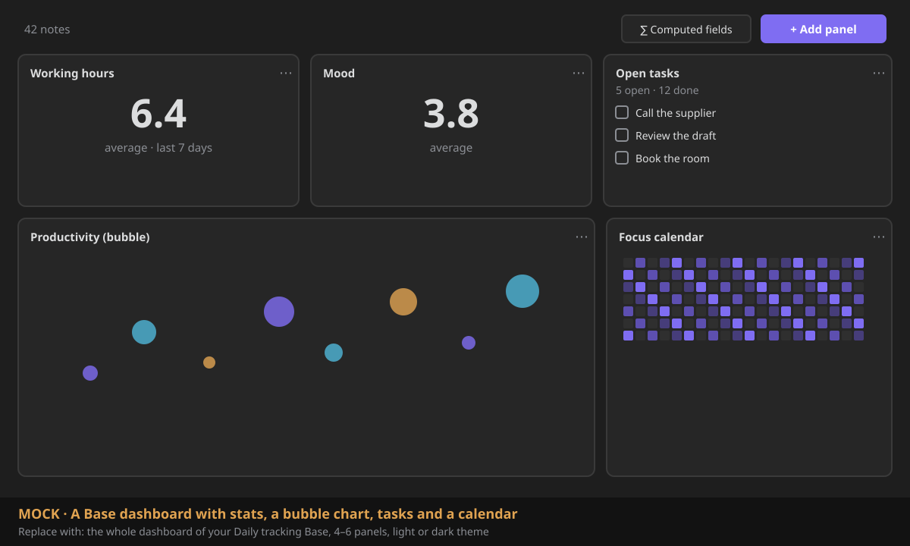
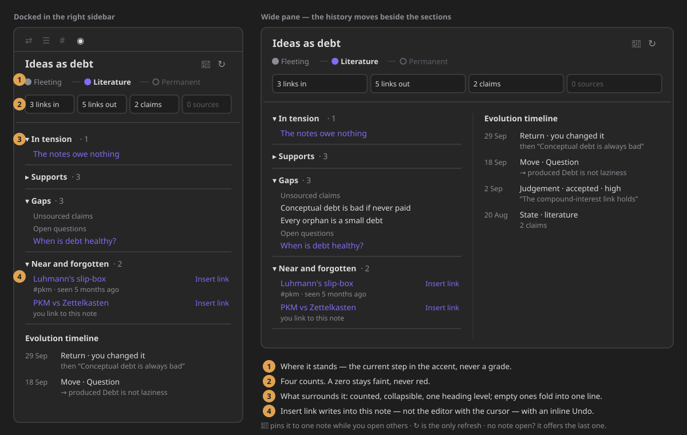
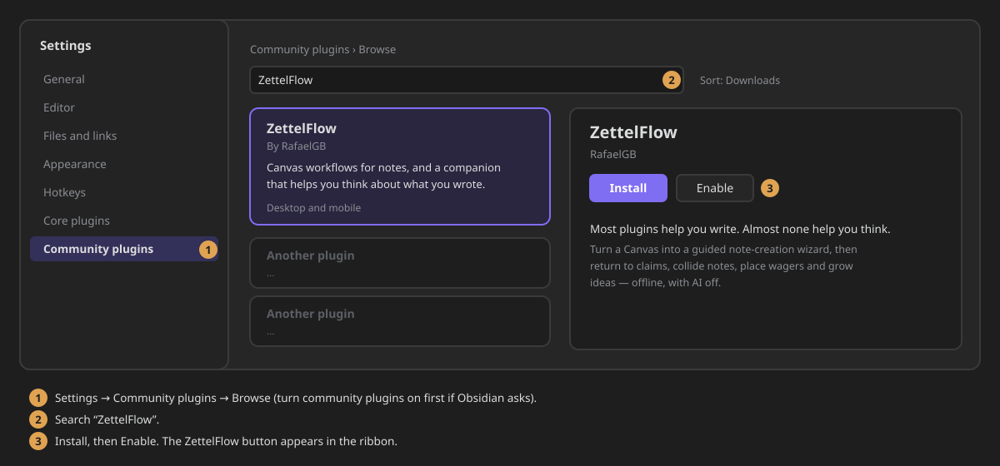

<h1 align="center">ZettelFlow</h1>

<b>Draw your note workflow on a Canvas once — then think with every note it makes.</b>

  
  
  

  <a href="#get-started-in-5-minutes"><b>Get started</b></a> ·
  <a href="https://rafaelgb.github.io/Obsidian-ZettelFlow/why/">Why ZettelFlow</a> ·
  <a href="https://rafaelgb.github.io/Obsidian-ZettelFlow/showcase/">Showcase</a> ·
  <a href="https://rafaelgb.github.io/Obsidian-ZettelFlow/">Documentation</a> ·
  <a href="https://rafaelgb.github.io/Obsidian-ZettelFlow/reference/capabilities/">Everything it does</a>

  

> **Most plugins help you _write_. Almost none help you _think_.**

**Stop managing notes. Start managing knowledge.** Obsidian is the store; **ZettelFlow is the engine that makes the knowledge inside it evolve.** It turns a native Canvas into a note-creation wizard — and then gives you a small set of **practice loops** that ask something of *you*, so a slip-box becomes thinking you actually do rather than notes you merely keep. Every loop is offline, works with AI switched off, and writes nothing to your vault you did not decide.

## What it asks of you

Before any feature list, the handful of things ZettelFlow asks you to **do** — each a small loop on your own notes, each reached where you already are:

- 🔁 **Return a claim** — say in one sentence what a note claims; after a while ZettelFlow brings it back **blind** from **Home** and asks what you say about it *now*, then sets the two sentences side by side. See [the return of a claim](docs/development/claim-returns.md).
- 🎲 **Collide two notes** — from **Think**, it puts two of your notes with nothing in common side by side and asks what they could share. It never answers; the connection is your thinking. See [two things far apart](docs/architecture/collision.md).
- ⚖️ **Place a wager** — add *what you expect to see* and *by when* to a claim, from the **note's right-click menu**; on the day you named, it asks what actually happened *before* it shows your prediction. See [a wager](docs/development/wagers.md).
- 🧠 **Make a move on an idea** — challenge it, reframe it, branch it, set it aside: a **cognitive move** from the **note's right-click menu**, recorded as something you did and never written for you. See [make a move](docs/development/cultivate.md#the-moves).

Everything else — the Canvas wizard, the semantic graph, health, discovery, cultivation — is one click away: **[Everything it does →](https://rafaelgb.github.io/Obsidian-ZettelFlow/reference/capabilities/)**, or read the **[manifesto](https://rafaelgb.github.io/Obsidian-ZettelFlow/manifesto/)** and the **[full documentation](https://rafaelgb.github.io/Obsidian-ZettelFlow/)**.

**AI is one action, never the product.** Every loop and every view works fully with AI disabled; when it is on it **proposes**, and you accept, edit or reject — the verdict is recorded, never assumed. **Knowledge with purpose** — starting from your own question and writing a provisional response — shipped in 3.3 and needs no AI, methodology or Canvas setup; see [Cultivate](docs/development/cultivate.md).

---

## How it works

**ZettelFlow turns an Obsidian Canvas into a guided note-creation wizard.** Draw your workflow as a graph — steps as nodes, order as arrows — and the plugin walks you through it every time you create a note, filling in frontmatter, body content, dates and selectors without you touching a template by hand. Each step is a piece of the cognitive engine; each note lands already related, cross-checked and scored.

1. **Design** — create a `.canvas` file. Each node is a step; arrows define the order. Mark one node as the root.
2. **Configure** — right-click any canvas node → *Edit ZettelFlow step* to add actions (prompt, calendar, selector, tags…).
3. **Run** — click the ZettelFlow ribbon button → **Create note** (or bind a hotkey to the *Open workflow* command). ZettelFlow walks the graph and builds the note.

**…and the wizard is only the door.** The note it makes lands inside a knowledge engine you can walk:

  
  
  

<b>Think</b> · a place for what isn't knowledge yet &nbsp;·&nbsp; <b>Explore</b> · the graph as a query &nbsp;·&nbsp; <b>Cultivate</b> · grow an idea by hand

---

## Dashboards for your vault

Point an **[Obsidian Base](https://help.obsidian.md/bases)** at any folder and ZettelFlow turns it into a **dashboard** — a local "Grafana" that never leaves Obsidian. Compose **stat, bar, line, area, scatter, bubble, pie, donut, table, heatmap and calendar** panels over the same filtered notes: map fields with working defaults, reshape them with no-code transforms (filter · group · aggregate · moving average…), and match light/dark automatically. Track daily productivity, mood or habits with **no `dataviewjs`**, click any bar or day to open its note, and tick off the notes' tasks right from the dashboard — the one thing it ever writes.

**[Base dashboards →](https://rafaelgb.github.io/Obsidian-ZettelFlow/development/base-dashboards/)**

---

## This note, beside every note

Open **This note** from the ribbon menu and the note you are reading gets a companion in the right sidebar: where it stands on its lifecycle, four plain counts, what argues with it, what supports it, what it is missing and what you wrote near it and forgot — then how it got here. It says the note's next step and lets you finish it in place. Pin it to one note while you work in another; link a forgotten note into it with one click and an Undo.

**[This note →](https://rafaelgb.github.io/Obsidian-ZettelFlow/development/this-note/)**

---

## Get started in 5 minutes

**Fastest path:**

1. Install **ZettelFlow** from the Obsidian community plugin browser.
2. Click the ZettelFlow ribbon button (or run *Open ZettelFlow* from the command palette).
3. On the welcome screen, click **Start with my own idea**, then choose an existing note or capture one.
4. State a question, inspect the material, write a response or a gap, and **Save progress** — this needs no Canvas setup and works in an empty vault.

**Build your own flow:**

1. Create a `.canvas` file (e.g. `flows/daily-note.canvas`).
2. In **Settings → ZettelFlow**, set that canvas as the "new notes canvas".
3. Add a note file to the canvas, right-click it → *Create managed step*, enable **Root**.
4. Click the ribbon button → **Create note** — your first wizard run.

Stuck? Read the [getting started guide](https://rafaelgb.github.io/Obsidian-ZettelFlow/) or open a [discussion](https://github.com/RafaelGB/Obsidian-ZettelFlow/discussions).

---

## Capabilities & privacy

ZettelFlow collects **no telemetry** and sends **no personal data or vault contents** anywhere. The plugin uses these capabilities:

- **File system (vault).** Reads canvas flow files and creates/edits notes (e.g. the **Change note state** command writes a single lifecycle property to the active note). All access goes through Obsidian's `Vault` / `FrontmatterService` API — never a hardcoded path. Works on desktop and mobile.
- **Vault enumeration.** ZettelFlow lists every markdown file **path** to build the offline knowledge model that health, discovery, the graph and Cultivate all read. Paths and metadata only, all local — and you can keep folders out of it with the knowledge scope.
- **Network — two opt-in paths, nothing until you use them.** The **community gallery** does read-only `GET`s of the static catalog on GitHub (no backend, no account, no uploads), and the optional **AI provider** sends length-bounded note content to the single https endpoint *you* configure. Both are off until you open the browser or enable AI.
- **Dynamic code execution.** The Script action, dynamic selectors, vault hooks and workflow-event conditions run **JavaScript you write**, with the plugin's access to your vault — including read-only access to the whole knowledge model via `zf.knowledge` — so only run scripts you trust. No remote code is ever fetched or executed, and every runtime function is built in one audited module.
- **Clipboard — write only.** The “copy” buttons put a step or action configuration on your clipboard as JSON. ZettelFlow never *reads* your clipboard.

See [Capabilities & privacy](https://rafaelgb.github.io/Obsidian-ZettelFlow/development/capabilities-and-privacy/) for full details.

---

## Contributing

- **Bug?** → [Open a bug report](https://github.com/RafaelGB/Obsidian-ZettelFlow/issues/new?template=bug_report.yaml)
- **Idea?** → [Open a feature request](https://github.com/RafaelGB/Obsidian-ZettelFlow/issues/new?template=feature_request.yaml)
- **Question?** → [Start a discussion](https://github.com/RafaelGB/Obsidian-ZettelFlow/discussions)
- **Code?** → Read [Contributing & conventions](https://rafaelgb.github.io/Obsidian-ZettelFlow/development/contributing-and-conventions/) and open a PR.

---

## Support

If ZettelFlow saves you time, consider supporting development:

