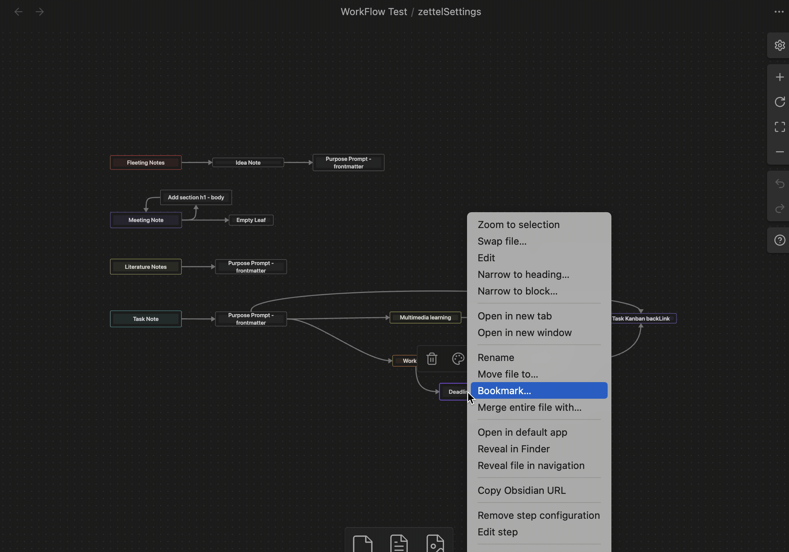
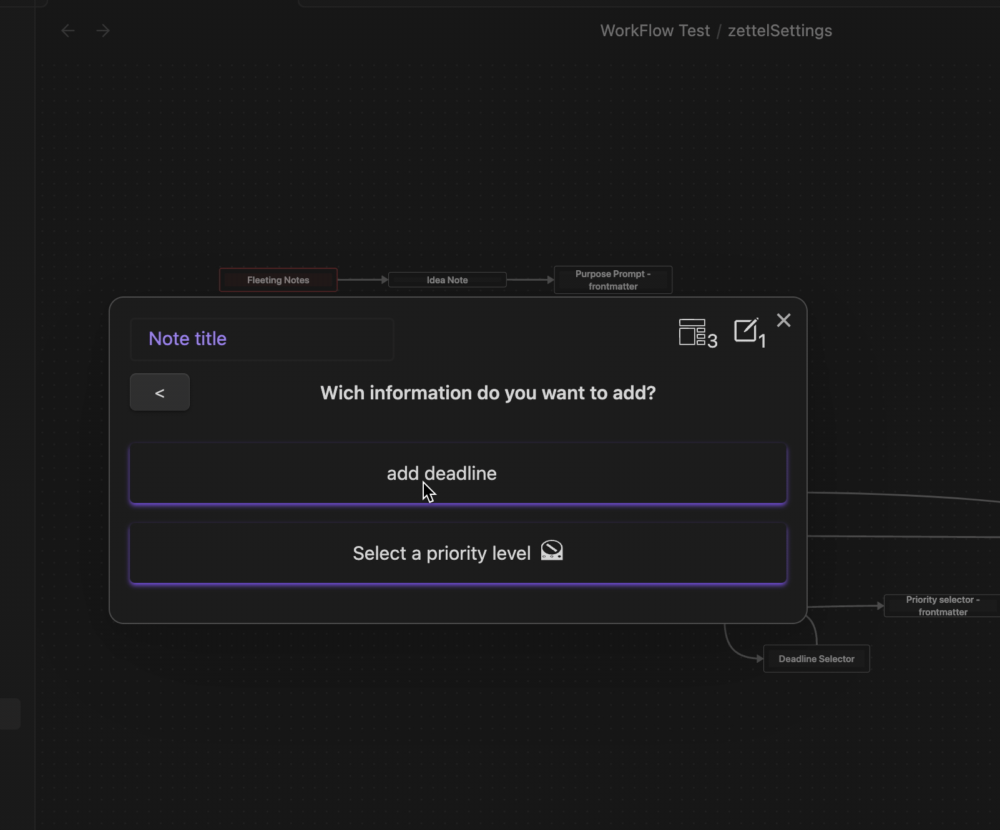

# Calendar Action
Date picker to add a date to the built-in note template as property.

## Options
- zone: The zone where the property will be added. (Frontmatter or Body)
- Key: The key of the property to be added.
- Label: An explanatory label for the property.

## Component
The component is a simple date picker. Select the date you want and press `confirm` to continue.

