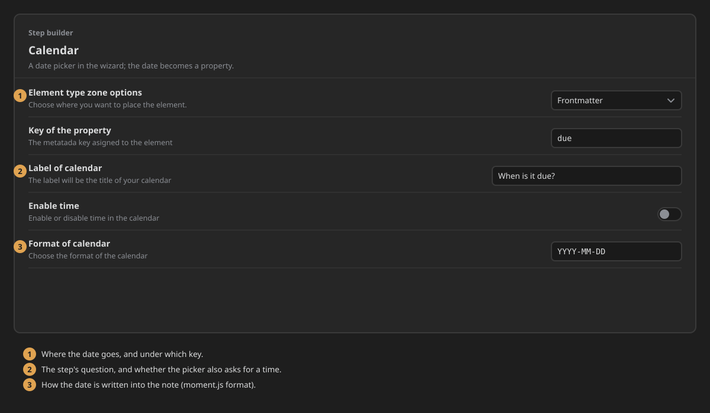
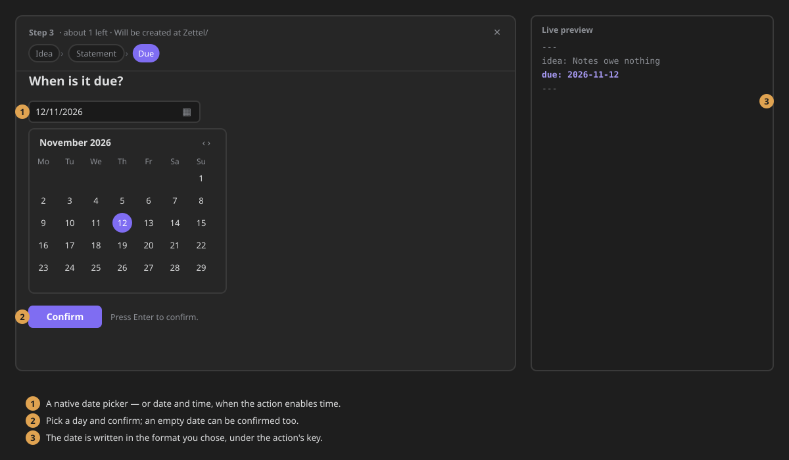

# Calendar Action
Date picker to add a date to the built-in note template as property.

## Options
- zone: The zone where the property will be added. (Frontmatter or Body)
- Key: The key of the property to be added.
- Label: An explanatory label for the property.

## Component
The component is Obsidian's own date field, with a label above it. Type the date, or open the
field's picker when you want one. The picker no longer opens by itself when the field is focused.
Press `Enter` or **Confirm** to continue. A date that is not a date is refused. When the step can
be skipped, **Skip this step** moves on without one.

