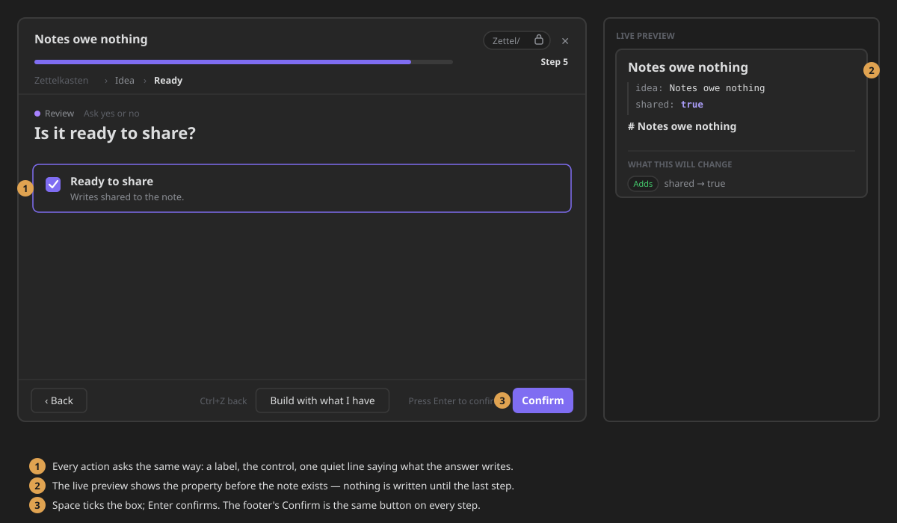

# Checkbox Action
Checkbox to select a boolean value. The value will be added to the note as a property.
## Options
- zone: The zone where the property will be added. (Frontmatter or Body)
- Key: The key of the property to be added.
- Label: An explanatory label for the property. The wizard shows it beside the box.
## Component
A checkbox with your label beside it. The whole row is clickable, and a line under the label says
which property the answer writes. `Space` ticks the box, and `Enter` or **Confirm** saves the
answer. With no label, the wizard shows the property's key instead.

