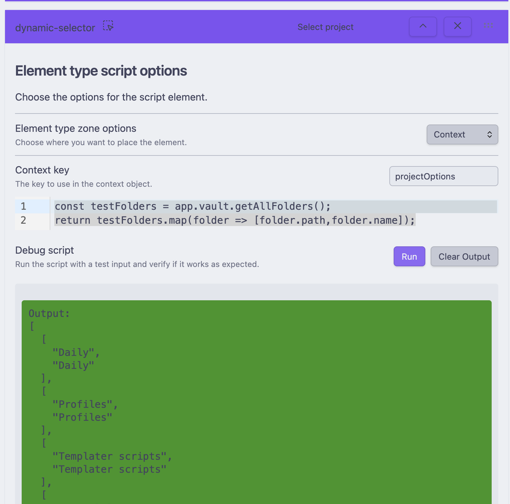

# Dynamic Selector Action

The Dynamic Selector Component allows users to define selection elements whose options are generated on-the-fly based on user-provided JavaScript code. This means that instead of having static dropdown options, the options can change dynamically depending on various factors such as dataview queries, or other custom logic.

## Key Features

- **Dynamic Option Generation**: Create selection options dynamically using JavaScript.
- **Contextual Configuration**: Define different zones (frontmatter, body, context) where the selector interacts within your notes.
- **Real-Time Debugging**: Test and debug your scripts directly within the Obsidian settings interface.

# Configuration

Configuring the Dynamic Selector Component involves defining scripts that generate the selection options and setting up the contextual zones where these selectors will operate.

## Writing the Script
To generate dynamic options, you'll need to write a JavaScript script that returns an array of string tuples. Each tuple represents a key-value pair for the selector options.

### Script Example:
```javascript
const testFolders = app.vault.getAllFolders();
// Add your filtering logic here
// ...
return testFolders.map(folder => [folder.path,folder.name]);
```



### Requirements:

- **Return Type**: The script must return an array of arrays, where each inner array contains exactly two strings: the key and the display label.
- **Format**: `[string, string][]` — an array of string tuples.
Example Script:

```javascript
return [
  ["home", "Home"],
  ["about", "About Us"],
  ["contact", "Contact"],
];
```

## Setting the Zone
The Dynamic Selector Component operates within specific zones of your notes. These zones determine where and how the selector interacts with your content.

### Available Zones

- **Frontmatter**: Interacts with the YAML frontmatter section of your notes.
- **Body**: Interacts with the main body content of your notes.
- **Context**: Utilizes a contextual key-value pair for more advanced interactions.

### Configuring the Zone

- Navigate to the Dynamic Selector Settings within your Obsidian plugin settings.
- Locate the Zone Selection dropdown.
- Choose one of the available zones (frontmatter, body, context) based on where you want the selector to operate.
