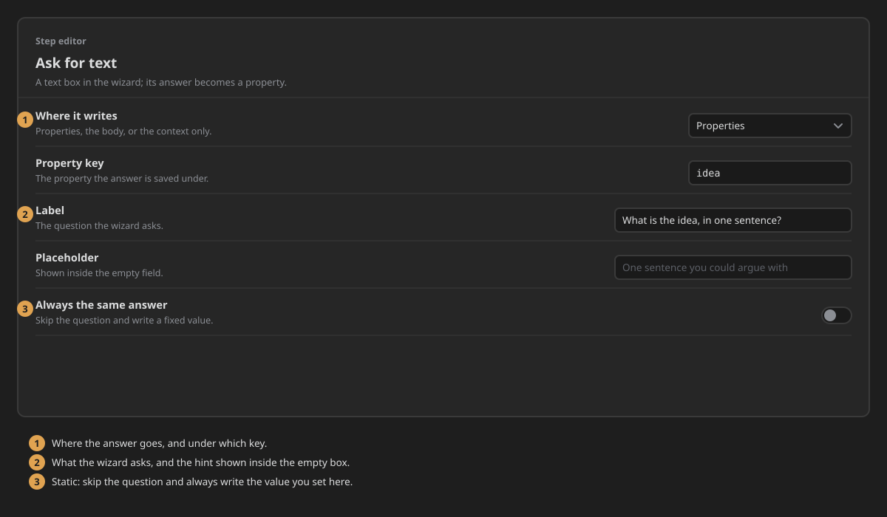
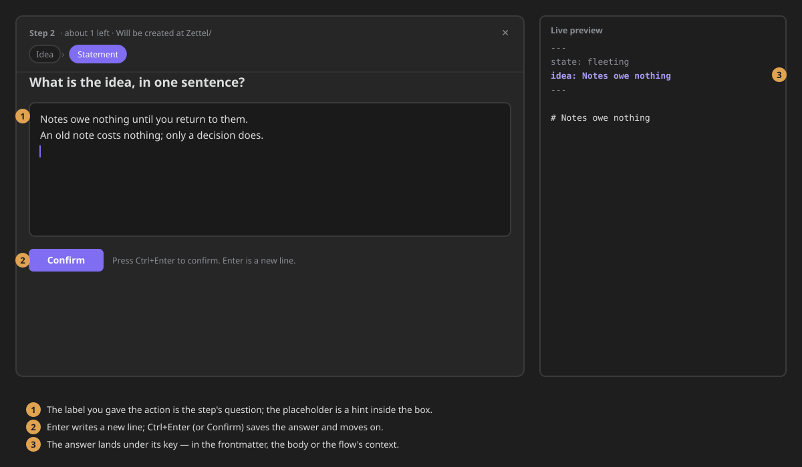

# Prompt Action
Include a textarea to save text as a property in the built-in note template.

## Options
- zone: The zone where the property will be added. (Frontmatter or Body)
- Key: The key of the property to be added.
- Label: An explanatory label for the property.
- Placeholder: A placeholder as a hint for the user (yourself).

## Component
The component is a text area with your label as the question and your placeholder as a hint. `Enter` starts a new line; `Ctrl`/`Cmd`+`Enter` (or **Confirm**) saves the answer and continues.

