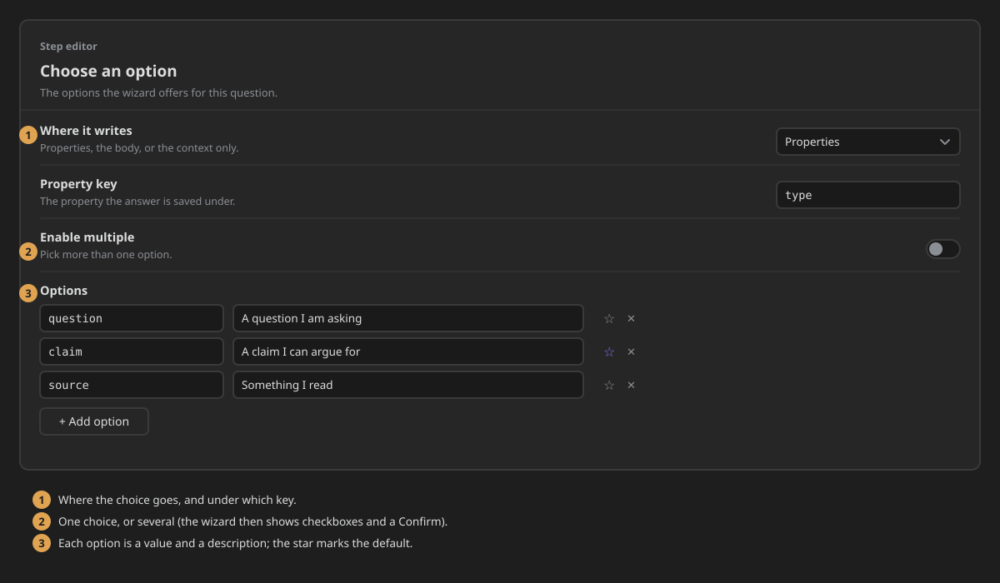
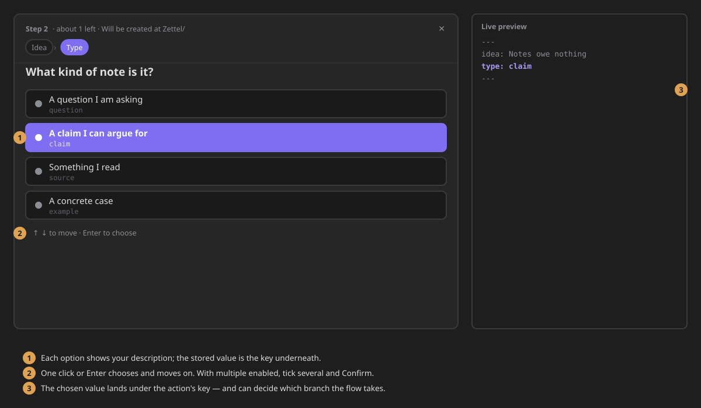

# Selector Action
Create some options to select one of them and add it into the built-in note template as property.

## Options
- zone: The zone where the property will be added. (Frontmatter or Body)
- Key: The key of the property to be added.
- Label: An explanatory label for the property.
- Options: The options to select one of them.
  - Value: the value that will be inserted into the property.
  - Description: An explanatory description for the option.

## Component
The component lists the options you defined. Click one, or move with the arrow keys and press `Enter`
or **Confirm**, to choose it and continue. The keyboard starts on the default option, which is
marked **default**. With **Enable multiple**, pick several and press **Confirm**.

