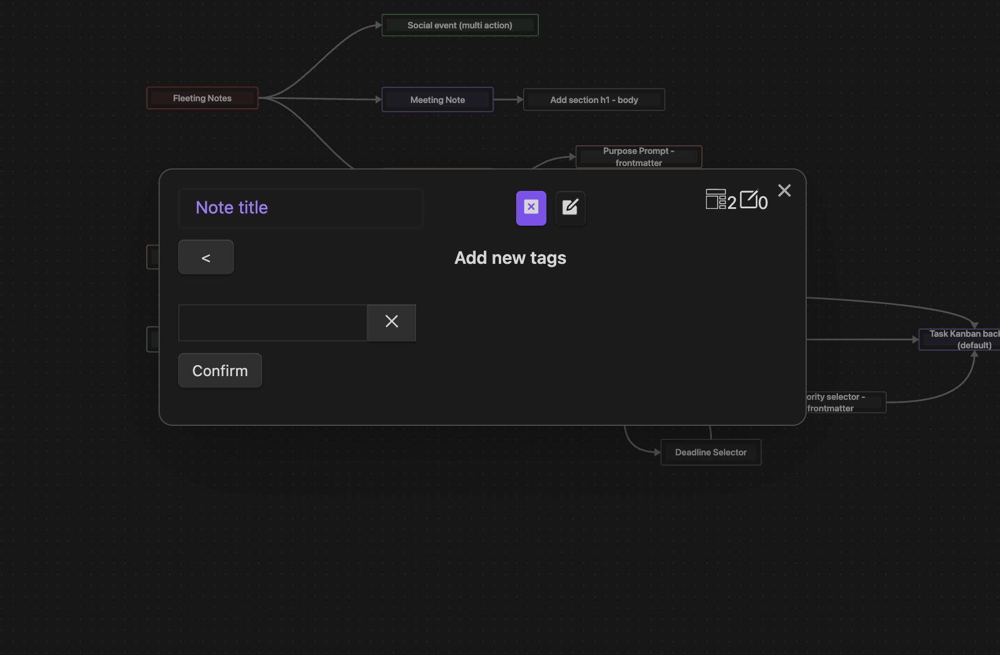

# Tags Action
Add tags to the built-in note template as property (will be merged with existing tags of another tag steps or tags in the frontmatter).

## Options
N/A

## Component
Multi-select component to add tags to the built-in note template as property.

