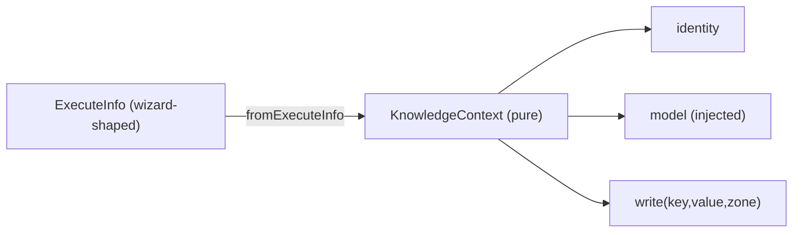
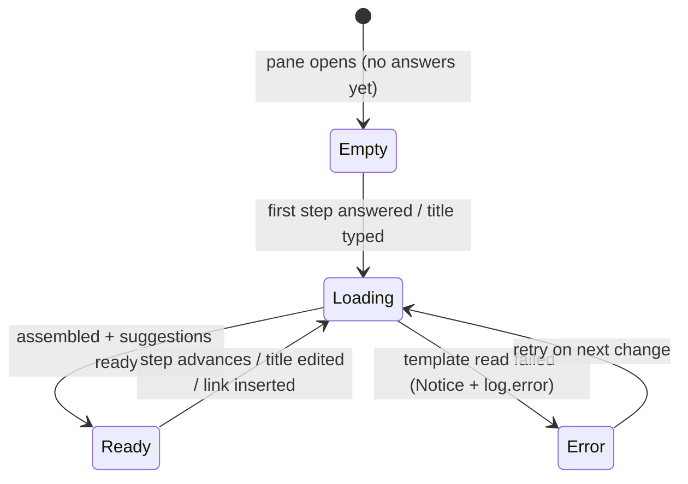

# Actions & note builder

This is the functional heart of ZettelFlow: the **action abstraction**, how each action
contributes to the generated note, and the **wizard state machine** that drives note creation.

## 1. The action contract

Every action implements `ICustomZettelAction` (`architecture/api/typing.ts`) and extends the
abstract base `CustomZettelAction` (`architecture/api/CustomZettelAction.tsx`):

```ts
interface ICustomZettelAction {
  id: string;
  component(props: WrappedActionBuilderProps): JSX.Element; // build-time UI
  settings: ActionSetting;                                  // design-time config UI
  execute(info: ExecuteInfo): Promise<void>;                // contribute to the note
  postProcess(info: ExecuteInfo, file: TFile): Promise<void>;
  getIcon(): string;
  getLabel(): string;
}
```

The base class adds four abstract members: `defaultAction: Action`,
`settingsReader: ActionSettingReader` (read-only config view), `link: string` (doc URL),
`purpose: string` (one-line description). `component`, `execute`, and `postProcess` have empty
default implementations, so an action overrides only what it needs.

### Lifecycle — what runs when

| Member | Phase | Purpose |
|---|---|---|
| `id`, `defaultAction` | registration / step editor | store key + the config template cloned by `getDefaultActionInfo` |
| `settings(contentEl, modal, action, disableNavbar?)` | **design time** (step editor) | render the config UI that mutates the `action` object |
| `settingsReader(contentEl, action)` | design time | read-only preview of the config |
| `component(props)` | **build time** (wizard) | the React UI the user fills in; calls `props.callback(value)` |
| `execute(info)` | **build** | write the action's contribution into `ContentDTO` / `context` |
| `postProcess(info, file)` | **after file write** | side effects needing the real `TFile` (e.g. backlinks) |
| `getIcon()`, `getLabel()`, `link`, `purpose` | menus / docs | presentation |

### Key types (`architecture/api/typing.ts`)

```ts
type Action = {
  type: string;        // "prompt", "script", …
  id: string;
  description?: string;
  hasUI?: boolean;     // true → renders a wizard step; false → background action
  [key: string]: Literal;  // arbitrary per-action config
};

type ExecuteInfo = {
  element: FinalElement;          // the configured action + its runtime `result`
  content: ContentDTO;            // note body / frontmatter / tags accumulator
  note:    NotePersistence;       // the note's persistence/representation view (path + title + folder)
  context: Record<string, Literal>; // ephemeral bag shared between actions
};
```

`FinalElement = { result: Literal } & Action`.

Since epic [#268](https://github.com/RafaelGB/Obsidian-ZettelFlow/issues/268) S6 (#275), the action
(and user-script) boundary sees the note as **`NotePersistence`**, not the wizard-shaped `NoteDTO` —
see [The note DTOs](#4-the-note-dtos). Knowledge **domain** access (identity, model, relation writes)
does not go through `note`; it flows through the [KnowledgeContext seam](#the-knowledgecontext-seam-xi-boundary).

### The 4-file convention

Each action folder (`src/actions/<name>/`) contains:

- `*Action.tsx` — the `CustomZettelAction` subclass (registration + `execute`/`postProcess`).
- `*Component.tsx` — the **build-time** React UI (skipped for background actions).
- `*Settings.ts(x)` — the **design-time** config UI (Obsidian `Setting` rows and/or React).
- `*SettingsReader.ts` — the read-only config view (used in community previews).

### The KnowledgeContext seam (§XI boundary)

> Epic [#262](https://github.com/RafaelGB/Obsidian-ZettelFlow/issues/262) Phase 2 (#264).

Knowledge and relation actions conceptually operate on the **Knowledge Model**, not on a `Note`.
The **KnowledgeContext** seam names the *only three* concerns those actions touch, so an action can
run unchanged during creation, review, from Home, Discovery, a condition or a workflow:

| Concern | What it is | Backed today by |
|---|---|---|
| **Identity** | the note/idea under operation — `el.target` or the built note's path, or `null` | `resolveTargetPath(info, el)` |
| **Model view** | the note's current frontmatter + the offline `KnowledgeModel` (or `null` when the index isn't ready) | `content.getFrontmatter()` + `readyModel()` |
| **Sink** | `write(key, value, zone)` — frontmatter for any zone that isn't `context`, always mirrored to `{{key}}` | `writeKnowledgeResult(info, el, value)` |



**Placement rule (the hardened boundary):**

- The **pure type** lives in the Knowledge layer at `src/architecture/knowledge/context/KnowledgeContext.ts`.
  It is offline and platform-free — **§XI**: it imports no platform API, no `NoteDTO`/`ContentDTO`, no
  `KnowledgeIndex`. **Gotcha:** import `KnowledgeModel` by its **deep path**
  (`architecture/knowledge/model/KnowledgeModel`), never the `architecture/knowledge` barrel, which
  re-exports the platform-coupled `KnowledgeIndex`. A grep gate
  (`test/architecture/knowledge/pure-is-obsidian-free.test.ts`) enforces this over `context/`.
- The **adapter** `fromExecuteInfo(info)` lives on the engine/actions side at
  `src/actions/knowledge/knowledgeContextAdapter.ts`. It is the **only** place that resolves the model
  from `KnowledgeIndex` (via `readyModel()`) and injects it into the context, so the pure type never
  reaches for a singleton. The execution helpers it composes live UI-free in
  `src/actions/knowledge/knowledgeActionCore.ts` (re-exported by `knowledgeActionShared.ts`).

`find-related` is the first action migrated to read identity/model/sink through the seam; the rest
follow as the epic splits actions into Commands vs Queries (Phase 3).

**Note → persistence inversion (#268 S6, #275).** With the domain flowing through this seam, the note
handed to an action no longer needs to be the wizard builder. `ExecuteInfo.note` is typed
[`NotePersistence`](#4-the-note-dtos) — only the note's destination path, title and target folder —
so neither an action nor the user-script sandbox (which receives `note` directly) can reach the
builder's wizard-flow methods. `NoteDTO` `implements NotePersistence` and stays the note-builder's
private object; the headless post-index re-run builds its stand-in with the pure
`notePersistenceForPath(path)` factory instead of casting a fake `NoteDTO`.

## 2. Zones — where a value goes

Most actions route their value by a `zone` config field:

- **`frontmatter`** (default) → `content.addFrontMatter({ [key]: value })` → a YAML property.
- **`body`** → `content.modify(key, value)` → replaces `{{key}}` placeholders in the merged
  step-template body.
- **`context`** → `context[key] = value` → **not written** to the note; a shared bag so later
  actions and scripts can read earlier values.

## 3. The 11 built-in actions

| # | `type` (class) | Icon | `hasUI` | Build-time UI | Writes | Key config |
|---|---|---|---|---|---|---|
| 1 | `prompt` (PromptAction) | `form-input` | ✅ | text area | string → zone | zone, key, label, placeholder, static toggle/value |
| 2 | `number` (NumberAction) | `binary` | ✅ | number input | number → zone | zone, key, static |
| 3 | `checkbox` (CheckboxAction) | `check-square` | ✅ | checkbox | boolean → zone | zone, key, static |
| 4 | `selector` (SelectorAction) | `square-mouse-pointer` | ✅ | single/multi select | string(s) → zone | zone, key, options (dnd list), `multiple` |
| 5 | `dynamic-selector` (DynamicSelectorAction) | `square-dashed-mouse-pointer` | ✅ | select from script output | option(s) → zone | zone, key, script `code` returning `[label,value][]`, `multiple` |
| 6 | `calendar` (CalendarAction) | `calendar-days` | ✅ | date/time picker | moment-formatted date → zone | key, zone, `enableTime`, `format`, static |
| 7 | `backlink` (BackLinkAction) | `links-coming-in` | ✅ | target/heading picker | **nothing here** — inserts `[[thisNote]]` into *another* file via `postProcess` | defaultFile, insertPattern (`{{wikilink}}`), defaultHeading |
| 8 | `tags` (TagsAction) | `price-tag-glyph` | ✅ | tag list | frontmatter `tags` | tags list, static |
| 9 | `cssclasses` (CssClassesAction) | `view` | ✅ | class list | frontmatter `cssclasses` | classes list, static |
| 10 | `script` (ScriptAction) | `code-glyph` | ❌ | none (background) | anything, imperatively | CodeMirror JS editor + debug runner |
| 11 | `task-management` (TaskManagementAction) | `list-checks` | ❌ | none (background) | rolled-over tasks → body | initialFolder, regex, rolloverHeader, prefix/suffix, key, recursive |

Outliers to know:

- **BackLink** overrides `postProcess` (not `execute`): it resolves the target file/heading and
  calls `EditService.instance(target).insertBacklink(...)`. `{{wikilink}}` becomes
  `[[source.basename]]`.
- **TaskManagement** scans files in `initialFolder`, extracts unfinished `- [ ]` todos under
  `rolloverHeader`, **removes them from the source files**, and appends them to the new note.
- **Script** is the imperative escape hatch — it receives the live DTOs and mutates them
  directly (see §6).

## 4. The note DTOs

**`ContentDTO`** (`application/notes/model/ContentDTO.ts`) — the note accumulator:

- `content: string` (body), `frontmatter: Record<string, Literal>`, `tags: string[]`.
- `add(str)` appends body; `modify(key, result)` replaces `{{key}}` in the body (the `body`
  zone); `addFrontMatter(fm)` merges frontmatter (hoisting any `tags` field into `addTags`);
  `addTags`/`addTag` de-dupe.

**`NoteDTO`** (`application/notes/model/NoteDTO.ts`) — the note-builder's private metadata + work list.
Only its **persistence/representation** view — the `NotePersistence` interface
(`application/notes/model/NotePersistence.ts`): `getFinalPath`, `getTitle`/`setTitle`,
`getTargetFolder`/`setTargetFolder` — crosses the action/script boundary (`ExecuteInfo.note`, #275).
The wizard-flow members below stay internal to the note-builder (`builder.note.*`):

- `title`, `targetFolder`, `uniquePrefixPattern`.
- `paths: Map<number, string>` — chosen step-template `.md` paths, keyed by wizard position.
- `savedActions: Map<number, FinalElement>` — configured actions + their results.
- `links: string[]` — connection links chosen in the companion pane; appended to the body as
  `[[wikilinks]]` at build time (`addLink`/`getLinks`, session-scoped).
- `getFinalPath()` = `targetFolder/title.md`; `deletePos(pos)` prunes paths/actions at/after a
  position (used by back-navigation).
- `lockTargetFolder(path)` — pins the note to a specific folder, preventing any per-step
  `targetFolder` from overriding it. Used by the **Create note in current folder** setting
  (`createInCurrentFolder` in `ZettelFlowSettings`): when enabled, the active file's parent
  folder is locked in at wizard start and no step can change it.

## 5. The build pipeline — `NoteBuilder.ts`

`build(modal, actions)` branches on `modal.isEditor()`:

- **New note** — `buildNewNote()`: freeze the vault → compute the filename (optional date
  prefix) → `buildNote()` → guard empty title → `FileService.createFile(finalPath, body)` →
  `FrontmatterService.processTypedFrontMatter` → `postProcess(file)`. On error it deletes the
  half-created file and defrosts the vault.
- **Editor / embedded** — `buildEditor()`: `buildNote()` → `modal.onEditorBuild(body)`; if
  backed by a real file, also `processTypedFrontMatter` + `postProcess`.

`buildNote()` — for each chosen step template: read its frontmatter (`addFrontMatter`) and body
(`add`), then `manageElements()`, then `appendConnectionLinks()` (companion-pane links, if any).

`manageElements()` — for each saved action element:
`actionsStore.getAction(element.type).execute({ element, content, note, context })`, advancing
the progress bar.

`postProcess()` — a second pass calling each action's `postProcess(info, file)` (backlinks land
here), then triggers Templater's `replace-in-file-templater` command after ~1 s.

**Typed frontmatter write** — `FrontmatterService.processTypedFrontMatter` writes
`content.getTags()` into `frontmatter.tags` and coerces every value to the property's native
Obsidian type via `ObsidianConfig.parseType(...)`, using `fileManager().processFrontMatter`.

## 6. The wizard — state machine

### The store

`useNoteBuilderStore` (`application/components/noteBuilder/state/NoteBuilderState.tsx`) is the one
Zustand store (created via `createWithEqualityFn` from `zustand/traditional`). Key state:
`position` (wizard index + Map key), `section` (current React element + color), `header`,
`previousSections` + `previousArray` (back-navigation stack), `builder` (the DTOs), progress-bar
fields, `currentAction`/`currentNode`, `enableSkip`. Mutators include `setTitle`,
`manageNodeInfo`, `addAction`, `addBackgroundAction`, `addJsFile`, `build`, `reset`, `goPrevious`,
`setSectionElement`.

### The three selectors

Each is a `<Select>` wrapper: **`RootSelector`** (options from `flow.rootNodes()`),
**`ElementSelector`** (a node's children), **`ActionSelector`** (renders
`actionsStore.getAction(type).component`).

### The transitions (`callbacks/CallbackUtils.tsx`)

- **`nextElement`** — `flow.get(selected)` → set current node; if it has untriggered actions →
  `manageAction(node, 0)`, else → `manageElement(node)`.
- **`manageAction(node, …, position)`** — if `position >= actions.length` → `nextElement`
  (descend to children); else if `action.hasUI` → render `ActionSelector` and pause for input;
  else → `addBackgroundAction` and recurse to `position+1` (no UI).
- **`manageElement(node, …)`** — record the node's template path/folder (or `addJsFile` for a
  `.js` step), then look at `childrensOf(node.id)`: **>1** → render `ElementSelector` (branch);
  **1** → auto-advance `nextElement(child)`; **0 (leaf)** → show `ProgressBar` and call
  `actions.build(modal)`.
- **`setSelectionElementAction`** — the "advance" primitive: optionally snapshots the current
  section onto the back stack, then sets `position+1` and the new section.
- **`goPreviousAction`** — pops the back stack, restores the saved section, and
  `builder.note.deletePos(previousPosition)` so the DTO forgets later steps.

### End-to-end sequence

```
RootSelector ─pick root─► callbackRootBuilder ─► initPluginConfig ─► nextElement
  nextElement: flow.get(node)
    ├─ node has actions & !triggered ─► manageAction(node, 0)
    │     ├─ hasUI     ─► ActionSelector (component) ─user submits─► callbackActionBuilder
    │     │                                              addAction(result); manageAction(pos+1)
    │     └─ background ─► addBackgroundAction; manageAction(pos+1)
    │     (exhausted)  ─► nextElement(node.id)   # descend to children
    └─ else ─► manageElement(node)
          manageNodeInfo (template path + folder)
          childrensOf(node):
            >1 ─► ElementSelector ─► callbackElementBuilder ─► nextElement(child)
            =1 ─► nextElement(child)          # auto
             0 ─► ProgressBar ─► builder.build(modal)
                     buildNote → execute each action → createFile
                     → processTypedFrontMatter → postProcess → open note
```

### A step that throws no longer blanks the wizard (#417)

React unmounts the whole tree on an uncaught render error, so one broken step component left an
**empty modal**: no message, no failing step named, and no way to keep the answers already given. A
blank modal is the one state from which no choice is possible.

`WizardErrorBoundary` contains the step and (separately) the companion pane — the same discipline
#327 applied to the hooks panel, where one bad row could blank the rest. It names what failed, logs
it through `log.error` with the first frame of the component stack, and offers only the recoveries
that exist, computed by the pure `recoveryActions()`:

| Recovery | Offered when |
|---|---|
| **Try again** | the failure has not already survived one retry (a second identical button is a loop, not a recovery) |
| **Go back a step** | there is a walked step to return to |
| **Skip this step** | the step is optional (`enableSkip`) |
| **Create the note with what you have** | something has already been answered |

`describeFailure()` turns anything a component can throw — an `Error`, a string, an object, nothing
— into one bounded, whitespace-collapsed line. A stack trace in a modal helps nobody. The draft
(#410) is untouched by a crash, so the session is still resumable either way.

### Branches you cannot see are explained (#414)

A conditional edge that evaluates false used to make its branch **vanish**: the filter dropped it and
nothing was said. For the user the wizard silently decided on their behalf; for the author, a correct
expression that happens to be false was invisible — only a *malformed* one produced a Notice.

`branchVisibility.ts` partitions the children instead of filtering them, adding **no evaluation
logic**: it reports what the #119 evaluator already decided, and evaluates individual comparisons
only to say *which one* failed.

| Case | What the step shows |
|---|---|
| Closed by one comparison | *"frontmatter.state is permanent, and this branch needs fleeting"* |
| Closed `&&` chain | the **first** failing comparison |
| Closed `||` | that **every** alternative failed, listing them |
| Anything harder to decompose | the expression itself — an honest "here is what was evaluated" beats a confident wrong story |
| Malformed | still **visible** (safe-open, as before) and flagged for the author |
| Nothing hidden | nothing rendered: zero cost for the common case |

There is deliberately **no way to take a closed branch anyway**. The gate is made legible, not
bypassable.

### Going back to any step (#413)

One back button that popped a single position meant correcting a choice made four steps ago cost
four blind clicks — so people abandoned the flow instead. The breadcrumb from #408 is now navigable:

- **Activating an entry** returns to that step and **discards the answers after it**
  (`NoteDTO.deletePos`), so the note always matches the visible path — no orphan frontmatter from a
  branch nobody walks any more.
- **More than one step is confirmed**, with the count. One step is not: that is the back button.
- **Steps that already had an effect** outside the note (a `script`, anything in the `ai` category)
  are named in the confirmation as *already applied and not undone*. You are told, not blocked, and
  nothing is ever re-executed.
- **Undo / redo** (`Ctrl/Cmd+Z`, `Ctrl/Cmd+Shift+Z`) is scoped to the wizard. Going back captures
  the contributions it removes so redo can put them back; answering something new clears the
  forward history — a line, not a tree.

### The preview became a diff (#412)

The pane answered *"what will the note look like?"*. At the moment of committing the question is
*"what is about to change, and where?"* — and **edit mode** answered it not at all: `onEditorBuild`
inserted the merged template at the cursor and then ran a **document-wide** `{{key}}` replace, and
the user saw the result only after it happened.

- `noteDiff.ts` is pure and works off the **same assembled preview the builder writes**, so it
  cannot drift: frontmatter keys *added* / *changed* / *unchanged*, the body blocks that will be
  appended, the placeholder replacements and their **occurrence counts**, and conflicts.
- **Conflicts are stated, not resolved.** Two steps setting the same key used to be settled silently
  by the merge (last one wins, in both `assembleNotePreview` and `ContentDTO.addFrontMatter`). The
  pane now names the winner, its source step and what it overrode. A test pins the stated winner
  against what the assembly actually produces — one rule, not a second opinion about it. `tags` are
  excluded: they merge rather than overwrite, so two steps adding tags is not a conflict.
- **Edit mode is confirmed before it writes.** The build assembles, the diff is on screen, and
  `confirmEditorInsert()` asks; declining returns `""` and the wizard stays open with the document
  byte-identical.
- The pane runs in edit mode now (it used to be creation-only), and change kinds are labelled in
  **words** — colour is never the only carrier.

### The verdict is recorded where it is taken (#411, §XII)

The pane's connection suggestions are **interpretive output from a heuristic**
(`rankConnectionSuggestions`). The constitution says interpretive output — AI *or* heuristic —
reaches the vault only through an explicit accept / modify / reject, with the verdict recorded.
Accepting one used to write a link and record nothing, and there was no way to reject at all.

- **Three outcomes.** *Accept* inserts `[[Basename]]`. *Modify* inserts `[[Basename|your words]]`.
  *Reject* inserts nothing and drops the suggestion for the rest of the session.
- **Buffered, then flushed.** The note does not exist while the wizard runs, so verdicts are held in
  the store and written with the created note's path from the build callback. **A wizard closed
  without building records nothing** — an abandoned session is not a decision.
- **Content-free by construction.** The subject is `suggest-link:<target path>`; a guardrail test
  asserts the shape. Reason and confidence are optional and hidden behind *add a reason*.
- **Origin `derived`**, not `ai` and not `human`: a ranking, not a model and not your own idea.
- **Deliberate friction is off by default** (`builderFriction`), unlike Cultivate's
  `cultivateFriction`. Note creation is high-frequency and the manifesto is explicit that friction
  is not a tax on every click. Skipping the prompt records nothing — a skip is not a verdict.
- **Navigation is not a verdict.** Choosing a step is not recorded; inflating the log would make the
  agency index dishonest.

Effect: the surface where most decisions are made now feeds the agency index and the Health → Agency
tab, which until now only saw AI actions and Cultivate.

### Drafts: closing the wizard no longer destroys the walk (#410)

`SelectorMenu` resets the store in its unmount cleanup, so closing the modal used to throw away the
title, the answers, the prompts and the accepted links. It now hands the session to `DraftStore`
first (`architecture/plugin/noteBuilder/DraftStore.ts`), which persists a **versioned, bounded,
local** record — the same shape as the inquiry checkpoint (#401).

| Concern | How it is handled |
|---|---|
| Identity | One draft per **canvas**; five canvases at most, oldest dropped |
| Lifetime | Cleared on a successful build or on *start fresh*; not offered after 30 days or if the canvas is gone |
| Corrupt data | **Retained, not deleted** — `readDrafts` skips what it cannot parse and the blob stays in `data.json` |
| Load timing | The store takes an **injected** host; `getOwnPlugin()` is undefined during enable/reload, which is exactly when a draft is read (#374) |
| Actions | Recorded **results** are restored; an action is **never re-executed**, because a step that already wrote something cannot be unwound |
| Resume point | The wizard re-enters at the node it was left on (`manageElement`); steps answered earlier show *"answered before you paused"* rather than a replayed form |
| Discovery | Home nudges the most recent draft. It asks through a `zettelflow-open-flow` **workspace event** rather than importing the modal — an import would tie the Knowledge-State surface to the wizard's module graph and create a cycle |

### What the wizard looks like, and why (#409)

One visual language, shared with the newer modals rather than the wizard's own dialect:

- **An option is a card**: label, the step's own description on a second line (it used to live in a
  `title` attribute — invisible on touch and to most people), and action badges that carry the
  action's **label** as assistive text, since the icon itself is `aria-hidden`.
- **The accent is the current node's canvas colour**, as a left edge. It used to be
  `borderColor: section.color`, and `section.color` is only ever `""` or `"info"` — an invalid
  declaration on an element with no border width, so the accent never rendered at all.
  `stepAccent()` (`noteBuilder/presentation.ts`) resolves the sentinel `getCanvasColor` returns for
  an uncoloured node to *no accent* instead of an invalid value.
- **One empty / loading / error treatment** (`WizardState.tsx`). `RootSelector` had three tidy
  states and nothing else in the wizard had any; that treatment is now the shared one.
- **Density** (`comfortable` | `compact`, in settings) trims padding and hides the descriptions and
  breadcrumb for long flows. Global, because it is a preference about the reader's eyes, not about a
  flow.
- **On a phone the companion pane collapses** into a `<details>` instead of being removed from the
  tree, so the preview is one tap away rather than desktop-only.
- **Interpretive output is marked as such**: the suggestions section states its basis and is visually
  set apart from the mechanical preview — the treatment #411 hangs the accept / modify / reject
  controls off.

### Position, estimate and destination (#408)

The wizard answers three questions it used to leave open, and each answer is derived, never invented:

| Shown | Derived from | When it is not shown |
|---|---|---|
| **Step N** | the walked path (`previousArray.length + 1`) | never — the position is always known |
| **about M left** | `remainingSteps(flowAdjacency(canvas), currentNode)` — the **longest** remaining path in the flow graph (`architecture/plugin/canvas/walkProgress.ts`) | a reachable cycle, or a node not in the graph: the position is shown alone rather than a number the flow cannot stand behind |
| **Will be created at `folder/name.md`** | `describeDestination` (`application/notes/destination.ts`) | no title yet — an honest *"destination not decided yet"* instead of a path ending in `/.md` |

The estimate is the *longest* path on purpose: a shorter number would read as a promise the flow cannot
keep. It is explicitly approximate in the wording, and its basis is in the tooltip.

The destination is not a second implementation of the builder's path rule: `NoteDTO.getFinalPath()` and
`NoteBuilder.buildFilename()` **call the same functions** the indicator displays, so the two cannot
drift apart. The unique prefix arrives already rendered (moment formats the pattern at the call site),
which keeps `destination.ts` pure and unit-testable.

A **breadcrumb** shows the walked path (canvas › step › step › current); the current step never
truncates. Making an entry activatable is #413.

### The companion pane — live preview & connection suggestions

On **desktop, in the creation flow** (ribbon → `SelectorMenuModal`), a **companion pane** renders
beside the wizard (`application/components/noteBuilder/CompanionPane.tsx`). It gives the author a
feedback loop (*what am I building?*) and nudges a link before the note is filed (*connect it*).
On mobile, or in the editor/embedded flow, the wizard renders exactly as before — the pane is
absent (`!Platform.isMobile && !modal.getMarkdownView()` gate in `SelectorMenu.tsx`).

**Live preview.** The pane reproduces the note **in memory** — no vault file is created,
modified, or deleted. The Obsidian-free pure function
`assembleNotePreview` (`application/notes/previewAssembly.ts`) mirrors `NoteBuilder.buildNote()`:
concatenate step-template bodies in position order, merge frontmatter (hoisting/de-duping `tags`),
run `substituteContextTokens`, apply each captured action result by its `zone`
(`body` → `{{key}}` replace, `frontmatter` → set, `context` → ignored for display), substitute
`{{title}}`, and append any recorded connection links. The React side does the async file reads
(`FrontmatterService.getContent`/`getFrontmatter`, cached per session), then calls the pure
function and renders the result via `MarkdownService` (a YAML frontmatter block + the body).

**Connection suggestions.** A second pure function
`rankConnectionSuggestions` (`application/notes/connectionSuggestions.ts`) scores candidate notes
(gathered from `metadataCache`) by shared tags and title-keyword overlap, returning a bounded,
relevance-ordered top-N. Each suggestion opens the note on click; the **insert-link** control
records the note on `NoteDTO` (`addLink`) via the store's `insertLink` action. Recorded links are
appended to the body as `[[wikilinks]]` at build time (`NoteBuilder.appendConnectionLinks`) and
are reflected live in the preview.

**Re-render, performance, observability.** The `builder` object is mutated in place and never
changes identity, so the pane subscribes to identity-changing store values — `position`, `title`,
and a `linkVersion` counter — and reads builder data fresh. Assembly is **debounced ~300ms**
(`window.setTimeout`), template reads are **session-cached**, and the candidate scan is bounded.
Assembly logs its elapsed time (`log.debug`); a template-read failure surfaces a `Notice` and
`log.error` and leaves the wizard fully usable. The pane always shows one of four states:



## 7. Script action & the `zf` API

`ScriptAction.execute` compiles the user's `code` into an `AsyncFunction` and calls it with
`(element, content, note, context, zf)`, where `zf = await fnsManager.getFns()`:

```ts
type ZettelFlowApp = {
  external: { tp?: TemplaterTools; dv?: DataviewTools }; // Templater & Dataview if installed
  internal: {
    vault: { resolveTFolder(path), obtainFilesFrom(folder, extensions) };
    user:  Record<basename, defaultExport>; // every .js under jsLibraryFolderPath
  };
};
```

The **editor** is CodeMirror 6 via `dispatchEditor` (`components/core/codeView/editor/`), with
`javascript()`, folding, bracket matching, and a ZettelFlow **autocomplete** driven by a
`CompletionTree` (`note.*`, `content.*`, `context`) described in `NoteFns.ts` / `ContentFns.ts`.
The settings panel also has a **debug runner** that executes the script against mock DTOs.

The **Dynamic Selector** uses a narrower script contract: called with only `zf`, it must
**return `[label, value][]` tuples**, which become the selectable options.

## 8. Adding a new action

See the step-by-step recipe in
[Contributing & conventions](../development/contributing-and-conventions.md#adding-a-new-action),
and the `new-action` harness skill which scaffolds the 4 files and the registration for you.

## 9. Action categories (cognitive capabilities)

Since #152 the action picker groups actions by **what they do to knowledge** rather than showing a
flat list. There are five closed categories, rendered in this canonical order (emoji is decorative;
the label is i18n, sentence case):

| Category | Meaning |
|---|---|
| 📝 **Manipulation** | create / modify a note, add a property, tag, id, task, css class |
| 🔗 **Relations** | create / remove / suggest a link between notes |
| 🧠 **Knowledge** | extract concepts, find contradictions/duplicates, maturity *(actions land here with #153)* |
| 🔍 **Research** | find / attach sources, extract & compare claims *(#155)* |
| 🤖 **AI** | optional, provider-agnostic AI capabilities *(#156)* |

**Built-in mapping (behavior-neutral — categorization changed nothing about how actions run):**
Backlink → 🔗 Relations; every other built-in (Prompt, Number, Checkbox, Calendar, Selector,
Dynamic selector, Tags, CSS classes, Task management, Script, Zettel ID) → 📝 Manipulation. The
Knowledge / Research / AI groups ship **empty** and fill in as #153 / #155 / #156 land.

**Declaring a category (third-party actions).** A category is an **optional** `category` field on
`CustomZettelAction`:

```ts
export class MyAction extends CustomZettelAction {
  id = "my-action";
  category = "relations" as const; // optional — omit to stay uncategorized
  // …
}
```

Omitting it is fully supported (the #33 back-compat contract): the action still registers, runs, and
appears in the picker under an **"Other"** group. **Empty groups are hidden**, so the uncategorized
group only shows when at least one action has no category. The vocabulary, the canonical order, the
grouping helper and the i18n label keys live in the pure, Obsidian-free
`architecture/api/categories`.

### Kind — command vs query (the primary axis, #265)

> Epic [#262](https://github.com/RafaelGB/Obsidian-ZettelFlow/issues/262) Phase 3.

`category` groups the picker by *topic*; **`kind` is the primary taxonomy axis** — *what the action
does to the Knowledge Model*, over the [KnowledgeContext seam](#the-knowledgecontext-seam-xi-boundary):

| Kind | Meaning | Contract |
|---|---|---|
| **`command`** | **mutates** knowledge | creates/changes a note, relation, source, property, id, task or backlink |
| **`query`** | **observes** knowledge | derives a value from the model and writes **only** through the context sink — no other mutation |

The 31 built-ins split **14 commands / 17 queries** (11 offline queries + **6 AI network queries**
under `src/actions/ai/**`, which are query-shaped but call `AiService`, so they are fenced out of the
offline/pure §XI layer). `kind` and `category` are **single-sourced, not parallel**: `kind` is
primary, `category` a validated facet — `manipulation ⟹ command` and `knowledge`/`ai ⟹ query`, while
`relations` and `research` legitimately contain both.

The marker types (`ActionKind`, `KnowledgeQuery`, `KnowledgeCommand`) live in the pure, Obsidian-free
`architecture/knowledge/taxonomy/actionKind` (deep-imported, never via the knowledge barrel).

**Contributor rule:** every action declares exactly one `kind` beside its `category`
(`kind = "query" as const;`). A source-level test
(`test/architecture/api/categories/actionKindClassification.test.ts`) enforces that all 31 built-ins
are classified, totally and disjointly — it reads the sources with `fs` (it never imports the
React-coupled action modules).

## Recorded decisions

### The canvas is *not* the wizard (#415, 2026-09-15)

Two ambitious repositionings were on the table after the creation experience landed (#405):

**A — the canvas *is* the wizard.** Run the flow on the canvas itself: current node highlighted,
available children lit, the walked path traced, each step's input anchored to its node.

**B — one flow, several connected notes.** A step can also create a linked satellite note, so
literature note → permanent note is one pass instead of two plus a manual link.

**B was chosen** (specced in #419). The reasoning, kept here so the rejection is discoverable:

| | A | B |
|---|---|---|
| Adds capability | no — same note, different place | **yes** |
| Risk | Obsidian internals: 13 monkey-patched sites, and *note creation* would sit behind them | none — all our own code |
| Mobile | no story; the canvas is uncomfortable on a phone | identical |
| Reversibility | all-or-nothing (it is the host) | opt-in per step |
| Value | identity and demo | the canonical Zettelkasten move |

A's *usability* case had already been answered by much cheaper work — drafts (#410), honest progress
(#408), free navigation (#413), the diff (#412) and explained branches (#414) — leaving only its
identity case, which is a differentiation argument rather than a workflow one.

**What A would cost, if it ever comes back.** The rendering half is nearly free:
`WorkflowLegibilityExtension` already toggles classes on `node.nodeEl`, and `EmptyStateExtension`
already injects a panel into the canvas. The **input** half is the problem: that panel anchors to
`canvas.wrapperEl` (a fixed overlay), while a step's field must follow a **node** through pan and
zoom — tracking coordinates and the canvas transform, or injecting into node DOM Obsidian recreates
at will. The honest moment to reconsider is **after #400**, when inline boxes are the primary
authoring surface and the canvas is denser.

**#400 stays independent**: B does not touch canvas authoring.
