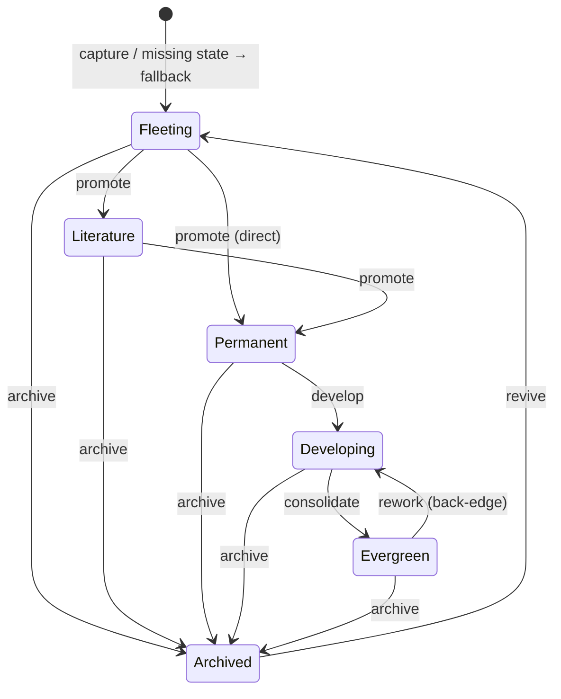

# Knowledge lifecycle

> Layer 1 of the [Knowledge OS epic (#144)](https://github.com/RafaelGB/Obsidian-ZettelFlow/issues/144),
> built on the [Knowledge model](knowledge-model.md) (#145). It gives every note a **first-class
> phase** and a validated way to move between phases.

Lives in the pure `src/architecture/knowledge/lifecycle/` (Obsidian-free, unit-tested) plus one
Obsidian-facing write service and a command.

## The six states

🌱 Fleeting → 📝 Literature → 💡 Permanent → 🔬 Developing → 📚 Evergreen → 🪦 Archived

- The **stored** value in frontmatter is always the plain ASCII token (`fleeting`, `literature`,
  `permanent`, `developing`, `evergreen`, `archived`). The emoji is **display-only** — never written.
- A note with **no / empty / unrecognized** state reads as **`fleeting`** (a quick capture is
  fleeting until promoted). Classification never rewrites a note.

## Frontmatter convention (configurable, no lock-in)

Three property names are standardized, each configurable in **Settings → Knowledge lifecycle** and
defaulting to a plain name:

| Purpose | Default property | Written by #146? |
|---|---|---|
| Lifecycle state | `state` | yes — only by an explicit transition |
| Capture timestamp | `created` | no — reserved name only |
| Last review | `last-reviewed` | no — reserved; written later by #160 |

Uninstalling the plugin leaves every note intact and readable.

## Transition state machine

The relation is exposed as pure predicates `canTransition(from, to)` / `allowedTargets(from)`.
Everything not drawn above (skip-ahead, self→self, arbitrary demotions) is rejected.

## Changing a note's state

The **"Change note state"** command (visible only when a markdown note is active) opens a picker
of the states reachable from the note's current state and delegates to `StateTransitionService`,
which validates the move and, on success, **writes only the configured state property** through the
`FrontmatterService` → `processFrontMatter` facade. An invalid move performs no write. The index
re-derives that single note when the metadata cache reports the change.

## Capability — new: file-system **write**

This is the first write in the Knowledge layer. It is scoped to **one property, on one
user-selected note, per explicit command** — never bulk, never automatic. Classification on load is
read-only. `created`/`last-reviewed` are reserved names only; #146 never writes them.

## Extending

The lifecycle plugs into #145 via a `LifecycleStateSchema implements StateSchema`, registered with
`KnowledgeIndex.getInstance().registerSchemas({ state })`. `byState` / `statePartition` then
classify every note. The maturity *score* over these states is #158.
