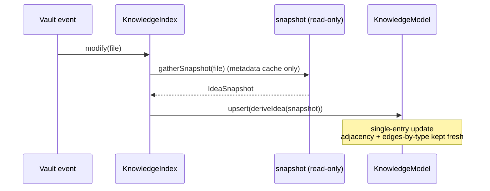

# Knowledge model

> The foundation of the [Knowledge OS epic (#144)](https://github.com/RafaelGB/Obsidian-ZettelFlow/issues/144).
> A single, read-only, incremental in-memory index that represents the vault as **ideas** — the
> substrate every later layer (Lifecycle, Semantic Graph, Discovery, Health) reads from, instead of
> each feature re-scanning the metadata cache with its own snapshot shape.

Lives in `src/architecture/knowledge/`, with a strict **pure / Obsidian-facing split** so every
derivation and query is unit-testable in jest's node environment.

```
src/architecture/knowledge/
  model/Idea.ts            # pure — Idea/Relation/Claim/Source types, deriveIdea(), safe defaults
  model/KnowledgeModel.ts  # pure — in-memory graph: Map<path,Idea> + adjacency + edges-by-type
  model/schema.ts          # pure — StateSchema/RelationSchema/ClaimSchema extension points
  parse/inlineFields.ts    # pure — standalone `key:: value` parser (no Dataview)
  derive/edges.ts          # pure — links → directed typed edges
  query/queries.ts         # pure — read-only query surface
  snapshot.ts              # Obsidian-facing (thin) — TFile + metadata cache → IdeaSnapshot
  KnowledgeIndex.ts        # Obsidian-facing — getInstance() singleton, event wiring, build state
  index.ts                 # barrel
```

## The idea model

Each note is modelled as an `Idea`, keyed by its **vault path**:

| Field | Meaning |
|---|---|
| `path` | Identity (decision #3 — by path, re-keyed on rename). |
| `title`, `created`, `modified` | Basic metadata (basename fallback if no title). |
| `state` | Lifecycle state. Vocabulary owned by **#146**; defaults to `DEFAULT_STATE` (`"unknown"`). |
| `relations` | Outgoing **typed, directed** edges. Vocabulary owned by **#147**; plain `[[links]]` become `DEFAULT_RELATION_TYPE` (`"link"`) edges. |
| `claims` | Claims & sources. Owned by **#148**; defaults to `[]`. |
| `maturitySignals` | Raw signals only (`inDegree`, `outDegree`, `degree`, `hasSources`). The maturity *score* is **#158/#159**, not here. |

`deriveIdea(snapshot, schemas?)` turns a pure `IdeaSnapshot` into an `Idea`. It never throws and
never touches Obsidian: a cache-miss / empty-frontmatter snapshot yields the documented defaults.

## Query surface

Pure functions over the model (`query/queries.ts`), all O(edges) reads that never re-derive:

- `get`, `byState`, `statePartition`
- `edgesByType`, `outgoingRelations`, `incomingRelations`
- `orphans` (no **incoming**), `leaves` (no **outgoing**) — plus the unambiguous primitives
  `notesWithNoIncoming` / `notesWithNoOutgoing`
- `hubs(threshold)`, `unsourced`, `byMaturity`

!!! note "Terminology (spec FR-5)"
    Here `orphan` = *no incoming* and `leaf` = *no outgoing*. The slip-box health view
    (`classifyHealth`) currently uses the **inverted** convention. The unambiguous primitives are
    exposed so the future health-view migration can map either naming explicitly, rather than
    silently swapping columns.

## Incremental-update contract

The index exposes `status: "idle" | "building" | "ready"`. Build is **synchronous** (decision #4):
it gathers snapshots via the metadata cache, derives ideas into the `KnowledgeModel`, and emits one
`log` timing line. Each vault event mutates a **single** entry — no full rebuild:

| Event | Model mutation |
|---|---|
| `create` / `modify` | `upsert(deriveIdea(snapshot))` (single-entry) |
| `delete` | `remove(path)` — drops outgoing edges; incoming edges from others tolerate the missing target |
| `rename(file, oldPath)` | `rename(oldPath, newPath)` — re-keys the entry and rewrites every edge referencing `oldPath` (the one O(edges) op decision #4 permits) |



Events are registered through `plugin.registerEvent` (auto-removed on unload); the initial build
runs on `onLayoutReady` and re-runs on the first metadata-cache `"resolved"` so `resolvedLinks` are
complete.

## Design decisions

1. **Read-only, rebuilt in memory on load** — no cache file, **zero writes** to the vault.
2. **Standalone inline-`key::` parser** — no Dataview dependency ("no lock-in").
3. **Identity by vault path** — re-keyed on rename; a stable-ID mode can layer on later via #122.
4. **Synchronous build + "building" state** — the query surface is O(edges), not O(vault);
   chunked/async is deferred until profiling requires it.

## Extension points (#146 / #147 / #148)

Sibling issues register a `StateSchema`, `RelationSchema`, or `ClaimSchema` via
`KnowledgeIndex.getInstance().registerSchemas({...})`. `deriveIdea` calls the registered parser or
falls back to the documented default. The `Idea` shape and the query signatures stay fixed, so a new
vocabulary becomes queryable **without** changing either.
