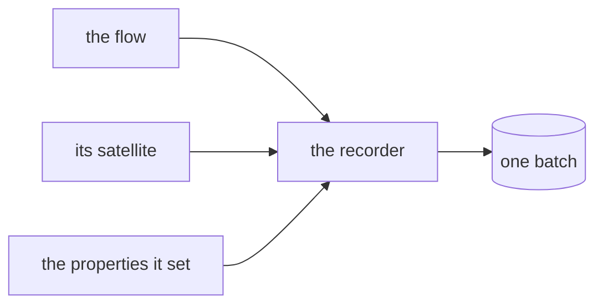

# What ZettelFlow wrote

ZettelFlow writes to your vault in a dozen places: a flow creates a note, a step declares a
satellite beside it, a property hook sets frontmatter on a note you were not looking at, giving a
canvas a role **moves** it, and installing a system from the gallery creates a handful of files.

Until 3.6 none of that was written down. The answer to *"what did that flow just do?"* was to open
the notes and look.

Now every write leaves a **fact**. This page is what that record is, what it deliberately is not,
and where it lives.

## The record

One entry per change, newest first:

| Field | What it holds |
|---|---|
| `kind` | `note-created` · `file-created` · `file-moved` · `properties-set` · `content-appended` · `content-replaced` |
| `path` | what was written |
| `from` | where a moved file came from |
| `origin` | who did it: a flow (and its step), a hook (and its property), an action, a gallery install, or you |
| `batch` | the id every write of **one action** shares |
| `before` / `after` | for a property change: the touched keys, as they were and as they were left |
| `at` | when |

### No note content, ever

There is no field for a note's body, and a test asserts there is not. The record is deliberately
not a second copy of your vault — a copy would have none of your vault's protections and all of
its contents.

This is affordable because of how undo works: a note ZettelFlow created is taken back by moving it
to **Obsidian's trash**, which needs no copy of the body. A property change is taken back by
writing the previous value, which is exactly what `before` holds — and only for the keys that
actually changed.

The one thing that cannot be taken back is therefore `content-replaced`: overwriting an existing
file. It is still **recorded**, because *what ZettelFlow changed* is worth answering even where
*take it back* has no answer.

### A week, and a ceiling

The record is kept for **seven days at most**, and never more than **1,000 entries** — whichever
comes first. Time is the policy; the entry cap is the safety net for a vault whose hooks fire all
day. Neither is configurable: a write record carries the values it would restore, and the honest
way to keep that small is to keep it short.

It lives in the plugin's settings (`data.json`), like the
[script run log](scripting.md#every-run-leaves-a-fact-444).

### A batch is what one action did

A flow that creates a note, writes a satellite beside it and sets two properties has performed
**four writes and one action**. The batch id is what says so, and it is the reason undo can take
back the thing you actually did rather than one file of it.

Batches nest: an action inside a flow belongs to the flow's batch, while the record still names the
action as the origin of that particular write — the outer batch is the unit you undo, the inner
origin is the accurate answer to *who wrote this file*.

## Where the record is taken

Not at the call sites. Two services are the only places ZettelFlow writes, and the record is taken
inside them:

- **`FileService`** — `createFile`, `createFileOnce`, `writeFile`, `writeBinaryFile`, `modify`
  and `moveFile`.
- **`FrontmatterService`** — every property write in the plugin passes through one private
  `processFrontMatter`, which is the only moment at which the *previous* value still exists. The
  record is taken there, as a **diff**.

Taking the diff rather than a copy has a consequence worth stating: a hook that sets a property to
the value it already had has **changed nothing**, so it leaves no record — and later, offers no
undo for a change it did not make.

A guardrail test (`test/architecture/plugin/vaultWriteCoverage.test.ts`) derives the writing
methods from the source and fails when one of them does not record. `deleteFile` is the single
named exception: undoing a deletion would mean keeping the body, and Obsidian's trash already holds
the file.

## Recording never changes the write

The rule the [script run log](scripting.md) established holds here too: **observing must never
change what was observed**. `recordVaultWrite` cannot throw into a write path — every branch is
wrapped, and a recorder that fails logs a warning and gives up. A record that breaks a note is
worse than no record.

## Capability disclosure

| Capability | Used |
|---|---|
| File system — write | The record itself, capped, in the plugin's own settings |
| Network | No |
| Clipboard | No |
| Script execution | No |
| AI | No |

Under [§XII](../development/constitution.md), a change record is a **mechanical** account of what
already happened: no severity, no ranking, no advice about whether a write was a good idea.
