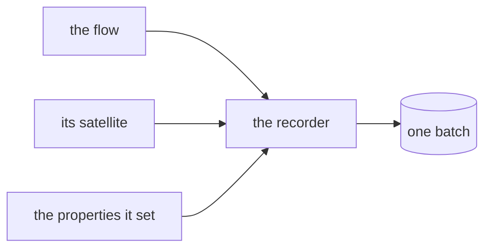

# What ZettelFlow wrote

ZettelFlow writes to your vault in a dozen places: a flow creates a note, a step declares a
satellite beside it, a property hook sets frontmatter on a note you were not looking at, giving a
canvas a role **moves** it, and installing a system from the gallery creates a handful of files.

Until 3.6 none of that was written down. The answer to *"what did that flow just do?"* was to open
the notes and look.

Now every write leaves a **fact**. This page is what that record is, what it deliberately is not,
and where it lives.

> **3.3 changed the shape of this.** The panel that read the record — *What ZettelFlow changed* —
> is gone (#511). Nobody opened it, and every thought typed in the Lab landed in the record it
> read, so an afternoon of thinking could evict the flow writes you would actually want to take
> back.
>
> Undo did not go with it. It moved to **the moment**: a flow now offers the same thirty-second
> notice a hook always did, which is when you still remember what you meant and the only moment
> you would notice that a third note was touched at all. One offer, one path, no panel.
>
> And the record then had nothing to outlive but that offer, so it is **in memory**: two minutes,
> never written to disk. No retention policy, no settings field, no `data.json` growth. A reload
> empties it.
>
> **The honest consequence:** a flow you regret an hour later is no longer reversible from inside
> the plugin. That was already true for hooks by decision (#455); it is now true for everything.

## The record

One entry per change, newest first:

| Field | What it holds |
|---|---|
| `kind` | `note-created` · `file-created` · `file-moved` · `properties-set` · `content-appended` · `content-replaced` |
| `path` | what was written |
| `from` | where a moved file came from |
| `origin` | who did it: a flow (and its step), a hook (and its property), an action, a gallery install, or you |
| `batch` | the id every write of **one action** shares |
| `before` / `after` | for a property change: the touched keys, as they were and as they were left |
| `at` | when |

### No note content, ever

There is no field for a note's body, and a test asserts there is not. (The one exception, stated
below, is the text of an **append** — ZettelFlow's own output, capped at 2,000 characters.) The record is deliberately
not a second copy of your vault — a copy would have none of your vault's protections and all of
its contents.

This is affordable because of how undo works: a note ZettelFlow created is taken back by moving it
to **Obsidian's trash**, which needs no copy of the body. A property change is taken back by
writing the previous value, which is exactly what `before` holds — and only for the keys that
actually changed.

The one thing that cannot be taken back is therefore `content-replaced`: overwriting an existing
file. It is still **recorded**, because *what ZettelFlow changed* is worth answering even where
*take it back* has no answer.

### A week, and a ceiling

The record is kept for **seven days at most**, and never more than **1,000 entries** — whichever
comes first. Time is the policy; the entry cap is the safety net for a vault whose hooks fire all
day. Neither is configurable: a write record carries the values it would restore, and the honest
way to keep that small is to keep it short.

It lives in the plugin's settings (`data.json`), like the
[script run log](scripting.md#every-run-leaves-a-fact-444).

### A batch is what one action did

A flow that creates a note, writes a satellite beside it and sets two properties has performed
**four writes and one action**. The batch id is what says so, and it is the reason undo can take
back the thing you actually did rather than one file of it.



Batches nest: an action inside a flow belongs to the flow's batch, while the record still names the
action as the origin of that particular write — the outer batch is the unit you undo, the inner
origin is the accurate answer to *who wrote this file*.

## Where the record is taken

Not at the call sites. Two services are the only places ZettelFlow writes, and the record is taken
inside them:

- **`FileService`** — `createFile`, `createFileOnce`, `writeFile`, `writeBinaryFile`, `modify`
  and `moveFile`.
- A **map of content** created from an Explore selection (#486) is an ordinary recorded
  `note-created`, attributed to `map-of-content` — previewed before it is written, never
  overwriting, and taken back with its batch like anything else.
- **`FrontmatterService`** — every property write in the plugin passes through one private
  `processFrontMatter`, which is the only moment at which the *previous* value still exists. The
  record is taken there, as a **diff**.

Taking the diff rather than a copy has a consequence worth stating: a hook that sets a property to
the value it already had has **changed nothing**, so it leaves no record — and later, offers no
undo for a change it did not make.

A guardrail test (`test/architecture/plugin/vaultWriteCoverage.test.ts`) derives the writing
methods from the source and fails when one of them does not record. `deleteFile` is the single
named exception: undoing a deletion would mean keeping the body, and Obsidian's trash already holds
the file.

### One door, and the test that keeps it shut

The reason a record like this rots is the writer that arrives later and does not join it — and
`vault.modify` is one import away from anywhere. So there is a second guardrail
(`test/architecture/plugin/vaultWriteSeam.test.ts`) that scans the whole of `src/` and fails on
**any** direct call to the vault's mutating API outside the two services:

```
vault.create · vault.createBinary · vault.modify · vault.modifyBinary · vault.delete · vault.trash
fileManager.renameFile · fileManager.trashFile · fileManager.processFrontMatter
```

`createFolder` is not on the list: a folder is structure, not content, and there is nothing to
record or take back about one.

This is the same move `FnConstructor` made for running code — one home, and a list of callers
derived from the source rather than copied into a test. Eight places were reaching past the
services when the rule went in; they now go through `FileService.modify` / `createFile` /
`deleteFile` or `FrontmatterService.update`, which is the public door onto the recorded
`processFrontMatter`.

Two modules that are unit-tested against a fake vault take a small **writer port** with a real,
service-backed default (`onboardingService`, and `applyUndo` itself) — the port is the seam, not a
way around it.

### Who is writing

The origin travels with the batch: `withWriteBatch({ kind, ref, step }, work)` is set once by
whoever starts the unit of work, and every write underneath inherits it. A call site never invents
a label, and a write that nobody claimed is recorded as *unattributed* rather than dropped — an
unexplained write is still a fact.

## Taking it back

The record is read by the **Recent** mode of the Home surface, which is now *What ZettelFlow
changed*: batches newest first, each one naming what ran, what it touched and when.

That mode used to list the notes the wizard built, from a second list kept only for it. It never
mentioned the satellite beside the note, the frontmatter a hook set while you were elsewhere, or
the canvas that moved when you gave it a role. The narrow list is gone; the complete one replaced
it, and the `history` setting is dropped on load.

### Undo takes a batch, not a file

`Ctrl+Z` reaches the note you have focused. This reaches what you actually did:

- Notes and files ZettelFlow **created** go to Obsidian's **trash**. Nothing is deleted.
- Properties it **set** go back to their previous values — and a key it *added* is removed again,
  because "before" recorded its absence.
- A file it **moved** goes back where it came from.
- Text it **appended** is removed, exactly that text and nothing around it.

### It is previewed, and it refuses

Before anything happens, a confirmation states the counts and names the notes. Cancelling changes
nothing.

And undo **refuses** rather than overwriting your work:

| Situation | What happens |
|---|---|
| You edited the note after ZettelFlow wrote it | Left alone, named, with when it changed |
| A property no longer holds what ZettelFlow left | Left alone, naming the key |
| The write was an overwrite (`content-replaced`) | Left alone: the old content was never kept |
| The file is already gone | Skipped quietly — there is nothing to take back |

When some of a batch is out of reach, the rest is still planned and offered as an explicit
*undo the rest* — a partial undo is a decision you take, never one taken for you.

A batch that has been taken back is marked as such, and is not offered again.

### A hook's change, undoable in the moment

Of everything ZettelFlow writes, a property hook's write is the one that surprises people: it
fires on a note you were not looking at, and the only trace is a notice that is gone in five
seconds.

So the notice carries an undo, live for **thirty seconds**. It says *which* property changed, on
*which* note. Taking it does exactly what the panel would do for that batch. Ignoring it is the
normal case — it is a notice, never a modal, and after thirty seconds it goes quietly: no second
notice, no badge, no counter. The same undo stays in the record.

A hook that set a property to the value it already had changed nothing, recorded nothing, and
offers nothing. That is the common case for an idempotent hook, and it stays silent.

### The one place content is kept

An **append** is the exception to *no note content*: the record keeps the exact text ZettelFlow
added, up to 2,000 characters, because removing it again is the only way an append can be reversed.
It is ZettelFlow's own output, capped, and gone in a week. Past the cap the write is recorded as an
overwrite instead, and cannot be taken back.

### Undoing is not a write

The undo's own operations are performed with recording **off**. Putting a note back is not a new
thing ZettelFlow did to your vault, and recording it would leave you an undo you could undo.

## Recording never changes the write

The rule the [script run log](scripting.md) established holds here too: **observing must never
change what was observed**. `recordVaultWrite` cannot throw into a write path — every branch is
wrapped, and a recorder that fails logs a warning and gives up. A record that breaks a note is
worse than no record.

## Capability disclosure

| Capability | Used |
|---|---|
| File system — write | The record itself, capped, in the plugin's own settings — and, only on an explicit, previewed undo: moving created notes to the trash and restoring previous property values |
| Network | No |
| Clipboard | No |
| Script execution | No |
| AI | No |

Under [§XII](../development/constitution.md), a change record is a **mechanical** account of what
already happened: no severity, no ranking, no advice about whether a write was a good idea.
