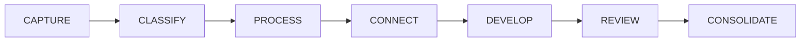

# Workflow phases

> Part of Layer 2 (Workflow Engine) of the [Knowledge OS epic (#144)](https://github.com/RafaelGB/Obsidian-ZettelFlow/issues/144).
> A **phase** reframes a Step from "do an operation on a note" to "advance a piece of knowledge".

A step can carry an optional **phase** — the stage of knowledge work it advances. Phases turn a flow
into a readable arc of thinking instead of a list of file operations.

| Phase | What the step does |
|---|---|
| **Capture** | Grab a raw thought or input before it slips away |
| **Classify** | Decide what kind of note this is and where it belongs |
| **Process** | Work the material into your own words |
| **Connect** | Link this idea to what you already know |
| **Develop** | Grow the idea with evidence, examples and questions |
| **Review** | Revisit and refine the idea over time |
| **Consolidate** | Settle the idea into a durable, evergreen note |

## Phase vs. state — two orthogonal axes

Do not confuse a step **phase** with a note **[lifecycle state](knowledge-lifecycle.md)** (#146):

- A **phase** lives on a **Step** — the *kind of work* a step performs in a flow.
- A **state** lives on a **note** — *how mature* that piece of knowledge is (Fleeting → … → Archived).

They are independent: a "Develop"-phase step might advance a note from `permanent` to `developing`,
but the two vocabularies never mix.

## Design (#149)

- **Fixed taxonomy.** The seven phases above are a closed, ordered set. Custom phases are deferred.
- **Per-step & optional.** `phase?: StepPhase` is additive metadata on `StepSettings`. Absence means
  *unphased* — there is **no migration**, and a legacy flow with no phases loads, lists, runs and
  saves exactly as before.
- **Cosmetic only.** In #149 the phase only **labels and groups** steps in the builder and the step
  selector; it does **not** influence execution or ordering. (Event-driven and conditional execution
  are later Layer-2 issues.)
- **Stored value** is the ASCII token (`CAPTURE`, `PROCESS`, …); the label is localized for display.
- The step builder groups options by phase (in canonical order, with an **Unphased** group last) only
  when at least one step is phased, so a fully-legacy flow looks identical.

### Assigning a phase

In the step builder, the **Knowledge phase** dropdown assigns (or clears, via *Unphased*) a step's
phase. It rides the existing save paths (canvas node config / file frontmatter) — no new storage.

## Default phases of the starter flows

The bundled [starter flows](../development/zettelkasten-starter-flows.md) ship a sensible primary
phase each:

| Starter flow | Default phase |
|---|---|
| Fleeting note | Capture |
| Literature note | Process |
| Permanent note | Develop |
| Structure map (MOC) | Connect |

## Actions and phases

Grouping **actions** by cognitive category (Manipulation / Relations / Knowledge / Research / AI) is
a separate concern — see #152. In #149, an action→phase mapping is guidance only, not code.
