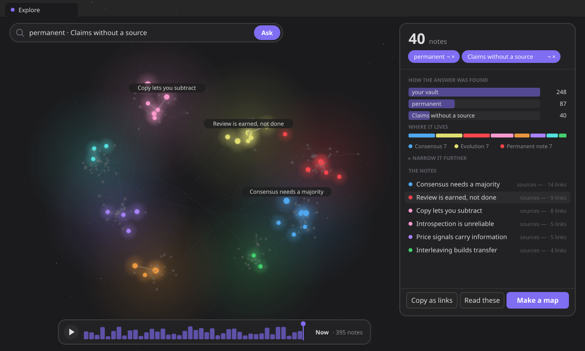
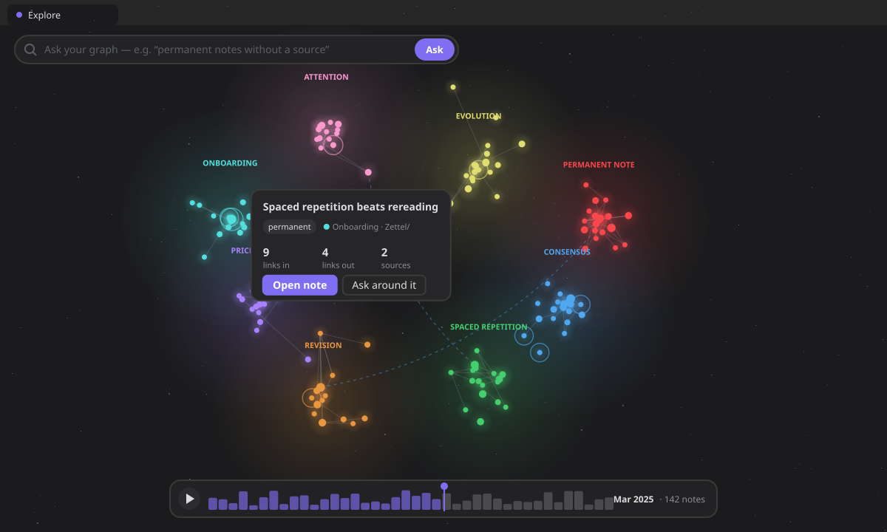
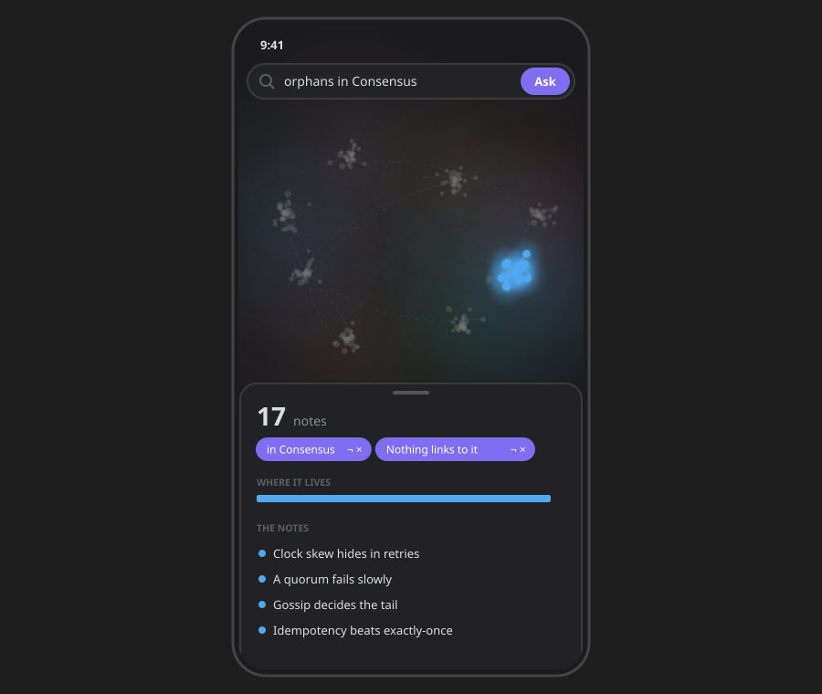

# Explore — ask, and the graph answers

**Explore** is your whole vault drawn as a graph, with a question bar on top. Ask something — *"permanent
notes without a source"*, *"what joins my regions?"*, `state:fleeting AND folder:Reading` — and the
graph answers: the notes that match glow, the rest of your vault dims, and the camera flies to frame
them. Beside it, a card says how many, **how the answer was found** and **where it lives**.

It queries your notes by **meaning and structure** — typed relations, connectivity, sources, regions,
age, lifecycle state — not by frontmatter or tags. *"Show me every idea that contradicts this"* is a
question about the **shape of your thinking**, and exactly what a Dataview query cannot answer. It
is **deterministic**: a question becomes a set of terms you can see, never a prompt, and AI is never
involved.

Open it from the ribbon menu (**Explore**) or the **Ask your graph** command. It is its own surface —
a tab you can move, split or pin — and it recomputes live as the vault changes.



## Ask, and the graph answers (#696)

Until #692 Explore had two control systems — facets and a lens bar on top, then a 3D graph below with
its own search box, a gear of seven lenses, a legend and a status line. Now there is one:

- **The ask bar is the mode's one primary action.** Type a question in words or in the query
  language; press **Enter**. What it understood comes back as **chips** — *permanent*, *Claims
  without a source* — that you can flip (¬) or remove (×). Nothing is guessed behind your back.
- **Before you type**, a row of **questions to try** — the questions the old gear lenses used to be:
  *What joins my regions?*, *What contradicts what?*, *Notes nothing links to*, *Notes on their own*,
  and your pinned saved queries. Each shows how many notes it would light and a strip of the regions
  they live in, **in the regions' own colours**; hovering one previews the answer in the graph. A
  question that would answer nothing in your vault is not offered.
- **The regions are the legend**, bottom left. Hover one to light it, click it to ask for it.
- **The answer card** says how many; the terms as chips; **how the answer was found** — your vault,
  then each term and what it left, as bars; **where it lives** — a bar in the regions' colours, each
  of the biggest four framing its notes on a click; the notes, each row carrying the facts the
  question asked about; **Narrow it further** — the facets, folded; and *Copy as links*, *Read these*,
  *Make a map of content*. The query as text is still under the card — the escape hatch (§XIII).
- **The graph lights the answer**: matches glow, the rest of the vault dims (nothing is hidden), and the
  camera frames them. ←/→ step through the answer, one note at a time.

What was **subtracted**: the List lens (the card is the list), the graph's own search box (one ask box),
the seven lenses behind the gear (they are questions now, which you can also save, narrow and pin to
Home), the lens bar and the intro line.

### Asking in your own words

The bar reads a sentence the way the chips would write it: a phrase table in English and Spanish
(*without a source*, *nothing links to*, *joins*, *contradicts*, *on their own*, *this month*…), and your
vault's own words — its states, its top-level folders and its region names. Whatever is left becomes a
title search (`about:`). Query syntax — `state:permanent AND orphan` — is used exactly as typed. The
whole bridge is `wordsToTerms()`: a table and your vocabulary, no model, no network.


### Time, and a note up close (#697)

A **strip of months** under the graph shows when your notes were made. Drag it, step it with the
arrows, or press **Space** to play your vault's growth: notes made after the cursor are not there yet,
and new ones arrive with a ring that opens and fades (none under reduced motion).

**Click a note** and a **peek card** opens beside it with its facts — state, region, folder, links in,
links out, sources — and *Open note* or *Ask around it* (the note and its neighbours, a `near:` term).
Facts only, never a grade (§XII).



### Rename a region

A region is a neighbourhood the graph finds (#522), named after its best connected note. That name is a
guess; yours is better. Hover a region in the legend and press the pencil. The name is kept in plugin
data by the region's hub — never written into a note — used everywhere the region is named (the
legend, the nebula, the chips, the answer card, the words you ask with), and an empty name gives the
hub's back.

### Keys

On the Explore tab: **/** ask · **F** frame the answer · **←/→** step through it · **Enter** open the
stepped note · **Space** play time · **Esc** let go of the step, then clear the question. They are the
leaf's own keys, so they work whatever has focus — except while you type in a field.

### On a phone

The same graph as a flat sheet: one finger pans, two pinch, and the answer card rises from the bottom
as a sheet. A device that can draw no graph at all gets the card open on every note — still a way
in, never a blank view.



## Clicking is the query (#483)

Until 4.2 this mode opened on an empty box. You had to compose a specification in a small boolean
language before it would show you anything at all — and the "guided builder" that was supposed to
help was two dropdowns, a value field, a checkbox and an **Add** button whose entire effect was to
**paste DSL text into the box**. A form that emits code.

[Constitution §XIII](constitution.md) is explicit about that shape: configuration syntax is *an export
format and an escape hatch, never the front door*. So the order is inverted.

**Your whole vault is the starting selection**, and everything you could narrow it by is offered to
you, derived from your own notes, with counts:

| | |
|---|---|
| **region** | the neighbourhoods the graph found, by their names (#696) |
| **state** | the lifecycle states *you* use — three if you use three |
| **links out to** / **linked from** | the typed relation types present, in both directions |
| **folder** | your top-level folders |
| **shape** | well connected · nothing links to it · links to nothing · claims without a source · joins two regions · on its own · in a contradiction |

Clicking a value narrows the selection; the facets re-derive against what is left. Each choice
becomes a **chip** you can remove, or flip to its opposite with **¬** — negation stays reachable
without typing anything.

### Clicking can never empty your results

The counts are conditional on the **current selection**, and a value is offered only when
`0 < count < selection.length`. Nothing that matches nothing; nothing that matches everything.
Neither can narrow, and a filter that cannot narrow is noise.

Two things follow. Once a selection is entirely `permanent`, the state group **disappears** instead
of offering you the thing you already did. And every offered term finds something — so an empty
answer is no longer somewhere the interface can walk you into. See
[facets](../architecture/knowledge-state.md#facets-what-your-vault-lets-you-ask-482) for the derivation
and its cost.

### The text is what that produces

The query text lives under **As text**: generated from your chips, editable, runnable, and still
exactly what a saved query stores. It is the escape hatch, and it completes as you type — from the
grammar below and from your vault's own values, and from no third list.

The one thing the text can express that chips cannot is `OR`. A hand-written disjunction is shown as
written and **says so**, and the facets stand down rather than appending a term that would silently
re-bracket the query.

## The answer speaks (#485)

**Each row carries the facts your selection asked about.** Filter by sources and the row says what
it cites; filter by `relation:supports` and it says how many. With nothing selected it reads
`state · links`, exactly as it always did — nobody who never clicks a facet sees a change.

**A zero names the term that caused it.** `state:permanent AND unsourced AND folder:Reading`
matching nothing used to be a wall. Now the surface narrows one term at a time and says which one
reached zero, with the count immediately before it:

> Nothing matches. `folder:Reading` took it from 43 to none.

That is a **fact about your selection** and it stops there. Naming the term is mechanical;
proposing the fix would be a verdict, and [§XII](constitution.md) puts verdicts behind an explicit
human decision — of which there is none to take here, because the query is on screen and editable.
A guardrail scans these strings for advice verbs in both locales, because a doc paragraph will not
stop the next person adding a helpful sentence.

It refuses rather than guesses: a query containing `OR` has no single culprit, and a query with a
typo is broken rather than empty. Both get the plain message.

## A selection is a place to start (#486)

A selection is the most concentrated piece of intent the plugin holds — you built it click by
click — and until 4.2 it evaporated when you closed the tab. Only the *question* survived, as a
saved query, never the thing the question found.

Two moves, under the answer:

- **Copy as links** — the matches as wikilinks, in your clipboard, for the note you are already
  writing. Only on the click, never otherwise.
- **Make a map of content** — the matches become a real note, written by the **same builder**
  `build-map-of-content` has always used (#505): the links go into a machine-managed region, so
  running the map again updates that block and leaves every word you wrote around it untouched.
  It is **previewed first** (name, folder, how many will be listed) and it goes through
  `FileService`, so it appears in [Recent](../architecture/reversibility.md) and **undo takes it
  back**. A map of everything is not a map, so the action only appears once you have narrowed
  something.

  It did not always work that way. 4.3 shipped a second writer here that made a fresh numbered
  note and could not be re-run, because re-running had been declared out of scope **without
  checking that a re-runnable map already existed**. Maps written by that version have no managed
  region, so running them again appends one rather than updating it.

Both are **mechanical output** under [§XII](constitution.md): a gathered list, derived facts.
Neither concludes anything, so neither needs the accept/reject gate interpretive output does — and
a guardrail fails the build if the map ever grows a field a conclusion could live in.

### Why there is no third button

The obvious third destination is *Think about this selection*, and it is deliberately absent.
Thinking is about **something in particular**, and a set of forty notes is not something in
particular. The per-note move already exists (*Think about this note*), and the map this creates is
itself a note — so the moment a selection becomes a thing you can think about, the command that
does it is already there. A third button would have been a worse version of a door that is open.

There is no new export either: the graph already exports an image, with its own confirmation. Two answers to one question is the disease this epic exists to treat.

## Think before you look

*Moved here from the Thought Lab by [#576](https://github.com/RafaelGB/Obsidian-ZettelFlow/issues/576).
The mechanic is [#470](https://github.com/RafaelGB/Obsidian-ZettelFlow/issues/470)'s, unchanged.*


When you ask your vault a question it answers immediately — and the moment it does, **your own
answer is gone**. You never learn what you thought before you read it, and you never notice the
thing worth noticing: that you had already worked this out two years ago and forgot.

Every tool in this space optimises for retrieving what you knew. None preserve what you thought
*before* you retrieved it, which is the only way to watch your own reasoning move.

So Explore can wait:

1. You ask a question.
2. It asks **what do you currently think?** — and shows nothing.
3. Your answer is stored as a thought, **before** anything is revealed.
4. Then **Explore answers** — the same facets, the same card, the same graph — beside what you
   said.
5. You say what changed in you: *nothing* · *I had forgotten this* · *I was wrong* · *I still
   think so*.

That last step is recorded as a verdict in the same `JudgementLog` as every other — subject only,
never content.

### The leak is impossible, not forbidden

The one requirement this feature exists for is that nothing from your vault appears before you
answer. A careless re-render would break that silently, and a source scan would not catch it.

So `blindView` **does not return** what the vault holds until there is an answer. Before you
submit, it is not hidden — it is **absent from the view model**, and the renderer has nothing to
draw even if it tried. A test asserts the serialised view contains no trace of a note that was
already fetched.

### It is a choice, and it is not a quiz

It is **off by default**, and turning it on is a stance you take once — not a dialog in front
of every search. §XII allows deliberate friction where judgement is genuinely at stake and
forbids it as a generic confirmation, and that line is exactly where the setting sits.

And there is no tally, no accuracy and no streak — that would turn thinking into a game with a
loser. *"I was wrong"* is available because it is **your** word about **yourself**; what must not
exist is the system saying it. A guardrail scans the strings for *correct*, *accuracy*, *score*
and their relatives.

Offline, and no AI.

### One engine, not two

The panel that did this in the Lab carried its own matching: a walk over the model asking whether an
idea's title contained any word of your question. That is `about:<term>` — the predicate this
product has shipped since #318 — reimplemented smaller, and of the two only one would ever get a
fix.

`questionQuery()` is the whole of what moving it needed: words in, a query out
(`about:attention OR about:memory`). The matching belongs to `graphQuery` and stays there. **You
never have to learn a predicate to use it** — §XIII's rule that syntax is an export format and an
escape hatch, never the front door.

## The query language

You do not have to write this. It is here because you can, and because it is what a saved query
stores.

A query is predicate **terms** combined with `AND` / `OR`. `AND` binds tighter than `OR`, so
`a AND b OR c` means `(a AND b) OR c` (disjunctive normal form). A term can be negated with a leading
`!`. A blank query matches nothing in the engine; on the surface, no filters means **every note**.

| Term | Selects |
|---|---|
| `state:<value>` | notes in a lifecycle state, e.g. `state:permanent` |
| `relation:<type>` | notes with an outgoing typed edge, e.g. `relation:contradicts` |
| `relation:<type>:<target>` | …pointing at a note whose name/path contains `<target>`, e.g. `relation:supports:decisionA` |
| `incoming:<type>[:<source>]` | notes with an **incoming** typed edge — the mirror of `relation:`, e.g. `incoming:contradicts` (notes *something contradicts*) |
| `folder:<path>` | notes under a folder, e.g. `folder:Projects` (folder-boundary match, case- and Unicode-tolerant) |
| `degree>=<n>` | connectivity — also `<=`, `>`, `<`, `=` (e.g. `degree>=5`) |
| `hub` | a well-connected note (degree ≥ 5) |
| `orphan` | nothing links to it (no incoming edges) |
| `leaf` | it links to nothing (no outgoing edges) |
| `unsourced` | it makes a claim but cites no source |
| `older-than:<days>` / `newer-than:<days>` | by creation age |
| `about:<term>` | its title or path contains the term |
| `region:<note>` | it lives in the region named after that note (its path or its name) |
| `bridge` | it links across regions — where two of them meet |
| `alone` | it links to nothing and nothing links to it, among your notes |
| `contradiction` | it is in a `contradicts` relation, either side of it |
| `near:<note>` | that note, or one link from it either way |
| `!<term>` | negate any term, e.g. `!orphan` |

```text
state:permanent AND unsourced                        # permanent notes with no sources
state:permanent AND orphan AND older-than:30         # orphaned permanents older than 30 days
hub AND relation:contradicts                         # well-connected notes that contradict something
state:fleeting OR unsourced                          # fleeting or still-unsourced ideas
```

Results are sorted by connectivity (degree, highest first) then path, and every result opens on
click.

## Architecture

```
runGraphQuery(model, source, now)                    (pure, Obsidian-free, unit-tested)
  → { matches: Idea[], error? }                       DNF of predicate terms; deterministic sort

deriveFacets(model, selection) → Facet[]             (pure) what can still narrow, with counts
selection.ts: toQuery / asSelection / toggleTerm /   (pure) the chips, and the text they produce
              invertTerm / matchesFor                       no filters ⇒ every note

wordsToTerms(question, vocabulary) → terms           (pure) a sentence → the chips, no model
graphFacts(model)                                     (memoised) regions, bridges, contradictions
answerFunnel(model, terms) → steps                   (pure) how the answer was found

AskGraphRenderer — the Explore surface (command: ask-your-graph)
  the graph (GraphCanvas) · ask bar · questions to try · regions · answer card · time · peek
  saved queries (settings.savedGraphQueries: named / pinned)
  region names (settings.graphRegionNames: by the region's hub path)
```

The engine lives in `src/architecture/knowledge/query/graphQuery.ts`, the facets and the selection
beside it, and all three are re-exported from the Knowledge State barrel. They read only the
`KnowledgeModel` — offline, read-only, and they never mutate the vault. `zf.knowledge.query` and
`zf.knowledge.facets` expose the two of them a script can usefully ask.

## What this deliberately does not have

- **A term builder.** A form whose output is syntax does not satisfy §XIII; it conceals the failure.
  The facets replaced it, and they carry your real counts.
- **A grammar reference card on the surface.** It is on this page, where a reference for a language
  you no longer have to write belongs.
- **A table lens.** It showed the same matches as the list with four fixed columns — state, degree,
  sources — a universal schema instead of your question. Its one real advantage was alignment, and
  alignment is CSS. A lens has to be a genuinely different way of *seeing*.
- **Reordering saved queries.** Two buttons per row to move a list nobody sorts.
- **A list lens, a graph search box, a gear of lenses (#696).** The card is the list, the ask bar is
  the only box, and the lenses are questions — each of them a term you can save.
- **Embeddings, RAG or vector search.** The manifesto: a query stays deterministic and offline.

## Saved queries

A useful selection is **saved** from the chips row and re-run from the *Saved queries* list. Each
saved query carries an optional **name** (rename inline) and a **pin** state. A pinned query surfaces
on **Home** as a live count — mechanical output, no judgement written
([constitution §XII](constitution.md)) — and clicking it reopens the mode on that query, pre-filled.
The list persists in `settings.savedGraphQueries` as `SavedGraphQuery` objects
(`{ query, name?, pinned? }`); an install predating the enrichment stored bare strings, which migrate
transparently on read (`normalizeSavedQueries`).

_README vocabulary for this page: **Explore your graph**._
