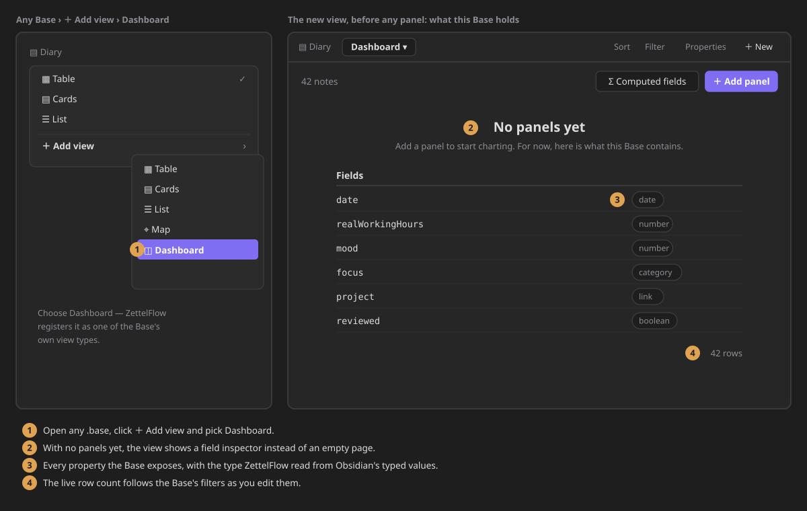
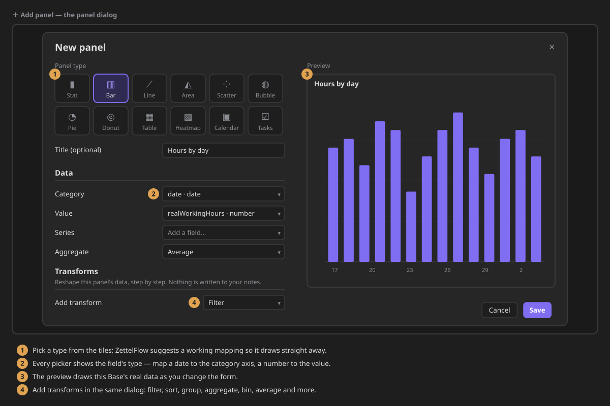
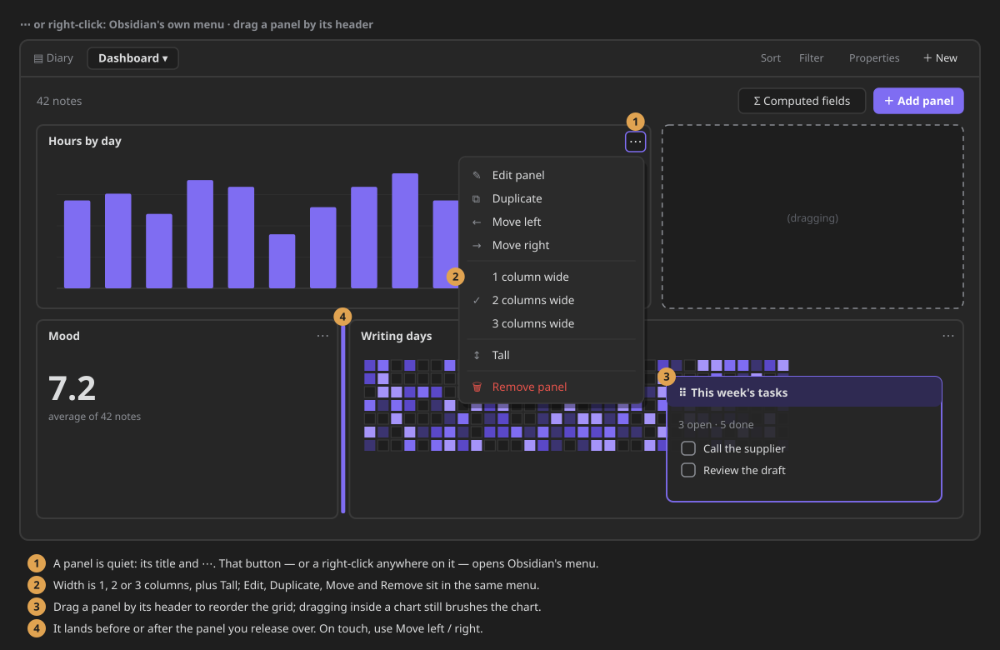
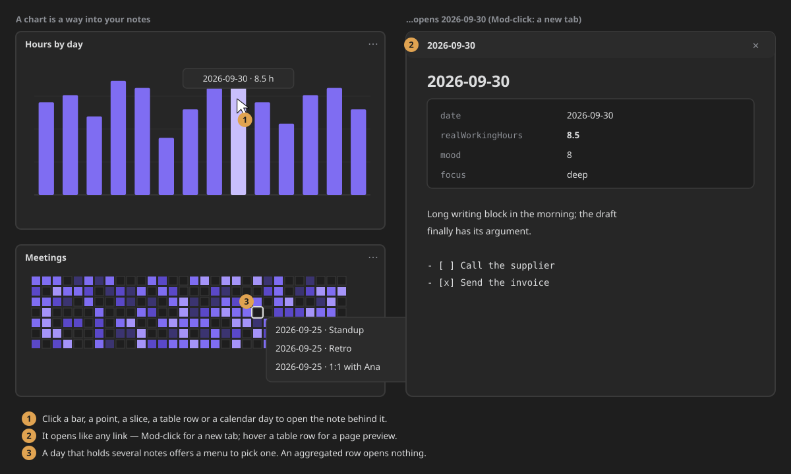
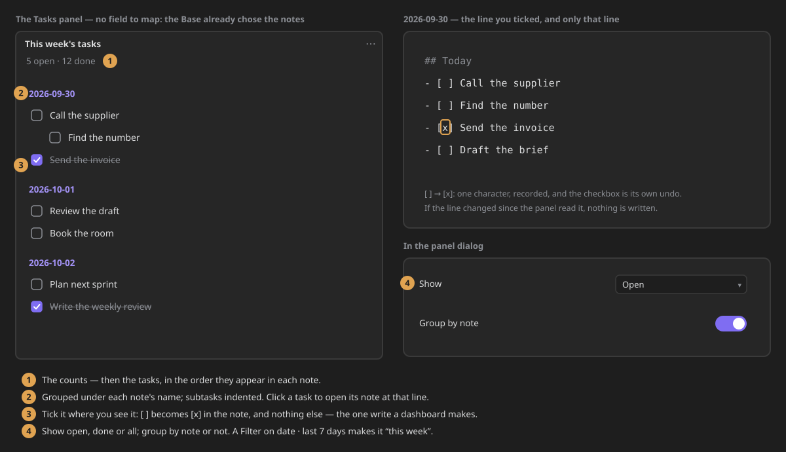
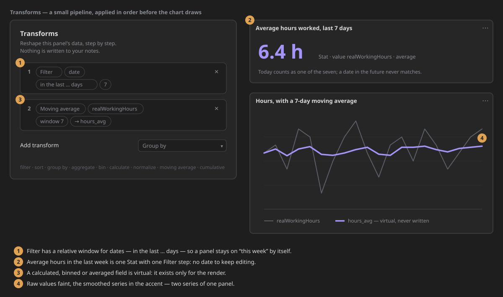
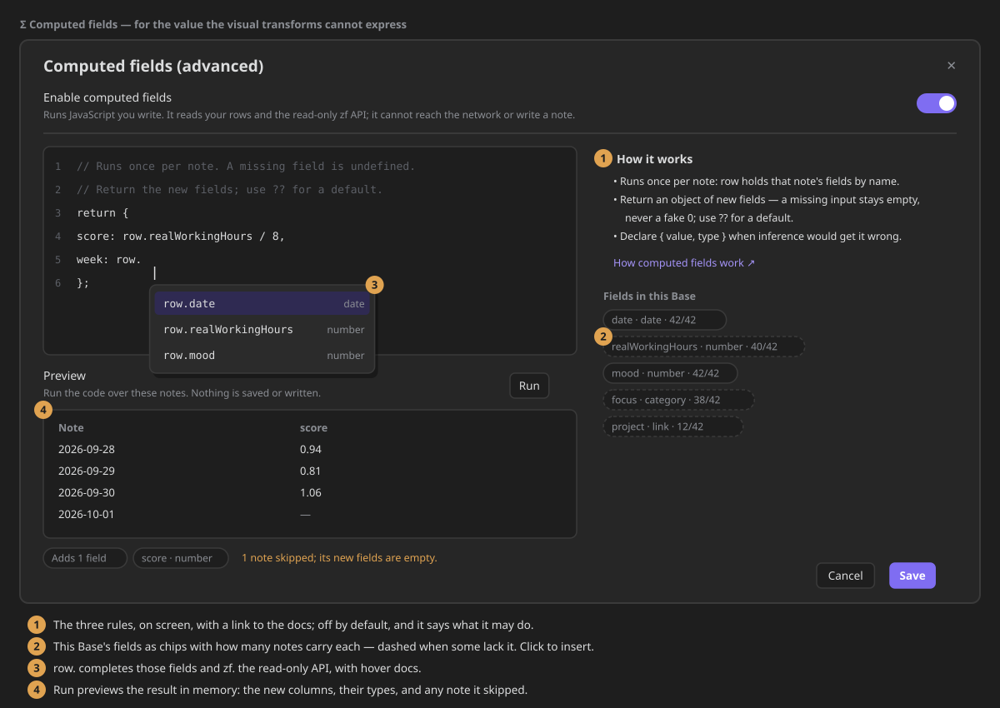

# Base dashboards

**Point an [Obsidian Base](https://help.obsidian.md/bases) at a folder and ZettelFlow turns it into a
dashboard** — a local "Grafana for your vault". One Base is the datasource; you compose many
**panels** over the same filtered result. The unit is the *panel*, not the chart: stat, bar, line,
area, scatter, bubble, pie, donut, table, heatmap and a contribution-style calendar, all reading one
shared, in-memory projection of your notes. No backend, nothing leaves Obsidian, and **nothing is
written back to your notes** — a dashboard is read-only, with one deliberate exception: the
checkbox of a task you tick in a [Tasks panel](#tasks).


It is distinct from the [knowledge dashboard](knowledge-dashboard.md), which reports on the *idea
graph*. Base dashboards chart the **metadata** of whatever notes a Base selects — daily working
hours, mood, habits, reading, sleep — the things you used to chart with hand-written `dataviewjs`.


## Open one

Open any `.base`, click **＋ Add view**, and choose **Dashboard**. With no panels yet, the view shows
a **field inspector**: every property the Base exposes, the type ZettelFlow inferred for it (date,
number, category, boolean, link) and the current row count. Edit the Base's filters and it reconciles
live. Types come from Obsidian's own typed values — not guessed from raw text — so a date reads as a
date and a link as a link.



## Panels

**Add panel** opens the panel dialog: pick a type from the icon tiles, map its fields (each picker
shows the field's type, e.g. *hours · number*), and watch the **live preview** beside the form draw
the panel with this Base's real data as you change it. ZettelFlow suggests a working mapping from
the inferred schema, so it renders immediately and you adjust from there. Charts take their colours
from your Obsidian theme and **re-paint when you switch light/dark**. Panels (and their layout) are
saved in the Base's view config.



| Panel | What it draws |
|---|---|
| **Stat** | one number from a numeric field — sum, average, min, max, or a row count |
| **Bar / Line / Area** | a category or date on the x-axis, one or more numeric series |
| **Scatter / Bubble** | x vs y; a bubble adds *size* and *colour* from extra numeric fields |
| **Pie / Donut** | a share by category |
| **Table** | the mapped columns, sortable, rendered read-only |
| **Heatmap** | a category × category grid, coloured by a value |
| **Calendar** | a contribution-style day grid from a date field (+ optional value) |
| **Tasks** | the `- [ ]` tasks of the Base's notes — tick them off from the dashboard ([below](#tasks)) |

A panel's card is quiet: its title and a **⋯** button. That button — or a **right-click anywhere on
the panel** — opens Obsidian's own menu: *Edit*, *Duplicate*, *Move left/right*, the width (1, 2 or
3 columns), *Tall*, and *Remove*. Double-click the title to edit. **Drag a panel by its header** to
reorder the grid — it lands before or after the panel you release over (on touch, use *Move
left/right* from the menu).

 The grid reflows to a single column
on a narrow pane or on mobile. (Treemap, radar and sankey are intentionally left for later.)

**A chart is a way into your notes.** Click a bar, a point, a slice, a table row or a calendar day
to open the note behind it — Mod-click opens it in a new tab, as everywhere in Obsidian. A day that
holds several notes offers a menu to pick one. Hover a table row (with Mod, per your *Page preview*
settings) for a page preview. A row a transform aggregated has no single note, so it opens nothing.



## Tasks

The **Tasks** panel lists the Markdown tasks (`- [ ]`, `* [ ]`, `1. [ ]`) of the notes the Base
selects, read from Obsidian's own index. There is no field to map, and no query language to learn:
the Base already chose the notes. It shows `N open · M done`, then the tasks under each note's name,
subtasks indented, in the order they appear. In the panel dialog choose **Show** (*Open*, *Done* or
*All*) and whether to **Group by note**. Transforms apply to the **notes** first, so *this week's
open tasks* is a Tasks panel with one **Filter** · `date` · *in the last … days* · `7`.



- **Tick a task off where you see it.** The checkbox changes that one character in the note
  (`[ ]` → `[x]`), and nothing else. It is the only thing a dashboard ever writes, it happens only
  when you click, and it goes through ZettelFlow's single write path, which records it (without the
  task's text). If the line changed since the dashboard read it — you edited the task, or it moved —
  **nothing is written** and the panel says so, then shows the note as it is now.
- **The checkbox is its own undo**: click it again and the line is exactly as it was.
- Click a task's text to open its note **at that line** (Mod-click: a new tab); hover for a page
  preview. Click a note's name to open the note.
- Edit a task in its note and the panel follows.
- **Fast on a large Base.** Only notes with tasks are read, several at a time, and a note that has
  not changed since the last update is not read again: the next update after an edit reads just
  that note (budget `dashboard.tasks.read.300`).

The text is shown as plain text, as written — including any Tasks-plugin emoji. Due dates,
priorities and custom statuses (`[/]`, `[-]`, shown as done) are left for later.

## Transform the data

Each panel can reshape its data with a small pipeline of **transforms**, applied in order before the
chart is drawn: **filter, sort, group by, aggregate, bin, calculate, normalize, moving average** and
**cumulative**. A calculated, binned or averaged field is **virtual** — it exists only for the render
and is never written back to your notes.

**Filter** compares numbers and dates as you'd read them (`date ≥ 2026-09-01`), and has a relative
window for dates — **in the last … days** — so a panel can stay on *this week* without anyone editing
a date. *Average hours worked in the last week* is a **Stat** (value `realWorkingHours`, aggregate
**average**) with one step: **Filter** · `date` · *in the last … days* · `7`. Today counts as one of
the seven; a date in the future never matches.



Three levels, lowest first — reach for the lowest that answers your question:

1. **Base formulas** — the native, preferred way to derive a value.
2. **Visual transforms** — the no-code pipeline above.
3. **Computed fields** — a dashboard-level script in the JS editor that runs once per note, given its `row` + a read-only `zf` (below).

## Computed fields (advanced)

For the rare value the visual transforms cannot express, define a **computed field**: a small
JavaScript body, authored once at the **dashboard level** (the **Computed fields** button) in the
plugin's own editor. Every field it returns becomes a first-class field that appears in **every**
panel's picker. It is **off by default** and says so when enabled, because it runs code you provide.

### How it works

The body runs **once per note** and returns an object of the **new** fields for that note:

```js
return { score: row.realWorkingHours / 8 };
```

- **`row`** is that note's fields, by short name (`row.realWorkingHours`) and by full id
  (`row["note.realWorkingHours"]`). Note properties win a short-name clash; formulas are
  `row["formula.x"]` when a property has the same name.
- **`index`** and **`rows`** are there for a field that needs its neighbours (a day-over-day change:
  `rows[index - 1]`).
- **`zf`** is the read-only, offline script API (below).

### Missing values are handled for you

Most fields are not in every note. A field a note does not have is **`undefined`** in its `row` —
never a fake `0` or `""` — and arithmetic on it yields `NaN`, which ZettelFlow stores as **empty**.
So `row.realWorkingHours / 8` is simply empty for a day you did not log hours; no guard needed.

- Want a default instead? `row.realWorkingHours ?? 0`.
- Return nothing (`return;`) for a note to leave its new fields empty.
- A note whose code **throws** (say, `row.tags.length` on a note without tags) is **skipped**: its new
  fields are empty, every other note still computes, and the dashboard says how many notes were
  skipped and why. The script only fails as a whole if it fails for *every* note.
- A returned name that is already a field of the Base is ignored (with a warning) — a computed field
  adds, it never overwrites your data.

### Types

A new field's type is **inferred** from its values (empty cells don't count), but you can
**declare** it when inference would get it wrong — return `{ value, type }` for that field (`date`,
`number`, `category`, `boolean`, `link`), so a string-shaped date charts on a time axis:

```js
return { due: { value: row.deadline, type: "date" } };
```

### The editor



Everything you need is on one screen:

- the three rules above, in three lines, with a link here;
- **this Base's fields** as chips — name, type and **how many notes carry it** (a dashed chip is a
  field some notes lack) — click one to insert `row.<name>` at the caret;
- **`row.` autocompletes** those fields, and `zf.` completes the API, with hover docs;
- **Run** previews the code over the real notes — in memory, nothing saved or written — and shows
  the new columns, their inferred types, the first rows, and any note it skipped, with the reason.

### The sandbox

The sandbox is deliberately small and **offline**: the script gets the rows and a **read-only
`zf`** — `zf.knowledge` plus vault reads. It gets no `app`, makes no vault write and reaches no
network (so it never auto-calls AI — a computed field resolves automatically, and AI never
auto-fires in an automation). Its output enriches the shared snapshot **in memory only**, never a
note. Resolution runs **off the render path** and is cached per data signature; a script that fails
for every note fails safe — the panels keep the un-enriched data and an inline message names the
error (click it to open the editor).

> **Capability — script execution, no network.** Enabling this runs user-provided JavaScript, opt-in,
> through ZettelFlow's single function-constructor home (the same one the Script action and vault
> hooks use); every run — including each preview — is recorded in the
> [script run log](../architecture/script-workbench.md).

A script written for the earlier `rows => rows` contract (`return rows.map(...)`) still works: an
array returned for the first note is taken as the whole result.

## Worked example — daily tracking

This rebuilds a journaling dashboard — the kind people wire up with `dataviewjs` today — as **pure
configuration**. Start from [`daily-tracking.base`](../examples/daily-tracking.base), point the folder
filter at your own journal, open the **Dashboard** view, and add four panels:

1. **Stat** — *Working hours*: value `realWorkingHours`, aggregate **average**.
2. **Stat** — *Mood*: value `dayFeeling`, aggregate **average**.
3. **Bubble** — *Productivity*: x a date field, y `realWorkingHours`, size `productivitySize`, colour `realWorkingHours`.
4. **Bar** — *Focus & mood*: category the date, series `focusLevel` and `dayFeeling`.

Change the Base's filter from the last 45 days to the last 90 and every panel follows — no
`dataviewjs` to rewrite.

```yaml
filters:
  and:
    - 'file.inFolder("Journal")'
    - 'file.name != "readme"'
formulas:
  productivitySize: 'if(goalsAchieved, 3, 1) + file.tasks.completed.length'
views:
  - type: zettelflow-dashboard
    name: Daily dashboard
```

## How it reads the Base

- The **Base owns the query**: filters, formulas, properties, sort and grouping are configured in the
  Base itself — ZettelFlow never builds a parallel query engine.
- ZettelFlow reads the already-filtered result and normalises it **once** into a shared, in-memory
  model every panel reads; it updates in place on each change and stays fast on vaults of thousands of
  notes. Read-only throughout.
