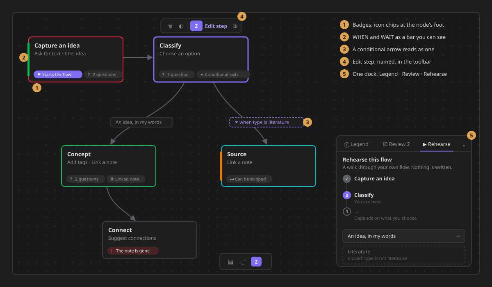
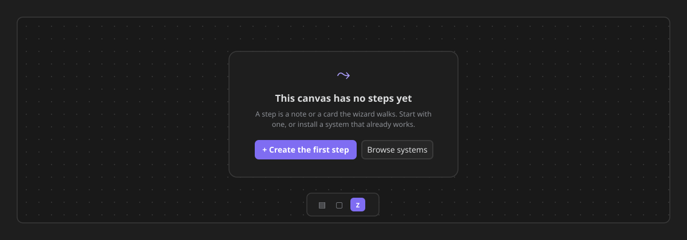

# Canvas integration & robustness

ZettelFlow turns Obsidian's native Canvas into a workflow surface by **monkey-patching** a few
internal Canvas APIs (`src/architecture/plugin/canvas/extensions/CanvasPatcher.ts` via
`monkey-around`). Obsidian does not expose these as a public API, so they can change between app
versions. The integration is built to **degrade gracefully** rather than break the canvas (#304).

## What is patched

| Patch | Target | Purpose | If the internal changed |
|---|---|---|---|
| `popup-menu` | `canvas.menu.render` | fire the `canvas:popup-menu` event + re-center | skipped; menu still works |
| `view-data` | `CanvasView.getViewData` / `setViewData` | stable serialization + JSON repair + fire injection/render events | skipped; canvas save/load still works |
| (events) | — | the `zettelflow-*` events the extensions listen to | best-effort; a throw never corrupts a save |

## How it degrades (never a hard break)

1. **Patch-time (missing method).** `PatchHelper.patch` checks that every method it means to override
   exists; if one is gone it returns `null` instead of throwing, and the caller marks that patch
   **degraded** (`CanvasPatchStatus`).
2. **Run-time (a patched body throws).** Each patched body runs inside Obsidian's own loops, so its
   ZettelFlow additions are wrapped: on a throw it logs, marks the patch degraded, and **falls back
   to the original** method. The canvas keeps working without our enhancement.
3. **Report once.** The first degrade shows a single Notice ("canvas integration partially
   unavailable after an Obsidian update") — never a stack trace, never repeated spam.
4. **Self-check.** On load, a one-line summary is logged, e.g. `canvas patches: 2 attached, 0
   degraded`.

The status tracker (`CanvasPatchStatus`) is pure and unit-tested; `PatchHelper`'s fail-soft path is
tested too.

## What ZettelFlow draws on the canvas (#686)

Everything below is **ours**: our own classes and children, added inside elements Obsidian gives us
and removed before every redraw and on unload. The patches above are untouched by it.

| What | Where it lives | Notes |
|---|---|---|
| **Badges** — icon chips along a node's foot: *Starts the flow*, *2 questions*, *Template*, *Linked note*, *Can be skipped*, *Conditional exits*, *The note is gone* | a strip appended to `nodeEl` | `pointer-events: none`; derived from the step's settings, nothing stored |
| **Accents** — WHEN a green bar, WAIT an orange bar, on the node's left side | a child of `nodeEl`, after Obsidian's container | the old inset shadow sat under `.canvas-node-container` (absolute, full size, its own background) and never showed |
| **IF** — a conditional arrow's label: dashed purple, with a filter icon | a class and an icon on the label's wrapper | the icon takes no pointer events, so editing the label is unchanged |
| **Edit step · Copy flow · Edit this exit** | the selection toolbar, as `clickable-icon` buttons | stable ids, removed before re-adding; *Edit step* shows its name |
| **One dock: Legend · Review · Rehearse** | one element on `canvas.wrapperEl`, bottom right | clear of the card menu and the canvas controls; the container takes no pointer events, only its tabs and panels; it folds to a row of tabs |
| **An empty canvas** — *Create the first step* and *Browse systems* | one card on `canvas.wrapperEl` | only its buttons take pointer events |

Colours are Obsidian's: `--color-green/orange/purple` for the blocks and `--canvas-color-1…6` for
the phases, so a theme recolours all of it.

## Manual-check matrix (run after an Obsidian update)

Do this against the latest Obsidian when bumping `minAppVersion` or after an app update:

| Check | Expected |
|---|---|
| Open a ZettelFlow canvas | loads; no error Notice |
| Console on load | `ZettelFlow: canvas patches: N attached, 0 degraded` |
| Right-click a node / open the canvas popup menu | ZettelFlow options appear |
| Select a **file node first** (nothing selected before) | *Edit step* is in the selection toolbar when its note is a step (#686) |
| Create a note through the wizard (drop-menu) | the node-connection drop menu appears and builds a note |
| Edit + save the canvas | saves; reopen shows the same graph (getViewData/setViewData intact) |
| Reopen an already-open canvas at startup | card-menu options + workflow styling are present (#234 re-apply) |

If any row fails, the console/self-check tells you **which** patch degraded; harden that specific
patch in `CanvasPatcher`. A degraded patch must never crash note creation.
