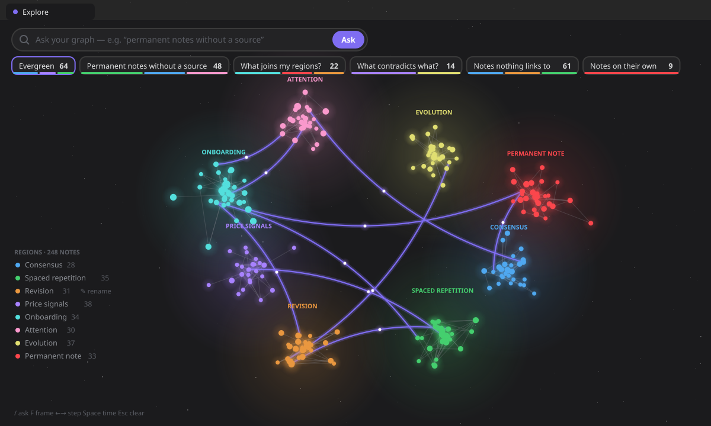

# The graph

> Epic [#692](https://github.com/RafaelGB/Obsidian-ZettelFlow/issues/692) — *ask, and the graph
> answers*. It replaces the 3D view of [#280](https://github.com/RafaelGB/Obsidian-ZettelFlow/issues/280),
> which [#484](https://github.com/RafaelGB/Obsidian-ZettelFlow/issues/484) had folded into Explore as a lens.
> If you knew it as the **3D knowledge graph** or as **The graph lens**, this is where it went.

The graph **is** [Explore](ask-your-graph.md): your whole vault drawn as a field of notes in their
regions, with a question bar on top. Ask, and the graph answers — the matching notes glow, the rest of
your vault dims, the camera frames them. This page is about the graph itself: what it draws, how, and
what it costs.

Everything here is **read-only and offline** — a click focuses a note, a double click opens it, and
the graph never writes. The one thing it keeps is the name you give a region, in plugin data.



## What it draws

- **Notes** are dots, sized by how connected they are. Colour has two modes, in the ⋯ menu:
  **by region** (default) — the neighbourhood the note lives in — and **by maturity** — its lifecycle
  state on the theme's own colours.
- **Regions are nebulae.** A region is a community the graph finds in your links (Louvain, #522), drawn as
  soft weather around its notes and named after its best connected note — until you
  [rename it](ask-your-graph.md#rename-a-region). Seen from afar, the names float over the regions;
  closer in, the notes' own names take over.
- **Links** are coloured by relation type (supports, contradicts, expands…). A link that crosses from one
  region into another — a **bridge** — is drawn dashed; ask *what joins my regions?* and the bridges glow
  with light travelling along them.
- **Labels** go on the best connected notes, on the answer's notes when you ask, and on whatever you point
  at — placed so they never cover each other.
- **The sky is your theme's background.** Light theme, light sky; dark theme, dark sky with a few stars.
  Every colour is read from your theme (§XV), and changes when you change it.

## How it is drawn (#693)

The old view drew one mesh per note and a cylinder and a cone per link through `3d-force-graph` and
`three` — about **nine thousand draw calls** at two thousand notes, and **1 MB** of the plugin (31 %).
The engine that replaced it is ZettelFlow's own, on **WebGL2**:

- **Five draw calls a frame, whatever the size of your vault**: nebulae, stars, links, halos, notes.
  Every note is one instance of the same quad, every link one instance of the same strip.
- **It draws only when something moves** — a camera flight, the layout settling, a fade, light along a
  bridge. Idle, it costs nothing; behind another tab, it does not even ask for frames.
- **Colours live in typed buffers.** A hover rewrites numbers in place; the GPU re-reads them only when
  they changed. Labels and rings are on one 2D overlay, never a texture per note.
- **No WebGL2?** The same picture on a 2D canvas, drawn by the CPU. No canvas at all? Explore opens its
  answer card on every note — still a way in, never a blank view.

`main.js` went from **3,251 KB to 2,273 KB**.

## The layout (#694)

Notes are placed by a force layout — links pull, notes push apart, each region holds together — written
on typed arrays with a Barnes–Hut octree, and **run in a Web Worker** so the view never stalls while it
settles. (When a worker cannot start, it runs in 6 ms slices of the main thread instead.) Every region
starts on its own spot, so the layout spends its time settling rather than untangling.

It is **remembered for the session**: reopen Explore on an unchanged vault and the notes are exactly where
they were, with nothing to lay out; change a note and only the difference settles.

| Measured (test/perf) | Before | Now |
|---|---|---|
| one layout tick, 2,000 notes | 16.8 ms on the main thread | 4.6 ms, in a worker |
| one layout tick, 10,000 notes | 131 ms on the main thread | 32 ms, in a worker |
| settle 2,000 notes from scratch | 5–9 s of main-thread frames | ~1.3 s, off the main thread |
| a hover at 10,000 notes | re-digests every object | 2 ms of buffer writes |
| draw calls | ~n + 2 · links | 5 |

The frame rate itself needs a screen and is walked by hand; everything above is a budget in
`npm run test:perf` that fails the build when it is exceeded.

## Moving around

- **Drag** to orbit (3D) or pan (flat); **Shift-drag** pans in 3D; **wheel** or **pinch** to zoom.
- **Click** a note to focus it and its neighbours and open its peek card; **double-click** to open it;
  **right-click** for open, open in a new tab, focus.
- The ⋯ menu: colour by region or maturity · **3D** or **flat** view · more or fewer labels · fit
  everything · **take a tour** (a flight through the hubs and the newest notes) · **export image**.
- Keys, time and the peek card are on the [Explore page](ask-your-graph.md#time-and-a-note-up-close-697).

## Share your universe (export)

**Export image** frames the whole graph and captures it — graph and labels — as a PNG, then opens a
preview with a file name; **Save to vault** writes it through the vault facade, never the Adapter API.
Nothing is written until you confirm.

## What went, and where it is now

| The 3D view had | Now |
|---|---|
| seven lenses behind a gear (orphans, dead ends, contradictions, alone, frontier, bridges, gaps) | questions to try, and terms you can save: `orphan`, `leaf`, `contradiction`, `alone`, `bridge`, `region:` (the gap lens lives in Home and This note, where a gap is answered) |
| its own search box | the one ask bar |
| a legend of neighbourhoods and seams | the regions as the legend, which also ask |
| path mode, spread, lite, fullscreen | the layout needs no spread; the graph is light by construction; the tab is the window |
| time-lapse with a slider | the time strip, with a sparkline of your months and notes arriving with a ring |
| a clip export (WebM) | an image export; a clip may return when someone asks for it |

### Why three.js went (a settled decision, reversed)

This page used to say *three.js stays*: a dependency that drew the scene well enough, and writing a
renderer was not worth it. Two measurements reversed it: three and its graph wrapper were **31 % of the
plugin** for one view, and the layout through them took **a whole frame per tick** on the main thread at
two thousand notes. A graph of dots and lines needs instancing, a worker and the theme's colours — not a
scene graph — and the engine that does exactly that is smaller than one of the libraries it replaced.

## Where it lives

```
architecture/components/core/graph/
  graphScene.ts      the graph as typed columns (positions, communities, edges, adjacency)
  layoutCore.ts      the force layout (Barnes–Hut, seeded by community) — pure, runs in the worker
  layout.worker.ts   the worker, bundled inline by esbuild and started from a Blob
  layoutRunner.ts    worker or main-thread slices; layoutCache.ts remembers layouts per session
  graphCamera.ts     one projection for the GPU and the pointer
  graphTheme.ts      every colour from the theme
  graphPaint.ts      colours, sizes and glows into buffers
  glBackend.ts       WebGL2: five draw calls · canvasBackend.ts: the 2D fallback
  graphLabels.ts     labels and region names on one overlay · graphPick.ts: what is under the pointer
  GraphCanvas.ts     the host: loop, camera, pointer, overlay
askGraph/AskGraphRenderer.ts — Explore, which owns the graph
```

The data comes from the Knowledge State surface (`build3DGraph`), offline and read-only.
