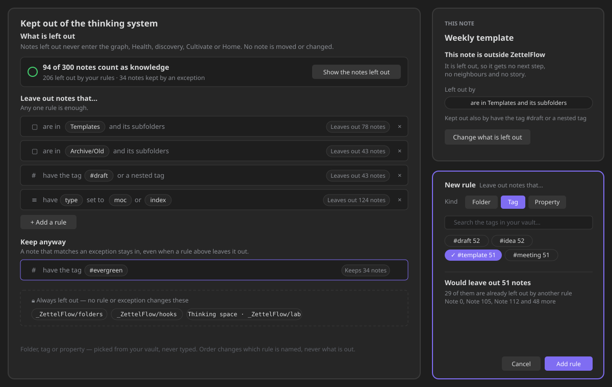

# Knowledge scope (what is left out)

Not every note in a vault is knowledge. Templates, meeting boilerplate, archived drafts and
ZettelFlow's own flow files would otherwise show up as orphans in Health, as ideas to cultivate,
as dots on the graph. **What is left out** decides which notes never become ideas: a note that is
left out disappears from the graph, Health, discovery, Cultivate and Home at once, because it never
enters the index. No note is moved or changed.

It lives in **Settings › Your knowledge › What is left out** (Obsidian's settings search still finds
it as *Excluded folders*), and **This note** links straight to it from any note that is left out.

## The rules: three closed kinds, no formulas

A rule finishes the sentence **"Leave out notes that…"**, and is built only from what your vault
already holds — nothing is typed except a search:

| Kind | Says | Picked from |
|---|---|---|
| **Folder** | *are in* / *are not in* a folder, with or without its subfolders | the vault's folders |
| **Tag** | *have any of* / *have none of* some tags, nested tags included or not | the vault's tags, each with how many notes carry it |
| **Property** | a property *is one of* some values, *is set* or *is not set* | the vault's properties, then the values notes already carry, as a checklist |

A folder rule matches the folder, everything under it, and its folder note (`Templates.md`), but
never a sibling that only starts the same (`Templates-old/`). Tags are case-insensitive, and from
the frontmatter and the body alike. A property list matches if any item does; a checkbox reads as
`true` / `false`. Only values that some note carries can be picked: the rules can never name
something your vault does not have.

## How they combine — one sentence

> **A note is left out when any rule leaves it out, unless an exception keeps it in — and
> ZettelFlow's own folders are always out.**

- **Keep anyway** (exceptions) use the same three kinds. *have the tag #evergreen* keeps an
  evergreen note in even when it sits in `Templates/`.
- **ZettelFlow's own folders** — flow canvases and their steps, hook flows, the script library and
  the [Thinking space](../architecture/thought-lab.md) — are listed on the card, locked: no rule
  or exception changes them.
- **Order never changes what is in or out.** It only decides which rule is **named**: the first
  that matches. Every surface that refuses a note says the same thing — This note (*Left out by …*,
  and *Kept out also by …* for the others), the crystallize dialog, Cultivate's inquiry.

## What the card counts

- *94 of 300 notes count as knowledge*, then how many your rules leave out, how many an exception
  keeps, and how many are in ZettelFlow's own folders.
- Each rule says what it leaves out (**Leaves out 42 notes**); each exception what it keeps. Rules
  may overlap, so these counts are each rule's own and do not add up to the total.
- **Show the notes left out** lists them under the rule that names each one — those groups do add
  up — or A–Z. A name opens its note.
- A rule being written says what it would do before it is added (**Would leave out 31 notes**, how
  many another rule already leaves out, the first few names). Once added it shows exactly that.
- If the rules would leave out every note, the card says so inline — and still lets you save.

Nothing is saved while you pick, search or switch kind: only **Add rule**, **Save** and **Remove**
write the settings. On a phone the rule editor opens as a sheet.

## The migration from excluded folders

Before #713 this was a list of excluded folders. On first load each folder becomes the rule
*are in X and its subfolders*, in the same order — and leaves out exactly the same notes: a
property test over thousands of generated paths (accented names in both Unicode forms, `X.md`
siblings, `X-other/` folders) proves the new verdict equals the old prefix match, and a fixture
vault's left-out list is compared byte for byte.

**Downgrade mirror (one release).** Every change also writes those folder rules back to the old
`excludedPaths` list, so the previous version still excludes every folder it understands (it
ignores tag and property rules and keeps them in `data.json`). If you add a folder there and
upgrade again, it is appended as a rule. The one lossy direction: a folder **removed** in the old
version is not removed from the rules — no configured exclusion is ever lost. The mirror goes away
in the next release ([#715](https://github.com/RafaelGB/Obsidian-ZettelFlow/issues/715)).

**What was deliberately left out.** File type (only Markdown ever becomes knowledge), created or
modified age (notes would drift out on their own over time), file-name patterns, link counts,
AND-groups and ranges (one sentence must describe the combination), and switches or reordering for
rules (order already changes nothing). No rule is ever suggested to you: what counts as knowledge
is your judgement (§XII).

## Architecture

| Piece | Where |
|---|---|
| The stored shape and its validation | `architecture/knowledge/scope/scopeRules.ts` (pure) |
| The verdict | `architecture/knowledge/scope/scopeEvaluate.ts` (pure, Obsidian-free) |
| Counts, draft preview, the pickers' vocabulary | `architecture/knowledge/scope/scopeCensus.ts` (pure) |
| A note's facts (path, tags, frontmatter) | `architecture/knowledge/scopeFacts.ts` (`getAllTags`) |
| The one gate | `KnowledgeIndex.inScope` / `scopeOf` / `excludedBy`, and `scopeGate.ts` for settings-held callers |
| The card | `config/modals/handlers/scope/` |

There is **one gate**: the judgement and move logs, the claim and move doors, the capture writer,
the inquiry context and every surface ask it, so a tag rule applies everywhere at once —
`oneGate.test.ts` fails the build on a caller that matches folders itself. A tag added or removed
is followed when Obsidian re-reads the note (`metadataCache` `changed`), membership only, so
nothing is recorded twice.

**Budgets** ([performance budgets](performance-budgets.md)): deciding 50,000 notes 67 ms (ceiling
120), counting the card 220 ms (400), previewing a draft 22 ms (60), a scoped 10,000-note build
26 ms — under the unscoped ceiling of 150. Health › Timings shows *Counting what is left out* on
your machine.
