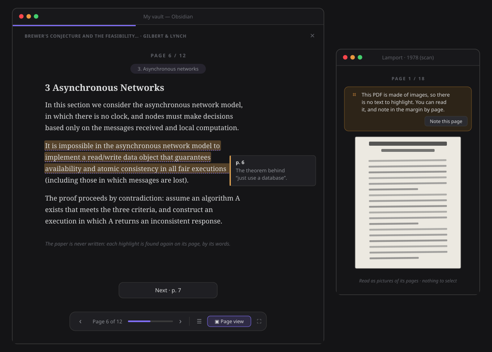
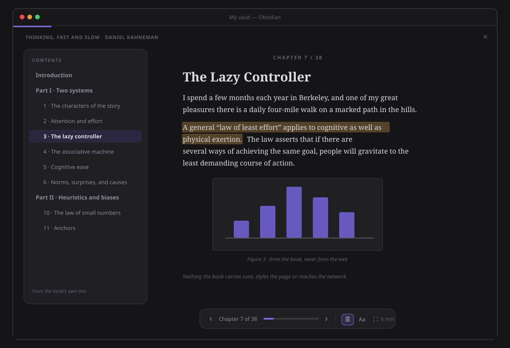

# Your Library

**The sources your ideas come from.** Ideas rarely start in a note: they start in what you read — a
paper, a book, a long article saved as a PDF. The Library puts those sources on one shelf, beside
the reading paths you saved across your own notes, and says what came of each one: how far you are,
what you marked, and the notes born from it.

## Open it

- **The ribbon menu → Library.** The door that is always there, whatever you have open.
- **Right-click a PDF or an EPUB → Read in the reader** opens it in the [Reader](reader.md) where you
  left it.
- **Right-click a PDF or an EPUB → Show in the library** opens the Library on that source's detail.
- **Command palette → "Open the library"**, which you can bind to a hotkey.

The Library opens in the main area, like any tab. It is laid out to work as well in a narrow pane or
a sidebar: the shelf narrows, the cards get smaller and *Continue reading* stacks.

## The shelf

Three kinds of things share the shelf:

| Kind | What it is | Its cover |
|---|---|---|
| **Books** | the EPUBs in your vault, and any PDF longer than sixty pages | the book's own cover |
| **Papers** | the PDFs in your vault up to sixty pages | the PDF's first page |
| **Paths** | the [reading paths](reader.md) you saved at the end of one | a constellation of its notes |

**Nothing is imported.** A source is a file that is already in your vault, in any folder: drop a book
in and it is on the shelf; delete it and it is gone. Nothing is uploaded and nothing leaves the vault.

Until a cover has been read, a book is drawn with its title on one of your theme's colours, so a new
shelf is never a wall of grey boxes. Covers are read as they scroll into view.

Each card says **what came of it**:

- **how far you are** — a ring, and a percentage;
- **how many passages you highlighted** in it;
- **how many notes were born from it** — the notes that cite it as their source (see
  [From passage to note](#from-passage-to-note));
- **when you last read it**, or *Never opened*.

**Continue reading** leads the shelf: the two things you were last in and have not finished, with
where you are (*Page 8 of 12*, *Chapter 3 of 38*, *Note 2 of 7*) and **Resume**.

Above the shelf: **All · Books · Papers · Paths**, each with its count; a search over titles and
authors (*sonke* finds *Sönke*); and the order — **Recently read** (never-opened things come last,
by title), **Most highlighted** or **Title**. The Library remembers the filter and the order.

### A scanned PDF says so before you open it

Some PDFs are pictures of pages: a scan has no text, so there is nothing to select and nothing to
highlight. When the Library reads a PDF's cover it also looks for text on its first pages, and a PDF
without any is marked **Scanned · read only** on its card and in its detail. You can still open it
and read it.

## A source in detail

**⋯** on a card opens its detail, over the shelf: the cover, the title and author, the file, and three
facts — how far you have read and when, your highlights, and the notes born from it. Below them, the
**notes born from it**, each one a click away (Ctrl/Cmd-hover to preview), and **your highlights,
by chapter** — every passage with your note under it, each one opening the source at that passage.
**Esc** or **Close** puts the detail away.

## Reading a PDF

Click a paper or a PDF book on the shelf — or **Resume** — and it opens in the same
[Reader](reader.md) as your notes: the same keys (**← →**, **Space**, **Esc**), the same bar, the
same themes and type. Its **pages are the chapters**.

Reading happens **in the Library's own tab**, as [one continuous shot](reader.md#one-continuous-shot):
the camera pushes into the book and its cover opens on the page you were on — no new tab opens. Leave the Reader and the same tab is
the Library again, exactly as you left it: the same filter, the same sort, the shelf scrolled where
it was. (Opened from anywhere else — a note, Home, Think — the Reader keeps its own tab.)

- **Reading view** (the default) reflows each page into the Reader's own column — your font, your
  size, your theme. Lines are put back into paragraphs, a heading set larger stays a heading, a word
  broken across two lines with a hyphen is mended, a lone page number is left out, and a page in two
  columns is read one column, then the other. A page that is a figure is shown as its picture.
  Reading view follows the Reader's **Layout** — Scroll, Page or Spread
  ([pages or scroll](reader.md#pages-or-scroll)); Page view keeps its own pages for now (#767).
- **Page view** (the bar's **Page view**, or **V**) draws the page as it was laid out, for a paper
  whose figures and tables matter. It is read-only, and it says so: *highlight in the reading view*.
- **The paper's own contents.** **Contents** lists the PDF's outline, each entry with its page; a PDF
  without one lists its pages. The section you are in is shown above the page.
- **Highlights and margin notes**, exactly as in a note: select words, **Highlight** or **Highlight and
  note** (or **H** / **Shift+H**). Each one is a thought in [Think](../architecture/thought-lab.md),
  about the PDF, carrying the passage and **its page** (`p. 6`). It is found again on that page, by
  its words, every time you open the paper. Think shows where it came from — *cap.pdf › p. 6* — and
  **Open in the Reader** lands on that page.
- **Resume.** The Library remembers the page you were on; the shelf's **Resume**, the PDF's own menu
  and *Continue reading* all open it there. Reaching the last page marks it read.
- **The end** of a paper says what the reading added up to, and offers **Think on what you marked**,
  **See it in the library** or **Read it again**.

### A scan

A scanned PDF has no text, so every page is shown as its picture, and a quiet banner says so before
you try: *This PDF is made of images, so there is no text to highlight. You can read it, and note in
the margin by page.* **Note this page** writes a note in the margin of the page you are on — a thought
in Think with the page and no passage — listed under **Notes on this page**.

### Where you left off, to the line

The Library keeps the chapter or page you were on **and how far into it you were**. **Resume** opens
there, not at the chapter's top, which matters in an EPUB whose chapters are long. It is kept a moment
after you stop scrolling, and it lands on the same share of the chapter even if you changed the type
size. A deep link to a highlight lands on the highlight instead.

## Reading an EPUB

A book opens in the same Reader. Its **chapters are the book's spine**, named from the book's own
contents — the EPUB 3 `nav`, or the `toc.ncx` of an older book — and **Contents** shows those
contents, nested as the book nests them.

- **In your type and your theme.** Each chapter is rebuilt in the Reader's own column: the book's
  headings, paragraphs, lists, tables, quotes and figures — not its fonts, colours or layout.
- **Safe by construction.** A chapter is never inserted as HTML. It is parsed as data and rebuilt one
  allowed element at a time, so nothing the book carries can run: no scripts, no event handlers, no
  embedded frames or forms, no styles. Its images are read from the book itself; nothing is ever
  loaded from the web, and a link that leaves the book is shown as plain text.
- **Footnotes are read in place.** Click a footnote mark and the note floats over the page, at the
  mark. That works for a note in the chapter and for an endnote at the back of the book. The page
  does not move; Esc or a click elsewhere puts it away, and **Go to note** goes there.
- **Search inside the book.** **Ctrl/Cmd+F** (or the bar's search) opens a slim bar under the top.
  It searches every chapter or page, ignoring case and accents, and says *N results · in M chapters*,
  each with its snippet and its page or chapter. **Enter** and **Shift+Enter** step through them; the
  matches are tinted in the page and the current one is outlined. A match in another chapter is a
  jump, with its way back. **Esc** closes the search and takes every tint away. A scan says it has
  no text to search.
- **Every jump has a way back.** A cross-reference, **Go to note** or a **Contents** entry moves you,
  and a **← Back to …** pill shows where you came from. Click it, or press **Alt+←**, to return to
  the very line. The pill fades by itself after a few seconds; Alt+← keeps working until your next
  page turn. In a PDF the pill follows Contents jumps.
- **Highlights, notes, resume and the end** work as in a PDF. A highlight carries its chapter
  (*Thinking, Fast and Slow.epub › 3 · The lazy controller*) and is found again in that chapter.

## The book notebook

Everything you marked in one book, in one place. Open it from the book's detail (**⋯ → Notebook**)
or from the Reader (**Contents → Notebook**). It takes the shelf's place: **← Library** or **Esc**
brings the shelf back.

- **In reading order.** Your highlights and margin notes, by chapter or page, each with its
  meaning's colour, the passage, your note and its place. **Open in reader** goes to that passage;
  **To note** makes a note of it, through the usual preview.
- **Narrow it.** Chips by meaning (**Idea**, **Question**, **Quote**, **To discuss**, with counts)
  and **With notes only**.
- **Export as a reading note.** A preview of exactly what will be written, for what the filter
  shows: a title, `Source:: [[the book]]`, and per chapter the quotes (with the page, in a paper)
  and your notes as bullets. Pages are written as text, never as block ids. Pick a folder (the last
  one is remembered) and **Create note**. Nothing is written before that. The note never goes over
  an existing file, and its creation can be undone.

## From passage to note

What you mark in a book is where your own ideas start. Click a highlight in a PDF or an EPUB and
choose **Crystallize into a note**: the same preview [Think](../architecture/thought-lab.md) uses
opens, with the note before it exists.

- **It quotes the passage and cites the page.** The proposed note carries the passage as a quote,
  your margin note under it, and a citation line the knowledge model reads — `source:: [[Books/Thinking,
  Fast and Slow.epub]] p. 42`, or the chapter's name for a book without pages. Change the title and
  the text before you create it; **Cancel** writes nothing.
- **It is a sourced note.** Because it cites the book, the note's claim counts as sourced in Health,
  Cultivate and This note — the same way a `source::` you write by hand does.
- **This note knows where it came from.** Open the new note with [This note](this-note.md) beside it:
  under its counts, **Born from** names the book and the page; click it and the Reader opens there.
- **The Library counts it.** The book's card says **1 note born**, and its detail lists the notes
  born from it, each one a click away.
- **The book is never written.** The note is the only thing created — through the
  [write record](../architecture/reversibility.md), so it can be taken back. A PDF or an EPUB is
  never offered as a place to append to. The highlight stays a thought in Think, set aside rather
  than deleted, so it does not wait on your bench for a note you already made.

You can also crystallize a book's highlights from Think and from the review of
[a few things you marked](highlights-review.md): they cite their page the same way.

With a canvas in the **Crystallizes thoughts** role, the note does not land at the vault root: the
preview's button reads **Continue in «flow»** and that flow builds it, with the quote, the margin
note and the `source::` line already at the top — see
[Think → through your crystallize flow](../architecture/thought-lab.md#through-your-crystallize-flow).

## What it keeps, and where

**Your files are never modified.** Not a byte of a PDF or an EPUB is written: no annotation layer, no
sidecar file next to it. What the Library remembers about a source is kept in the plugin's settings:
the title, author and length the file declares, whether a PDF is only images, and where you are in
it — each with the size and date of the file it was read from, so a replaced file is read again.
Covers are kept for the session only, in memory: never in your vault, never in the settings.

What you *mark* — highlights and margin notes — is not kept by the Library at all: those are
[thoughts in Think](../architecture/thought-lab.md), files you can open.

## How to verify

| Command | Proves |
|---|---|
| `npx jest test/application/library` | the shelf (kinds, filters, accent-blind search, orders, *Continue reading*), what is remembered about a source, the notes born from it, the unzip and the EPUB package |
| `npx jest test/architecture/components/core/library` | the Library view: empty state, the shelf, filters with counts, search, sort, the detail and Esc, a rename; covers and what a source declares, a scan detected |
| `npx jest test/application/library/pdfText test/architecture/components/core/reader/readerSource` | a PDF page reflowed (paragraphs, headings, hyphens, page numbers, two columns); a PDF in the Reader: pages as chapters, page view, a scan's banner, landing on a highlight's page, the end card, a file that cannot be read |
| `npx jest test/application/library/epubSanitize test/architecture/components/core/reader/readerEpub` | the sanitizer against hostile XHTML (scripts, `on*` handlers, `javascript:` and `data:` URLs, iframes, forms, `meta`/`base`, SVG scripts, remote images, runaway nesting); an EPUB in the Reader: spine as chapters, contents from the nav, links inside the book, images from the archive let go on the next chapter |
| `npx jest test/application/library/passageToNote` | a book's passage cited as `[[book.epub]] p. 42`, the crystallized note read as a sourced claim and counted as born from the book, a source never offered as a place to append to, a note's origin read off its own lines |
| `npx jest test/architecture/components/core/reader/readerHighlights` | a source's highlights found only on their own page, kept with their page; a note by page with Undo |
| `npm run test:perf -- library` | the shelf of 500 sources builds, orders and searches in budget; a dense two-column page reflows in budget; a 5 MB EPUB opens in budget |

In a vault (a test vault with a PDF paper, a scanned PDF and an EPUB):

1. **Empty state.** In a vault with no PDF, no EPUB and no saved path, open **ribbon menu → Library**.
   Expect *Your shelf is empty, for now* and, with a note open, **Read a path across your notes**.
2. **The shelf.** Add the three files to any folder. Expect them on the shelf at once; each cover is
   drawn, then replaced by the real one as it scrolls into view. The EPUB is a book, the short PDF a
   paper.
3. **A scan.** Expect **Scanned · read only** on the scanned PDF's card once its cover has been read,
   and in its detail.
4. **Filters and search.** Click **Papers**: only PDFs. Type an author's name without its accents:
   it is found. Change the order to **Title**; close and reopen the Library: the order is kept.
5. **Detail.** **⋯** on a card: the detail slides in. **Esc** closes it; a second **Esc** does nothing
   to the Library.
6. **From the file.** Right-click the EPUB in the file explorer → **Show in the library**: the Library
   opens on its detail.
7. **A paper.** Click the paper on the shelf. Expect the Reader with *Page 1 / n*, the text in your
   reading font, no chapter dots for a long PDF. **→** turns the page; **V** switches to Page view (the
   page as laid out, *Highlight in the reading view*); **V** again comes back.
8. **Highlight.** Select a sentence → **Highlight and note**: the sentence stays marked while you
   type. Write a note, **Save**. Expect it in the
   margin. Leave with **Esc**, open the paper again from **Continue reading**: you are on that page,
   and the highlight is there. In Think the thought shows the passage and *› p. n*.
9. **The scan.** Open the scanned PDF. Expect the banner and the page as a picture; selecting does
   nothing. **Note this page** → a note → **Save**: it is listed under *Notes on this page*.
10. **A book.** Open the EPUB. Expect its title and author on the top line and *Chapter 1 / n*;
    **Contents** lists the book's own chapters. Click a footnote mark: the note floats over the page and
    the page does not move. Click a cross-reference: the Reader goes there, and **← Back to …** (or
    Alt+←) returns you to the line you left. Highlight a sentence; it shows in Think with the chapter's name.
11. **From passage to note.** Click a highlight in the book → **Crystallize into a note** → change
    the title → **Create**. Expect a new note quoting the passage, ending with
    `source:: [[…epub]] <chapter or page>`. Open This note on it: **Born from** names the book; click
    it and the Reader opens there. Back in the Library, the book's card says **1 note born**.
12. **Negative.** Compare each source file before and after (size and modification date): unchanged.
   No file was created in the vault.
