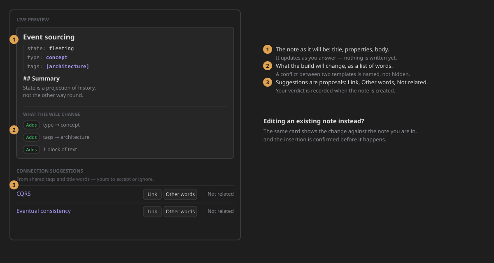

# Create a note: the wizard

Every note a flow creates is written by the **wizard**. It walks the flow's Canvas one step at a time,
asks each step's question, and shows you the note as it takes shape. Nothing is written to your vault
until the last step.

Open it from the ribbon button (**Create note**), the command palette, or a folder or property hook
that starts a flow.

## The four parts

**1 · The progress header.** The title of the note sits at the top, and you edit it right there.
Beside it, a chip says where the note will land. A lock means the flow fixes the folder. Under the
title:

- a progress bar reads **Step 2 · about 3 left**. The estimate comes from the longest path left in
  the flow, so conditions can make it shorter. When the flow cannot honestly estimate (it has a
  loop, for example), only the step number shows.
- the **path walked so far** sits under the bar. Click a step to go back to it. A long path folds its
  middle into **…**, which you click to unfold.

**2 · The step.** Each step has a heading: the question it asks. Above the heading, a line says:

- which **phase** of the note's life the step advances (Capture, Classify, Develop…), with its colour;
- what kind of answer it wants (*Ask for text*, *Choose one*…);
- whether it **can be skipped**.

**3 · The live preview.** On the right you see the note as it will be: its title, its properties and
its body. Under it, **What this will change** lists every property the note gains and every block of
text it adds. When two step templates set the same property differently, the list names the
conflict. **Connection suggestions** are notes that share tags or title words with this one. They
are only proposals. For each one you choose **Link**, **Other words** (link it with your own text)
or **Not related**. Your choice is recorded once the note exists.

**4 · The footer.** The footer stays in the same place on every step:

- **Back** returns to the previous step. It is greyed out on the first step, never hidden.
- **Skip this step** appears only when the step can be skipped. Its space is kept when it is
  hidden, so the other buttons do not move.
- **Build with what I have** creates the note now, from the steps answered so far.
- **Confirm** is the step's own button. Its hint beside it says which key does the same thing.

## Answering a step

Every kind of step asks the same way: a label, a field, and one quiet line that says what your answer
writes.

| The step asks for… | You answer with | Confirm with |
|---|---|---|
| **One option** (a branch, or a selector) | Click it, or move with the arrow keys | Click, `Enter`, or **Confirm** |
| **Text** | The text area. `Enter` starts a new line | `Ctrl/Cmd+Enter`, or **Confirm** |
| **A number** | A number field | `Enter`, or **Confirm** |
| **A date** | Type it, or open the field's own picker | `Enter`, or **Confirm** |
| **Yes or no** | Tick the box, or click its words. `Space` ticks it | `Enter`, or **Confirm** |
| **Tags or CSS classes** | Search, pick or create. Each one is a chip | **Confirm** |
| **A link from another note** | The note, a heading, and how the link reads | **Confirm** |

`Ctrl/Cmd+Enter` confirms the step from anywhere in the wizard.

When an answer cannot be accepted (an empty number, a date that is not a date, a backlink to no note),
the hint beside **Confirm** turns red and says why. Nothing is written.

**Options mean something.** In a list of options, the coloured edge of each one is the colour of the
step it leads to, which is its phase colour unless someone picked another. The step's default option
is marked **default**, and the keyboard starts on it. When a condition hides an option, a line under
the list says so; open it to see why.

Steps that load their options from a script show a spinner while the script runs. If the script fails,
they say so in place instead of leaving an empty box.

## The keys

| Key | What it does |
|---|---|
| `Enter` | Confirms the step (in a text area it starts a new line) |
| `Ctrl/Cmd+Enter` | Confirms the step from anywhere in the wizard |
| `Ctrl/Cmd+Z` | Goes back one step (the title field keeps its own undo) |
| `Ctrl/Cmd+Shift+Z` | Steps forward again, until you give a new answer |
| `↑` `↓` `Home` `End`, typing | Move through a list of options |
| `Esc` | Clears the option search, then closes the wizard |

## When something goes wrong

- **You close the wizard halfway.** Your answers are kept. The next time you open the same flow, a
  card offers **Resume** or **Start fresh**. Starting fresh asks before it throws anything away.
- **A step cannot be shown.** The wizard stays open and says which step failed. It offers what can
  still be done: **Try again**, **Go back a step**, **Skip this step** or **Create the note with
  what you have**.
- **There is no flow yet.** The first time, the wizard opens on a welcome screen with three ways in:
  install a ready system, try the example flow, or build your own.

## Density

**Settings → ZettelFlow → Creating notes → Wizard density** has two options. *Comfortable* is the
default. *Compact* hides option descriptions and tightens the spacing, but keeps every piece of
information, including the path walked so far.

→ [Build your own note flow](../architecture/flow-roles.md) · [Every action](../actions/Prompt.md) ·
[How the wizard works inside](../architecture/actions-and-note-builder.md#6-the-wizard-state-machine)
