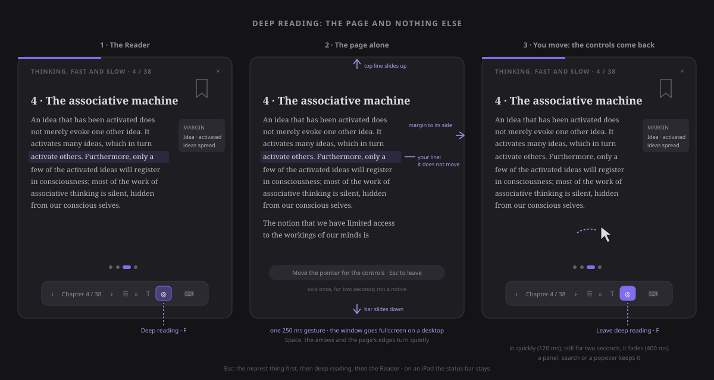
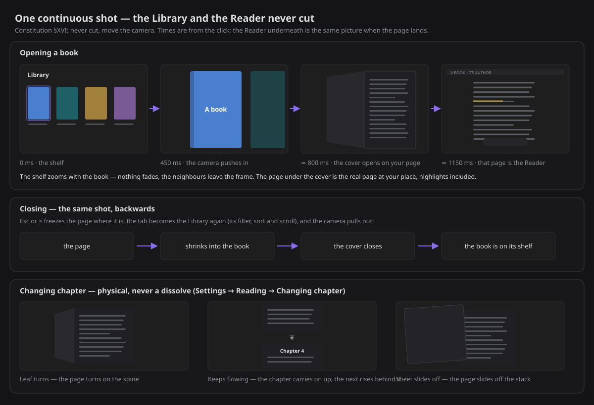
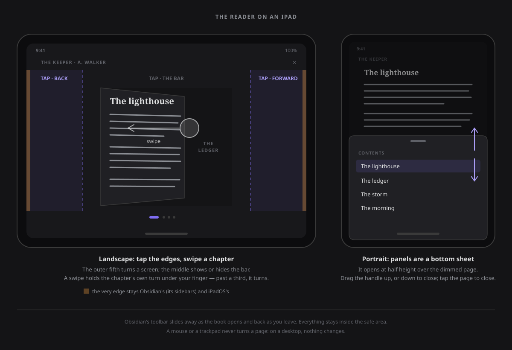
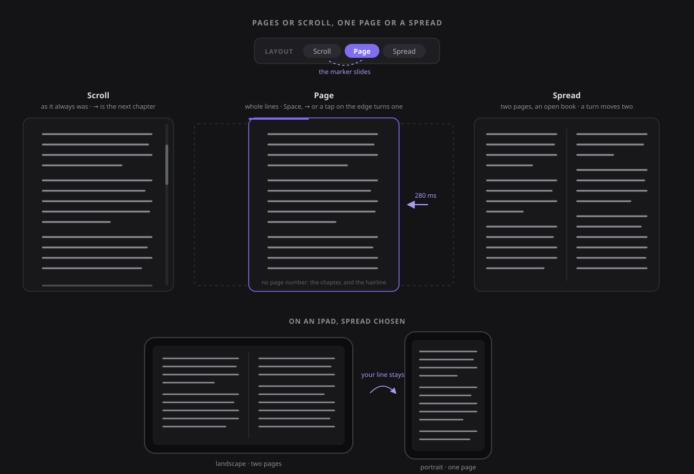

# The Reader

**Follow ideas, not files.** The Reader turns a handful of related notes into something you read
from start to finish, the way you read a book. It takes the whole window, gives you one chapter at a
time, and steps out of the way while you read.

## Open it

The Reader also reads your **PDFs and EPUBs** — a paper's pages reflowed into the same column, a
book's chapters rebuilt in your type, with the same highlights — from the [Library](library.md).

- **Right-click any note → Read from here.** That is the whole setup. You don't need a map of
  content or a list of relations: the note you right-click is where the reading starts.
- **This note → ⋯ → Read around this note**, from the note you are on.
- **Right-click several notes → Read these**, or **right-click a folder → Read this folder**.
- **Explore → Read these**, beside *Copy as links*, reads what your question selected.
- **Command palette → "Read from the active note"**, which you can bind to a hotkey.

None of these is offered on a note or folder in an **excluded folder**: it is outside ZettelFlow
(see [This note](this-note.md#a-note-in-an-excluded-folder)), and *Read these* leaves such notes out.

The sidebars fold away and the Reader takes the window. When you leave, with **Esc**, the **×** or
the command **Reader: exit**, the page fades out, the reader's tab closes, and your workspace comes
back exactly as it was: the sidebars that were open open again, and you return to the tab you were
in, where you left it. Closing the tab any other way gives everything back too, and so does a reader
left open across a restart.

A book opened from the [Library](library.md) is read in the Library's own tab, so leaving it does not
close anything: the tab becomes the Library again, with its filter, sort and scroll as they were.

## Choosing what to read

When there is more than one good way through a note, *Read from here* asks **how do you want to
read it?** Each way shows its shape, what it promises and the chapters it would read, so you choose
on what you will actually read.

| Way | Reads | Offered when |
|---|---|---|
| **Around this note** | the note, its neighbours strongest link first (counterpoints, supports, examples, other typed relations, plain links), then the notes two steps away that most of them touch, then notes near it you never linked | always — it is the default |
| **Argument** | the thesis, what supports it, what argues back, then the notes that speak to both sides | the note has typed `supports` / `contradicts` relations |
| **Story of an idea** | the same notes as *Around*, in the order you first worked on them (decisions, moves, creation date) | at least three chapters, on at least two different dates |
| **Essentials** | only the hubs around the note: the notes linked three times or more, most linked first, at most seven | it leaves something out |
| **Region** | the note's region of your graph: notes that link to each other more than to the rest, its hub first | the region has three notes or more, not all already its neighbours |

Every way reads at most twelve chapters, and only notes your vault actually has. A way that would
read exactly the same chapters as one already offered is not offered twice. When only one way
applies and there is nothing to resume, the chooser is skipped and the reading starts.

**Read these** and **Read this folder** read the notes you picked (up to sixty) in the order their
links suggest: each next chapter is the note most linked to the ones already read.

### Resume

Leave a reading part-way and the Reader remembers the chapter. Next time, the chooser offers
**Resume at chapter n**; a picked set or a folder reopens where you left that same set. Reaching the
last chapter, or going back to the first, forgets the place. The Reader keeps the forty most recent
places, in the plugin's settings — a picked set is kept as a fingerprint, not a list of your notes.

## Chapters and roles

Every reading starts with the note you started from (a picked set starts with its first note). A
note joined both ways comes before one joined one way, and a typed relation before a plain link. No
unresolved links, attachments or self-links are read.

Each chapter carries its **role** relative to the note you started from, read off your typed
relations:

| Role | When |
|---|---|
| **Thesis** | the note you started from, when something supports it or argues with it |
| **Support** | a note joined to it by `supports` |
| **Counterpoint** | a note joined to it by `contradicts` |
| **Synthesis** | in an *Argument*, a note that speaks to both sides |
| **Context** | anything else |

## Reading

| Key | Does |
|---|---|
| **→**, **Page down** | next chapter — in *Page* or *Spread*, the next page, then the next chapter |
| **←**, **Page up** | previous chapter — in *Page* or *Spread*, the previous page, then the previous chapter's last page |
| **Space** / **Shift+Space** | a screen down (up) the chapter, and the next (previous) chapter once you reach its end — in pages, a page on (back) |
| **↓** / **↑** | scroll the chapter a little (nothing in pages: there is no scroll) |
| **Home** / **End** | first / last chapter |
| **F** | deep reading: the page and nothing else, in and out (see [Deep reading](#deep-reading)) |
| **H** / **Shift+H** | highlight the selected words / highlight them and write a note |
| **B** | bookmark the place you are reading, or take away the bookmark on this screen (a book or a paper) |
| **Alt+←** | back to where your last jump left from (a book or a paper) |
| **Ctrl/⌘ +** / **−** / **0** | in a PDF's Page view: zoom in, zoom out, back to Fit width ([Page view](library.md#page-view)); elsewhere they stay Obsidian's |
| **?** | the keyboard shortcuts, on the page (also a button in the bar) |
| **Esc** | one thing at a time, nearest first: close the shortcuts, the highlight popover, a peek, step back from a detour, close a panel, leave deep reading, then leave the Reader |

The keys work whenever the Reader is the active tab, wherever the focus is: they are registered the
way Obsidian's own views register theirs, so they never fight a hotkey of yours. **Ctrl**, **Cmd**
and **Alt** combinations are always Obsidian's, and a key typed into a margin note or a name is
never taken.

Three **commands** do the same from the palette, and you can bind them to hotkeys of your own. They
appear only while a reading is the active tab, and none has a default hotkey:

| Command | Does |
|---|---|
| **Reader: next chapter** | the next chapter (the end card after the last) |
| **Reader: previous chapter** | the previous chapter |
| **Reader: exit** | leave the Reader and get the workspace back |

The **bar** at the bottom appears when you move the mouse and fades after two seconds, and the
pointer fades with it. On a touch screen a tap in the middle of the page shows it, and the next one
hides it. It holds:

- the chapter you are on, your progress through the path, and **about how many minutes are left**
  in this chapter (at 220 words a minute, counted down as you scroll);
- **Contents**, the chapters with their roles (in a book or a paper, with its **Bookmarks** and
  **Where you've been** beside them);
- **Type**;
- **Around this chapter**, with what supports it, what argues back and its open questions;
- **Deep reading**, the page and nothing else (**F**);
- **Keyboard shortcuts**.

A **hairline** across the very top fills as you scroll through the chapter. At the end of it, the
way on lights up: **Next · *its name* · *how long it is***.

### Deep reading

**Deep reading** is the page and nothing else. Press **F**, or the *Deep reading* button in the bar
(where *Fullscreen* used to be), and the top line slides up off the screen, the bar slides down,
the margin of highlights slides to its side, and the chapter dots, the hairline, the back pill and
the bookmark ribbon fade. The pointer hides. On a desktop the window also goes fullscreen. The line
you were reading does not move, not even while the window grows around it.

- **Said once.** For two seconds a line on the page says *Move the pointer for the controls · Esc to
  leave*, or *Tap the middle for the controls* on a touch screen. It is not a notice.
- **Everything comes back when you move.** Move the pointer (more than a jitter), tap the middle of
  the page, or press any key that does not read (**H**, **B**, **1–4**, **?**, **Ctrl/⌘+F**), and the
  controls slide back in, quickly. They fade again after two seconds of stillness, and they stay while
  a panel, search or a popover is open.
- **Reading keys stay quiet.** **Space**, **Shift+Space**, the arrows, **Page up/down**, **Home**,
  **End** and a tap on the page's edges turn without bringing anything back.
- **Nothing is lost.** Selecting and highlighting, footnotes, search, the panels, the end card and
  the way back (the pill through the controls, or **Alt+←**) all work as they do outside it.
- **Leaving.** **Esc** closes the nearest thing first, as always, then leaves deep reading, and only
  then the Reader. **F** or *Leave deep reading* (the same button) leave at once. The window is given
  back as it was: if it was fullscreen before, it stays fullscreen; if deep reading made it so, it
  is put back.
- **Beside focus mode.** *Focus mode* (in *Type*) is about the text, deep reading about the screen.
  Either works with or without the other, and deep reading never changes it.
- **Not remembered.** Every book opens in the ordinary Reader.
- **Reduce Motion** is honoured: the controls appear and go at once, and your line still stays.

On a desktop the window's fullscreen never takes **Esc** from the Reader: the Reader answers it
first, so the order above holds. If the window leaves fullscreen some other way (**F11**, the system),
the page stays in deep reading and is not put back into fullscreen when you leave.

On a desktop, Obsidian's own ribbon, tab bar and status bar slide away with the Reader's controls,
and come back as you leave.

**On an iPad** the app cannot make the window fullscreen, so deep reading covers Obsidian's own
toolbar instead (the Reader already does while you read) and takes the Reader's controls away too.
The iPadOS status bar, with the clock and the battery, stays: a plugin cannot hide it.

### One continuous shot

Opening a book from the [Library](library.md) never cuts to another view: the camera moves. The shelf
zooms with the book you clicked, the cover opens on its hinge **on the page you were on** (your
highlights already in their places), and that page lands exactly where the Reader's column is: it
*is* the Reader, with everything it has. Leaving plays the same shot backwards, until the book is on
its shelf again. Any key or click jumps a shot to its end, and with reduced motion, or
**Settings → Reading → Opening a book → Instant**, the same places are reached at once. This is
[constitution §XVI](constitution.md#xvi-one-continuous-shot) at work.

### A reader that feels good

- **The measure of a book.** About 68 characters to a line, with ragged edges evened out, long words
  hyphenated and generous leading, in your theme's font or a serif.
- **Pages that turn, physically.** Changing chapter never dissolves one into the next. The page you
  were on is laid on top like paper and leaves the way you choose in **Settings → Reading →
  Changing chapter**: a **leaf turns** on the spine, the text **keeps flowing** up into the next
  chapter (a small ❦ marks the seam), or the **sheet slides off** the stack. Going back plays it the
  other way. Arrows, keys, the contents and search jumps all turn the same page.
- **A marker, not a stamp.** A new highlight is swept across the words like a marker pen.
- **Time left, at your pace.** The bar says how long is left in the chapter and in the book,
  counted at **your** reading speed, learned from the chapters you read to the end and kept on this
  device only. It shows only while the bar does: move the pointer or press a key. **Type → Time
  left** turns it off.
- **Focus mode** (in **Type**): every paragraph but the one at your reading line steps back, so your
  eye stays where you are. It is remembered for next time.
- **Calm when you read.** Opening, the page rises out of the workspace; leaving, it sinks back.
- **Details that explain themselves.** A
  highlight you keep drifts into its card in the margin. Popovers grow from where you selected, and
  a chapter ends with a quiet ornament as you arrive. Day, sepia and night cross-fade instead of
  snapping, and the book you are reading breathes once when you come back to the Library. Each one
  moves only what the screen can move for free (transform and opacity), and none of them counts at
  you.
- **Less motion, if you asked for it.** With your system's *reduce motion* setting on, every one of
  these is instant: nothing slides, sweeps or fades.

Chapters are drawn by Obsidian's own Markdown renderer, so callouts, embeds, math and your theme look
as they do everywhere else.

## On iPad

The Reader is built to be read with a finger, a pen or a hardware keyboard. On a mouse or a trackpad
nothing below changes: a click never turns a page.

- **Tap the edges.** A tap in the outer fifth of the page turns a screen, the right edge forward
  (as **Space**) and the left edge back. A tap in the middle shows the bar, and the next one hides
  it. A tap on a link, a footnote, a highlight or a button is that thing, never a turn — and so is
  any tap while words are selected.
- **Swipe a chapter.** A sideways swipe holds the chapter's own turn — the leaf, the flowing text or
  the sheet you chose in **Settings → Reading** — under your finger. Let go past a third of the
  page, or with a flick, and it turns at the speed you let go; short of that it springs back. On the
  first or last chapter the page follows a third of your finger and comes back. A vertical drag
  scrolls, and a gesture is decided once: a diagonal drag never both scrolls and turns.
- **The very edge is not ours.** A swipe that starts within a finger's width of the screen's edge is
  left to iPadOS and to Obsidian, which opens its sidebars from there.
- **Back with two fingers.** Two fingers swept right anywhere on the page go back one step along
  [where you've been](#bookmarks-and-where-youve-been), as the back pill and Alt+← do. (The
  screen's left edge would be the obvious place, but it is Obsidian's.)
- **Selecting beside the system's menu.** A long press selects words as usual and iPadOS shows its
  own callout (Copy, Look Up, Translate). Once the selection has settled, the four meanings appear
  **below** it, clear of that callout, and without a second *Copy*.
- **Panels are a bottom sheet in portrait.** *Contents*, *Type* and *Around this chapter* rise from
  the bottom edge at half height over the dimmed page. Drag the handle up to nearly full height or
  down to close it, or tap the page above it. In landscape they open as the usual card.
- **The whole screen is the page.** While a book is open, Obsidian's own toolbar slides away, and it
  slides back as you leave, exactly as it was. The top line, the back pill, the dots, the bar and the
  sheet stay inside the safe area — in both orientations and in a Split View window — and rotating
  keeps the line you were reading in view.
- **No dead control.** The app cannot make the window fullscreen on an iPad, so there is no
  *Fullscreen*; *Deep reading* is there instead and works (see below). The shortcuts sheet names
  **⌘** and **⌥** on Apple devices.
- **A big book opens, or says why not.** A whole book is held in memory while you read it. On an
  iPad or a phone, a PDF over 100 MB or an EPUB over 50 MB is not opened — not even read: the page
  says it is too large to open on this device, with the way back to the library, and nothing is
  written. Those limits are deliberately cautious until a device has measured them.
- **Reduce Motion** is honoured: taps and sheets are instant, and a swipe still follows your finger,
  because moving something with your finger is not an animation.

**What is proven so far.** All of the above is tested, and was walked in Obsidian with its mobile
layout emulated at iPad sizes with touch. The walk on a real iPad — the one that settles iPadOS's
own callout and Look Up, the Pencil, a hardware keyboard and the memory limits — is recorded on
[issue #750](https://github.com/RafaelGB/Obsidian-ZettelFlow/issues/750); until it is, those rows
are assumed, not claimed.

**What a plugin cannot do on iPad.** Hide the status bar; hear the Pencil's double-tap or squeeze;
keep reading aloud in the background. These are the app's, not a plugin's.

## Links, detours and context

Getting lost is the main way reading fails in a linked vault: you follow a link, then another, and
the thread is gone. So a link in the Reader is a **peek**, not a jump.

In a book or a paper it is the same idea. A **footnote** opens over the page, at its mark, and any
**jump** (a cross-reference, Contents, a search, *Go to note*, a bookmark, a passage opened from
Think) leaves a **← Back to …** pill, Alt+← and a row in **Where you've been** to return to the line
you left — see [Bookmarks and where you've been](#bookmarks-and-where-youve-been) and
[Your Library](library.md#reading-an-epub).

Click a link and a card opens right under the paragraph that holds it. It says where the note sits
(*Chapter 3 of this reading*, or *Not in this reading*), shows the note's first lines, and offers:

| Action | Does |
|---|---|
| **Read as a detour** | reads the note now, then brings you back. A pill at the top says *↩ Back to …*; one press, or **Esc**, steps back one level. Detours can nest five deep. |
| **Jump to the chapter** | when the note is already a chapter of this reading |
| **Add to this reading** | puts the note right after the chapter you are on, for this reading only |
| **Open in a new tab** | as Obsidian would |

- While you are in a detour the counter says *Detour* and the progress stays on the path. The arrow
  keys move along the path, leaving the detour behind.
- **Mod-click** a link to open it in a tab without a peek, and **Ctrl/Cmd-hover** it for Obsidian's
  own page preview.
- A link to a note that does not exist yet only says so: following it would create the note, and the
  Reader writes nothing.

The **Contents** panel lists the chapters with their roles, ticks the ones you have read and marks
where you are. **Around this chapter** lists what supports it, what argues back and its open
questions, read from the same model as [This note](this-note.md). Each of those is a peek too.

## Bookmarks and where you've been

Two small tools every reading app has, made so that following a reference is never a risk to your
place. In a book or a paper (an EPUB or a PDF); a note reading keeps its place in the notes
themselves.

- **The ribbon.** At the page's top-right corner. Tap it — or press **B** — and it drops in: the
  place you are reading is kept, the chapter and the first line on screen. It shows filled on any
  screen that holds a bookmark; tap it there and it lifts out again. An empty ribbon steps back with
  the bar while you read; a filled one stays, as a ribbon in a book does.
- **A place, not a thought.** A bookmark writes nothing to Think, nothing to a note and never touches
  the book's file. It is kept in the plugin's data beside where the book resumes, for this vault, so
  it syncs only when your plugin settings do. Replacing the book's file with a new copy keeps its
  bookmarks, as it keeps its place.
- **Found by its words.** A bookmark keeps where it is in the text, and the words there — the way a
  highlight is found again — so a change of font, size, layout or device lands on the same line. In
  a PDF's Page view a bookmark is its page.
- **Contents · Bookmarks · Where you've been.** The Contents panel has three tabs. **Bookmarks** lists
  the book's bookmarks in reading order: the chapter or page, the first words of the line and when it
  was made (*now*, *2 days ago*); tap one to go there, or remove it in place. Neither tab counts
  anything.
- **Where you've been.** Before any jump the Reader remembers where you were, and why you left: a
  link in the book (*Before a link*), a Contents entry, a search (once per search, in any chapter),
  *Go to note* in a footnote, a bookmark, and a passage opened from Think or *This note* while the book
  is open (*Before an opened passage*). The list is newest first; tap a row to go back there, and it
  leaves the trail.
- **One trail.** The back pill, **Alt+←** and, on a touch screen, two fingers swept right walk the
  same trail one step at a time. An ordinary page or chapter turn puts the pill away but keeps the
  trail. It lives for the reading in progress and is forgotten when you close the book (the last
  twenty places).

### Going to a place is a camera move

None of these moves cuts ([constitution §XVI](constitution.md#xvi-one-continuous-shot)). In the
chapter you are reading, in **Page** and **Spread** the strip travels to the page that holds the
place — in proportion to the distance, and a far page by its last three, faint at first, rather than
dozens of pages flashing past. In **Scroll** the column glides there, two screens at most. In another
chapter it is the chapter turn you chose in **Settings → Reading**, towards the place, and the way
back is its reverse. On landing, the line is marked for a moment by a quiet wash under the words —
*you are here* — and then nothing. Under reduced motion every move is instant, and the mark shows for
a moment without fading.

## Highlights and notes in the margin

Reading well means stopping at the sentence that matters. Select some words in a chapter, as you
would on a Kindle — with the mouse, the keyboard, or a long-press on a phone — and a small popover
offers **Highlight**, **Highlight and note** or **Copy** (or press **H**, or **Shift+H** for the
note). A drag that ends past the text, in the margin or below the last line, still counts. While
you write the note, the passage stays marked; cancel and the mark goes.

- **A highlight says what it is.** The popover offers four meanings: **Idea**, **Question**,
  **Quote** and **To discuss**, each in a colour of your theme. Click one (or press **1–4**) and the
  passage takes it; **H** keeps the next one with the meaning you used last. Click a highlight to
  change its meaning. With more than one meaning in a chapter, the margin can show one meaning at a
  time. A highlight made before meanings existed reads as an idea.
- **A highlight is a thought.** It lands in [Think](../architecture/thought-lab.md), about the note
  you were reading, carrying the passage you picked and the heading it sat under. Your note is the
  thought's text. Open Think on that note and the passage is there, quoted above what you wrote, with
  **Open in the Reader** to come back to the exact place.
- **The note is never touched.** Nothing is added to it: no marker, no block id, no property. The
  highlight is found again every time you read, by looking for the same words and the words around
  them, so it survives edits elsewhere in the note.
- **Detached, never lost.** If the passage was edited away, the highlight is listed under
  **Detached** with its note and a way to open it in Think.
- **Click a highlight** to see its note, add or edit one, delete it, or open it in Think. A
  highlight with a note has a dotted underline.
- **In the margin.** On a wide pane your highlights are listed beside the page, in reading order;
  click one to go to it. On a narrow pane the same list is under **Around this chapter**.
- **Everything can be undone.** Highlighting, editing and deleting are recorded writes of a thought,
  in the [write record](../architecture/reversibility.md), and each answer offers **Undo** in place. A
  deleted highlight goes to the trash, not away.
- **It comes back.** A few days later, what you marked returns as a card, with one question: do you
  still think so? See [A few things you marked](highlights-review.md).
- **Your story shows it.** In [This note](this-note.md), a highlight appears in the story as a thought
  with its passage quoted.

## The end of a path

Past the last chapter — **Next**, **Space** or **Finish** — the reading does not just close. An
end card says what it added up to and what you can do with it.

- **What it added up to.** The minutes it took, the notes you read, and — only when there were any
  — the detours you took and the highlights and margin notes you made in this reading. No zeros, no
  score: a reading is not graded.
- **Save this path.** Name it (it proposes the note and the way you read it) and the path is kept,
  in this order, in the plugin's data. It comes back as **Your saved paths** in the chooser of any
  note it passes through — read it again, rename it in place, or delete it — on Home's **Where
  you left off** while you are part-way through it, one click back into the Reader — and on the
  [Library](library.md)'s shelf, with how far you are and what you marked. Saving again
  under a new name renames it; the same chapters are never kept twice.
- **Export as one document.** A preview first: the chapters, an appendix of your highlights on
  them, and how each chapter is carried — **Embed each note** (the default: `![[note]]`, live,
  nothing duplicated) or **Copy the text** (a snapshot, readable anywhere). Pick the folder (it
  proposes the folder the reading started in) and the file name, then **Export**. One new note is
  created — never over an existing one: a name that is taken gets *2*, *3*… The card says where it
  went, with **Open** and **Undo**; undo sends it to the trash.
- **Cultivate the thesis.** Gives the workspace back and opens
  [Cultivate](cultivate.md) on the reading's thesis — or the note it started from.
- **Read it again** from chapter 1, or — for a way through a note — **choose another way
  through it**.

**←** goes back to the last chapter; **Esc** leaves the reader.

## Pages or scroll

**Type → Layout** has three answers, and they apply to every book and every reading:

- **Scroll** is how the Reader always read: one long column, a scrollbar, **←** **→** for the
  chapters. It stays the default, and nothing about it changed.
- **Page** lays the chapter out in pages the size of the screen: whole lines only, no scroll.
  **Space**, **→**, **Page down**, a tap on the right edge or a swipe left turn a page; past the last
  page you are in the next chapter, with the chapter turn you chose. Back from a chapter's first
  page lands on the previous chapter's **last** page.
- **Spread** shows two pages side by side, like an open book, and a turn moves two. When the reading
  is too narrow for two comfortable lines (about 45 characters each at your size), it shows one
  page — without changing your choice. An iPad shows a spread in landscape and one page in portrait.

The page **slides** on (about a quarter of a second); with a finger it follows you 1:1 and turns
past a third of the width or on a flick, or springs back. Holding a key never queues turns.
Changing the layout, the font, the size or the window keeps **the line you were reading** on
screen, and the text around it settles into its new shape. Under reduced motion it is all instant.

There are **no page numbers**: an EPUB has none of its own, and a number would change with your
font size. The place is the chapter, and the hairline across the top fills page by page. A
search hit, a jump and its way back (**Alt+←**), a bookmark and a highlight opened from Think all
land on the page that holds them — and the strip **travels** there, never cuts (see
[Going to a place](#going-to-a-place-is-a-camera-move)). A resumed reading opens on its page, inside
the opening shot. A selection can run across a page break and be highlighted.
Pictures and tables are scaled to fit a page, never cut across two. In a spread there is no room
for the margin: the highlights are in **Around this chapter**.

A book written **right to left** turns the other way: forward is to the left (**←**, the left edge,
a swipe right), and its pages flow from the right. PDF Page view keeps its own pages (#767).

## Type you can tune

The **Type** panel is one panel, read top to bottom: **Layout** (above), **Look** (the reading
theme), **Font** (your theme's own, or a serif), **Size**, then the finer type — **Line spacing**,
**Width**, **Margins** and **Justify** — then **Focus mode** and the time left. Each row has its
name, and the marker under your choice slides to the next one you pick. Every change applies at
once, so you choose by looking, and the choices are kept for every book, next time too.

| Row | The three steps | The default |
|---|---|---|
| **Line spacing** | Tight · Normal · Airy (1.5 · 1.75 · 2) | Normal |
| **Width** | Narrow · Medium · Wide (about 56 · 68 · 80 characters a line) | Medium |
| **Margins** | Small · Medium · Large (the room between the text and the edges) | Medium |
| **Justify** | off · on | off |

- **The defaults are the page as it always was.** Someone who never opens these rows sees exactly
  3.6's page, and preferences saved before them read as they did.
- **Width is in characters**, so it follows the size. *Wide* stops at about 80: a longer line is hard
  to find your way back along. On a narrow screen (a phone, an iPad in portrait) *Wide* is as wide
  as the page allows, and stays chosen for when there is room.
- **Margins** show where the screen is narrow: on an iPad, *Large* leaves somewhere to hold it
  without a thumb on a word. In *Page* and *Spread* they are also the air between the pages, and
  Width is the pages' line.
- **Justify** evens the right edge and breaks long words with hyphens — in **the book's own
  language**. The column declares what you are reading: an EPUB's language (its package, or a
  chapter's or a passage's own `lang` / `xml:lang`), a PDF's when it declares one. A PDF that
  declares none, and a note reading, keep Obsidian's language, as before. Under the switch the panel
  says, quietly, which language the words are hyphenated in (*Hyphenated as Spanish*), so a wrong
  guess can be seen. The hyphenation itself is the platform's: a language it has no dictionary for
  is justified without hyphens. The iPad and macOS app hyphenate. The Windows desktop app ships
  without hyphenation dictionaries (measured in Obsidian 1.14.4), so there the text is justified
  but no word is broken.
- **Your line stays.** A change lays the page out once, puts the line you were reading back where
  your eyes are, and the lines around it settle in (a 120 ms fade from 0.85). Width, margins and
  spacing are never animated as such. Under reduced motion it is all instant, and the line is still
  kept.
- **PDF Page view** draws the page as printed: these rows shape the reading view only, and the panel
  says so in one line.

| Theme | Looks like |
|---|---|
| **Your theme** | the reader uses whatever Obsidian looks like now |
| **Light** / **Dark** | your theme's own light or dark palette, for the reading column only |
| **Sepia** | the light palette warmed with your theme's yellow |

No colour is invented: every look comes from your theme.

## What it writes

**Nothing, to any note you read.** Reading is the whole job, and a test holds the line: nothing in
the Reader reaches a file writer — except **Export**, the one button that makes a note, and only
when you press it: create-only, through `FileService`, in a recorded batch you can undo. The one
thing you can make while reading — a highlight — is a **thought** in Think, written through the
thought store like every other thought, and a second test holds that line too. The only things it remembers are where you are in a reading (in the workspace
layout, and the resume places in the plugin's settings), your type choices and the paths you saved
(in the plugin's settings), and the places you bookmarked in a book or a paper (beside its resume
place, in the plugin's settings — an older version of the plugin reads past them, so going back to
one forgets them). Choosing a way through a note writes nothing either, and neither do peeks, detours or
adding a note to a reading — an added note lasts as long as the reading on screen.

## For contributors

- The view is `ReaderView` (`zettelflow-reader`), a standalone `ItemView` like *This note*, and
  `openReader(app, seed)` is its only opener.
- Touch (#750) is decided in pure modules the later slices reuse: `readerDevice.ts` (what the device
  is: `touchPointer`, `isApple`, `canFullscreen`, `panelShape`, `DEVICE_LIMITS`/`tooLarge`),
  `readerGestures.ts` (the classifier: `startGesture` locks a tap, swipe, scroll or press once;
  `edgeZone`, `isThing`, `releaseTurn`, `rubberBand`, `completionRate`, `twoFingerBack`;
  `EDGE_BACK_SWIPE` stays off: the left strip is Obsidian's),
  `readerPlace.ts` (`placeAt`/`scrollFor`: a block and a share of it, kept through a reshape) and
  `readerSheet.ts` (the sheet's heights and settle). `beginChapterScrub` in `readerTurn.ts` builds
  the clock's own turn paused and moves it by the finger; the chapter shown next adopts it
  (`adoptChapterScrub`).
- Pages (#753) are CSS multi-column, not a pagination engine: in *Page* and *Spread* the chapter's
  `<article>` is one strip of columns the stage's height, moved with the individual `translate`
  property (so it never clashes with the `transform` the entrance uses). The decisions are pure in
  `readerPages.ts` (`pageGeometry`, `spreadFits`, `pageCount`, `pageHolding`, `pageForShare`,
  `keyIntent`, `edgeTurn`, `forwardSign`); `readerPager.ts` measures once per layout inside
  `measure("reader.paginate")` (shown under Health → speed), writes `--zf-page-*` with `setCssProps`
  and animates the turn on `translate` alone. A place is a `Range` at the first line on screen, so
  the DOM is never rebuilt. `readerSettle.ts` settles the text around that line after a change;
  `readerTypePanel.ts` draws the Type panel with `segmentedRow` — the one control later rows reuse.
  Page turns at a chapter's ends go through the view's `go(±1)`, where the chapter turn is played.
- The trail and bookmarks (#761): `ReaderTrail` in `readerJumps.ts` (one trail: `push`, `pop`,
  `list` newest first, `takeAt`; per reading, at most 20) holds a *spot* — the chapter and an offset
  into `chapterText` (`offsetAt`/`pointAt` in `readerMarks.ts`), with the share and scroll as
  fallbacks — and its `TrailReason`. Bookmarks are pure in `readerBookmarks.ts` (`bookmarkAt` keeps the
  offset and an ~80-character `TextQuote`; `landingOffset` finds it again by its words; at most 200 a
  book) and kept in `SourceMeta.bookmarks` (`withBookmarks`; `withFacts` carries them through a
  replaced file) by `rememberSourceBookmarks`. Every move goes through the view's `landOn` /
  `landHere`: another chapter is `show()` with its turn, then a landing at once; this chapter is a
  travel — `ReaderPager.travelTo` / `reveal(anchor, true)` in pages and `glideTo` in a scroll, both
  on `translate`, planned by the pure `readerTravel.ts` (`pageTravel`, `scrollTravel`,
  `travelDuration`). They return how long they take, and `readerHere.ts` waits that long before the
  *you are here* mark (`markHereAt`, `markHereOn`; `zf-reader-here`, opacity only). The old
  `reader-highlight--flash` box-shadow ring is gone.
- Deep reading (#764) is the idle bar grown up, not a new state: page only is `reader--deep` +
  `reader--idle`, the overlay is `reader--deep` alone, so `wake()` and the `IDLE_MS` timer are the
  ones the bar always had, and `idleAllowed()` keeps the chrome while a panel, search or a popover is
  open. `readerDeep.ts` is pure: `isReadingKey` (the keys that turn quietly), `movedEnough` /
  `JITTER_PX` and `escapeStep` (the one Esc order). The window's fullscreen is asked of `doc.body`
  only where `canFullscreen(doc)` says so, and given back only if deep reading took it; a
  `fullscreenchange` to windowed forgets that. `reader--deep-entering` / `reader--deep-leaving` carry
  the 250 ms gesture; the stage's insets never change under `reader--deep`.
  On a desktop, `deepCover` (in `openReader.ts`) slides Obsidian's ribbon, tab bar, sidebar toggles
  and status bar away (`reader-deep-hides-app`), then lets the Reader's leaf cover the window
  (`reader-deep-covers-app`); `holdLine` keeps the first block on screen at the same height
  through the cover, both ways, and the column travels sideways to its new centre inside the same
  250 ms gesture (`columnShift` + a FLIP in `coverKeepingColumn`), so the cover never steps.
- On mobile, `coverApp` (in `openReader.ts`) puts `zettelkasten-flow__reader-covers-app` on the body:
  the stylesheet slides Obsidian's chrome away and lets the Reader's leaf cover the screen. The stage
  sets `data-ignore-swipe` for the touches it takes, which Obsidian's own drawer swipe respects.
- The opener snapshots the sidebars, folds them and opens one reader leaf. `restoreWorkspace` gives
  them back, once.
- The snapshot also lives in the view state, so a reader left open across a restart still restores.
- Keys (#667) are registered on the view's `scope` (`new Scope(app.scope)`), which Obsidian's keymap
  consults for the active leaf whatever has focus. A handler returns `false` when it took the key;
  Esc is always taken, or Obsidian's global Esc would move the focus to another tab. The three
  commands live in `ReaderComponent` and use `getActiveViewOfType(ReaderView)`.
- `ReaderView.exit()` adds `reader--leaving`, waits for the fade (instant under reduced motion) and
  calls `exitReader`: restore the sidebars, re-activate the previous leaf, detach.
- Obsidian sets `body { user-select: none }`; `reader.scss` gives `user-select: text` back to the
  chapter body, or nothing in it could be selected — the cause of "highlighting does nothing".
- The progress numbers are pure (`readerPace.ts`); focus mode marks the block at the reading line
  with an `IntersectionObserver` on the stage.
- The ways come from pure generators in the State layer (`readingPath.ts`): `aroundThisNote`,
  `argumentPath`, `storyPath`, `essentialsPath`, `regionPath` and `selectionPath`, offered together
  by `readingPathOptions(model, seed, inputs)`. They are on `zf.knowledge.readingPaths` and
  `zf.knowledge.readSelection`; `readFromHere` stays.
- What the model does not hold — the near-but-unlinked notes (the resurface ranking) and when each
  note was first worked on (decisions and moves) — is read once, in `readerPaths.ts`, and handed in.
- The chooser is `ReadingPathModal`; `readFrom` and `readSelection` are the doors' shared entry
  points. The view state carries `kind` and, for a picked set, its `paths`.
- Highlights (#671) are `ReaderHighlights` (`readerHighlights.ts`): selection → popover → a thought
  written by `ThoughtStore.write(text, { about, quote })` inside a recorded batch. The anchor is a
  text quote (`exact`, `prefix`, `suffix`, ~32 characters each, plus the `heading`), matched by the
  pure `anchorQuote` in `application/thinking/quoteAnchor.ts` with whitespace folded. `readerMarks.ts`
  wraps the matched span in one `<mark>` per text node. `openReader(app, { seed, highlight })` lands
  on one.
- The end of a path (#672): `readerEnd.ts` renders the card (it writes nothing; every action is a
  callback from the view). Saved paths are pure (`readerSaved.ts`: newest first, at most 30, one
  entry per set of chapters) in `settings.readerSaved`, reopened as a `selection` with a `name`.
  The document is built by the pure `buildReadingDocument` (`readerDocument.ts`); `readerExport.ts`
  is the preview and the only reader file a test lets reach `FileService`. Cultivate takes a
  `target` in its view state.
