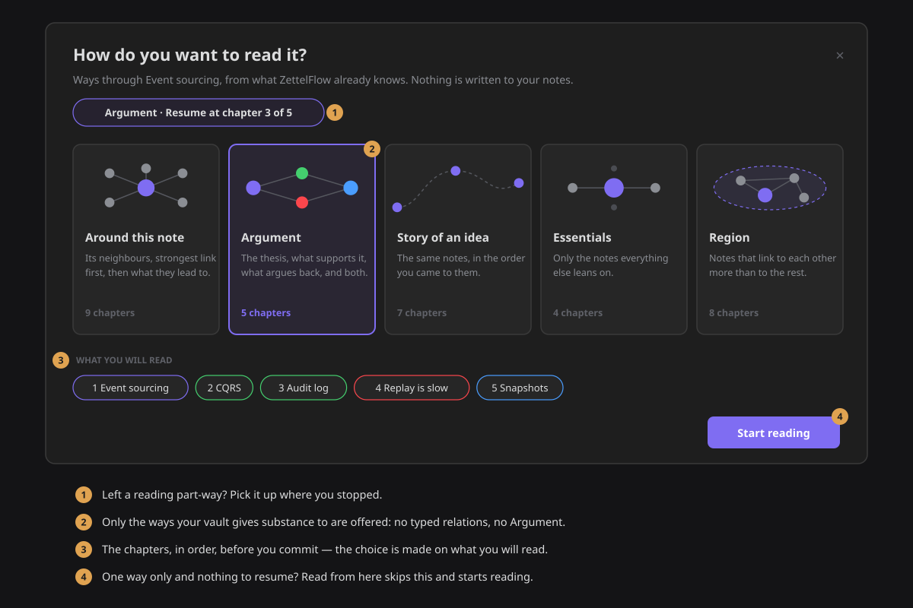
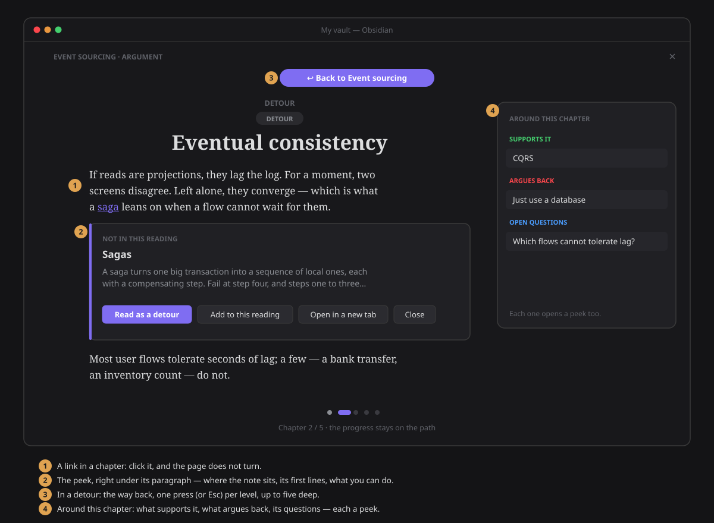
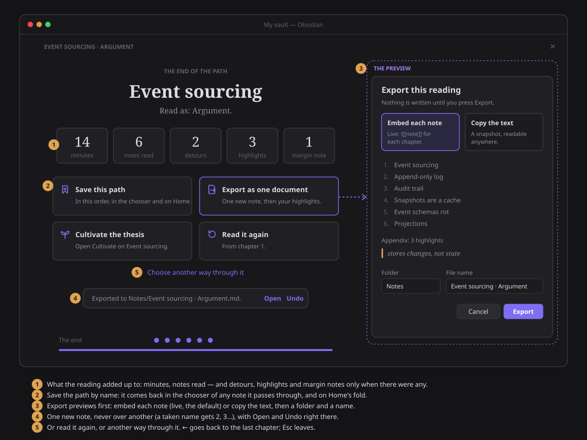

# The Reader

**Follow ideas, not files.** The Reader turns a handful of related notes into something you read
from start to finish, the way you read a book. It takes the whole window, gives you one chapter at a
time, and steps out of the way while you read.

## Open it

The Reader also reads your **PDFs** — a paper's pages reflowed into the same column, with the same
highlights — from the [Library](library.md).

- **Right-click any note → Read from here.** That is the whole setup. You don't need a map of
  content or a list of relations: the note you right-click is where the reading starts.
- **This note → ⋯ → Read around this note**, from the note you are on.
- **Right-click several notes → Read these**, or **right-click a folder → Read this folder**.
- **Explore → Read these**, beside *Copy as links*, reads what your question selected.
- **Command palette → "Read from the active note"**, which you can bind to a hotkey.

The sidebars fold away and the Reader takes the window. When you leave, with **Esc**, the **×** or
the command **Reader: exit**, the page fades out, the reader's tab closes, and your workspace comes
back exactly as it was: the sidebars that were open open again, and you return to the tab you were
in, where you left it. Closing the tab any other way gives everything back too, and so does a reader
left open across a restart.

## Choosing what to read

When there is more than one good way through a note, *Read from here* asks **how do you want to
read it?** Each way shows its shape, what it promises and the chapters it would read, so you choose
on what you will actually read.

| Way | Reads | Offered when |
|---|---|---|
| **Around this note** | the note, its neighbours strongest link first (counterpoints, supports, examples, other typed relations, plain links), then the notes two steps away that most of them touch, then notes near it you never linked | always — it is the default |
| **Argument** | the thesis, what supports it, what argues back, then the notes that speak to both sides | the note has typed `supports` / `contradicts` relations |
| **Story of an idea** | the same notes as *Around*, in the order you first worked on them (decisions, moves, creation date) | at least three chapters, on at least two different dates |
| **Essentials** | only the hubs around the note: the notes linked three times or more, most linked first, at most seven | it leaves something out |
| **Region** | the note's region of your graph: notes that link to each other more than to the rest, its hub first | the region has three notes or more, not all already its neighbours |

Every way reads at most twelve chapters, and only notes your vault actually has. A way that would
read exactly the same chapters as one already offered is not offered twice. When only one way
applies and there is nothing to resume, the chooser is skipped and the reading starts.

**Read these** and **Read this folder** read the notes you picked (up to sixty) in the order their
links suggest: each next chapter is the note most linked to the ones already read.

### Resume

Leave a reading part-way and the Reader remembers the chapter. Next time, the chooser offers
**Resume at chapter n**; a picked set or a folder reopens where you left that same set. Reaching the
last chapter, or going back to the first, forgets the place. The Reader keeps the forty most recent
places, in the plugin's settings — a picked set is kept as a fingerprint, not a list of your notes.

## Chapters and roles

Every reading starts with the note you started from (a picked set starts with its first note). A
note joined both ways comes before one joined one way, and a typed relation before a plain link. No
unresolved links, attachments or self-links are read.

Each chapter carries its **role** relative to the note you started from, read off your typed
relations:

| Role | When |
|---|---|
| **Thesis** | the note you started from, when something supports it or argues with it |
| **Support** | a note joined to it by `supports` |
| **Counterpoint** | a note joined to it by `contradicts` |
| **Synthesis** | in an *Argument*, a note that speaks to both sides |
| **Context** | anything else |

## Reading

| Key | Does |
|---|---|
| **→**, **Page down** | next chapter |
| **←**, **Page up** | previous chapter |
| **Space** / **Shift+Space** | a screen down (up) the chapter, and the next (previous) chapter once you reach its end |
| **↓** / **↑** | scroll the chapter a little |
| **Home** / **End** | first / last chapter |
| **F** | fullscreen (desktop) |
| **H** / **Shift+H** | highlight the selected words / highlight them and write a note |
| **?** | the keyboard shortcuts, on the page (also a button in the bar) |
| **Esc** | one thing at a time, nearest first: close the shortcuts, the highlight popover, a peek, step back from a detour, close a panel, leave fullscreen, then leave the Reader |

The keys work whenever the Reader is the active tab, wherever the focus is: they are registered the
way Obsidian's own views register theirs, so they never fight a hotkey of yours. **Ctrl**, **Cmd**
and **Alt** combinations are always Obsidian's, and a key typed into a margin note or a name is
never taken.

Three **commands** do the same from the palette, and you can bind them to hotkeys of your own. They
appear only while a reading is the active tab, and none has a default hotkey:

| Command | Does |
|---|---|
| **Reader: next chapter** | the next chapter (the end card after the last) |
| **Reader: previous chapter** | the previous chapter |
| **Reader: exit** | leave the Reader and get the workspace back |

The **bar** at the bottom appears when you move the mouse and fades after two seconds, and the
pointer fades with it. It holds:

- the chapter you are on, your progress through the path, and **about how many minutes are left**
  in this chapter (at 220 words a minute, counted down as you scroll);
- **Contents**, the chapters with their roles;
- **Type**;
- **Around this chapter**, with what supports it, what argues back and its open questions;
- **Fullscreen**;
- **Keyboard shortcuts**.

A **hairline** across the very top fills as you scroll through the chapter. At the end of it, the
way on lights up: **Next · *its name* · *how long it is***.

### A reader that feels good

- **The measure of a book.** About 68 characters to a line, with ragged edges evened out, long words
  hyphenated and generous leading, in your theme's font or a serif.
- **Pages that turn.** Going forward the page slides in from the right; going back, from the left.
  Each chapter opens in order: its number, its role, its title, then the words.
- **A marker, not a stamp.** A new highlight is swept across the words like a marker pen.
- **Focus mode** (in **Type**): every paragraph but the one at your reading line steps back, so your
  eye stays where you are. It is remembered for next time.
- **Calm when you read.** Opening, the page rises out of the workspace; leaving, it sinks back.
- **Less motion, if you asked for it.** With your system's *reduce motion* setting on, every one of
  these is instant: nothing slides, sweeps or fades.

Chapters are drawn by Obsidian's own Markdown renderer, so callouts, embeds, math and your theme look
as they do everywhere else.

## Links, detours and context

Getting lost is the main way reading fails in a linked vault: you follow a link, then another, and
the thread is gone. So a link in the Reader is a **peek**, not a jump.

Click a link and a card opens right under the paragraph that holds it. It says where the note sits
(*Chapter 3 of this reading*, or *Not in this reading*), shows the note's first lines, and offers:

| Action | Does |
|---|---|
| **Read as a detour** | reads the note now, then brings you back. A pill at the top says *↩ Back to …*; one press, or **Esc**, steps back one level. Detours can nest five deep. |
| **Jump to the chapter** | when the note is already a chapter of this reading |
| **Add to this reading** | puts the note right after the chapter you are on, for this reading only |
| **Open in a new tab** | as Obsidian would |

- While you are in a detour the counter says *Detour* and the progress stays on the path. The arrow
  keys move along the path, leaving the detour behind.
- **Mod-click** a link to open it in a tab without a peek, and **Ctrl/Cmd-hover** it for Obsidian's
  own page preview.
- A link to a note that does not exist yet only says so: following it would create the note, and the
  Reader writes nothing.

The **Contents** panel lists the chapters with their roles, ticks the ones you have read and marks
where you are. **Around this chapter** lists what supports it, what argues back and its open
questions, read from the same model as [This note](this-note.md). Each of those is a peek too.

## Highlights and notes in the margin

Reading well means stopping at the sentence that matters. Select some words in a chapter, as you
would on a Kindle — with the mouse, the keyboard, or a long-press on a phone — and a small popover
offers **Highlight**, **Highlight and note** or **Copy** (or press **H**, or **Shift+H** for the
note). A drag that ends past the text, in the margin or below the last line, still counts.

- **A highlight is a thought.** It lands in [Think](../architecture/thought-lab.md), about the note
  you were reading, carrying the passage you picked and the heading it sat under. Your note is the
  thought's text. Open Think on that note and the passage is there, quoted above what you wrote, with
  **Open in the Reader** to come back to the exact place.
- **The note is never touched.** Nothing is added to it: no marker, no block id, no property. The
  highlight is found again every time you read, by looking for the same words and the words around
  them, so it survives edits elsewhere in the note.
- **Detached, never lost.** If the passage was edited away, the highlight is listed under
  **Detached** with its note and a way to open it in Think.
- **Click a highlight** to see its note, add or edit one, delete it, or open it in Think. A
  highlight with a note has a dotted underline.
- **In the margin.** On a wide pane your highlights are listed beside the page, in reading order;
  click one to go to it. On a narrow pane the same list is under **Around this chapter**.
- **Everything can be undone.** Highlighting, editing and deleting are recorded writes of a thought,
  in the [write record](../architecture/reversibility.md), and each answer offers **Undo** in place. A
  deleted highlight goes to the trash, not away.
- **It comes back.** A few days later, what you marked returns as a card, with one question: do you
  still think so? See [A few things you marked](highlights-review.md).
- **Your story shows it.** In [This note](this-note.md), a highlight appears in the story as a thought
  with its passage quoted.

## The end of a path

Past the last chapter — **Next**, **Space** or **Finish** — the reading does not just close. An
end card says what it added up to and what you can do with it.

- **What it added up to.** The minutes it took, the notes you read, and — only when there were any
  — the detours you took and the highlights and margin notes you made in this reading. No zeros, no
  score: a reading is not graded.
- **Save this path.** Name it (it proposes the note and the way you read it) and the path is kept,
  in this order, in the plugin's data. It comes back as **Your saved paths** in the chooser of any
  note it passes through — read it again, rename it in place, or delete it — and as **Saved
  readings** in Home's **Show everything** fold, one click back into the Reader — and on the
  [Library](library.md)'s shelf, with how far you are and what you marked. Saving again
  under a new name renames it; the same chapters are never kept twice.
- **Export as one document.** A preview first: the chapters, an appendix of your highlights on
  them, and how each chapter is carried — **Embed each note** (the default: `![[note]]`, live,
  nothing duplicated) or **Copy the text** (a snapshot, readable anywhere). Pick the folder (it
  proposes the folder the reading started in) and the file name, then **Export**. One new note is
  created — never over an existing one: a name that is taken gets *2*, *3*… The card says where it
  went, with **Open** and **Undo**; undo sends it to the trash.
- **Cultivate the thesis.** Gives the workspace back and opens
  [Cultivate](cultivate.md) on the reading's thesis — or the note it started from.
- **Read it again** from chapter 1, or — for a way through a note — **choose another way
  through it**.

**←** goes back to the last chapter; **Esc** leaves the reader.

## Type and reading themes

The **Type** panel sets the font (your theme's own, or a serif), three sizes, a reading theme and
**Focus mode**. The choices are kept for next time.

| Theme | Looks like |
|---|---|
| **Your theme** | the reader uses whatever Obsidian looks like now |
| **Light** / **Dark** | your theme's own light or dark palette, for the reading column only |
| **Sepia** | the light palette warmed with your theme's yellow |

No colour is invented: every look comes from your theme.

## What it writes

**Nothing, to any note you read.** Reading is the whole job, and a test holds the line: nothing in
the Reader reaches a file writer — except **Export**, the one button that makes a note, and only
when you press it: create-only, through `FileService`, in a recorded batch you can undo. The one
thing you can make while reading — a highlight — is a **thought** in Think, written through the
thought store like every other thought, and a second test holds that line too. The only things it remembers are where you are in a reading (in the workspace
layout, and the resume places in the plugin's settings), your type choices and the paths you saved
(in the plugin's settings). Choosing a way through a note writes nothing either, and neither do peeks, detours or
adding a note to a reading — an added note lasts as long as the reading on screen.

## For contributors

- The view is `ReaderView` (`zettelflow-reader`), a standalone `ItemView` like *This note*, and
  `openReader(app, seed)` is its only opener.
- The opener snapshots the sidebars, folds them and opens one reader leaf. `restoreWorkspace` gives
  them back, once.
- The snapshot also lives in the view state, so a reader left open across a restart still restores.
- Keys (#667) are registered on the view's `scope` (`new Scope(app.scope)`), which Obsidian's keymap
  consults for the active leaf whatever has focus. A handler returns `false` when it took the key;
  Esc is always taken, or Obsidian's global Esc would move the focus to another tab. The three
  commands live in `ReaderComponent` and use `getActiveViewOfType(ReaderView)`.
- `ReaderView.exit()` adds `reader--leaving`, waits for the fade (instant under reduced motion) and
  calls `exitReader`: restore the sidebars, re-activate the previous leaf, detach.
- Obsidian sets `body { user-select: none }`; `reader.scss` gives `user-select: text` back to the
  chapter body, or nothing in it could be selected — the cause of "highlighting does nothing".
- The progress numbers are pure (`readerPace.ts`); focus mode marks the block at the reading line
  with an `IntersectionObserver` on the stage.
- The ways come from pure generators in the State layer (`readingPath.ts`): `aroundThisNote`,
  `argumentPath`, `storyPath`, `essentialsPath`, `regionPath` and `selectionPath`, offered together
  by `readingPathOptions(model, seed, inputs)`. They are on `zf.knowledge.readingPaths` and
  `zf.knowledge.readSelection`; `readFromHere` stays.
- What the model does not hold — the near-but-unlinked notes (the resurface ranking) and when each
  note was first worked on (decisions and moves) — is read once, in `readerPaths.ts`, and handed in.
- The chooser is `ReadingPathModal`; `readFrom` and `readSelection` are the doors' shared entry
  points. The view state carries `kind` and, for a picked set, its `paths`.
- Highlights (#671) are `ReaderHighlights` (`readerHighlights.ts`): selection → popover → a thought
  written by `ThoughtStore.write(text, { about, quote })` inside a recorded batch. The anchor is a
  text quote (`exact`, `prefix`, `suffix`, ~32 characters each, plus the `heading`), matched by the
  pure `anchorQuote` in `application/thinking/quoteAnchor.ts` with whitespace folded. `readerMarks.ts`
  wraps the matched span in one `<mark>` per text node. `openReader(app, { seed, highlight })` lands
  on one.
- The end of a path (#672): `readerEnd.ts` renders the card (it writes nothing; every action is a
  callback from the view). Saved paths are pure (`readerSaved.ts`: newest first, at most 30, one
  entry per set of chapters) in `settings.readerSaved`, reopened as a `selection` with a `name`.
  The document is built by the pure `buildReadingDocument` (`readerDocument.ts`); `readerExport.ts`
  is the preview and the only reader file a test lets reach `FileService`. Cultivate takes a
  `target` in its view state.
