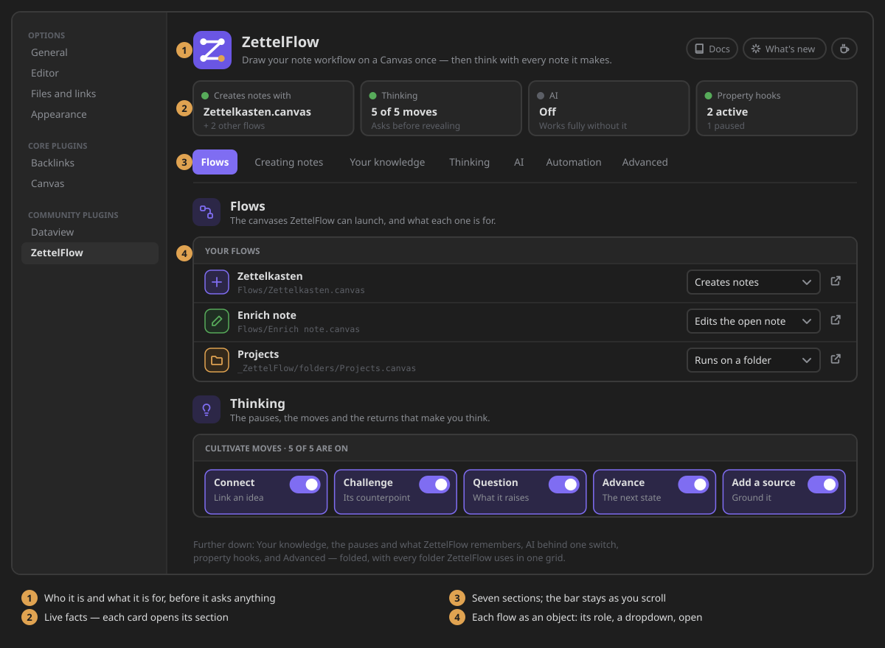
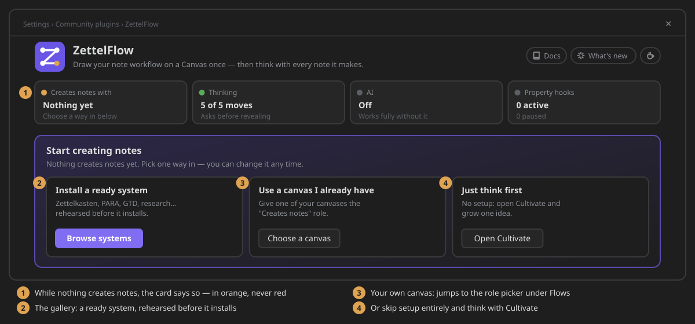
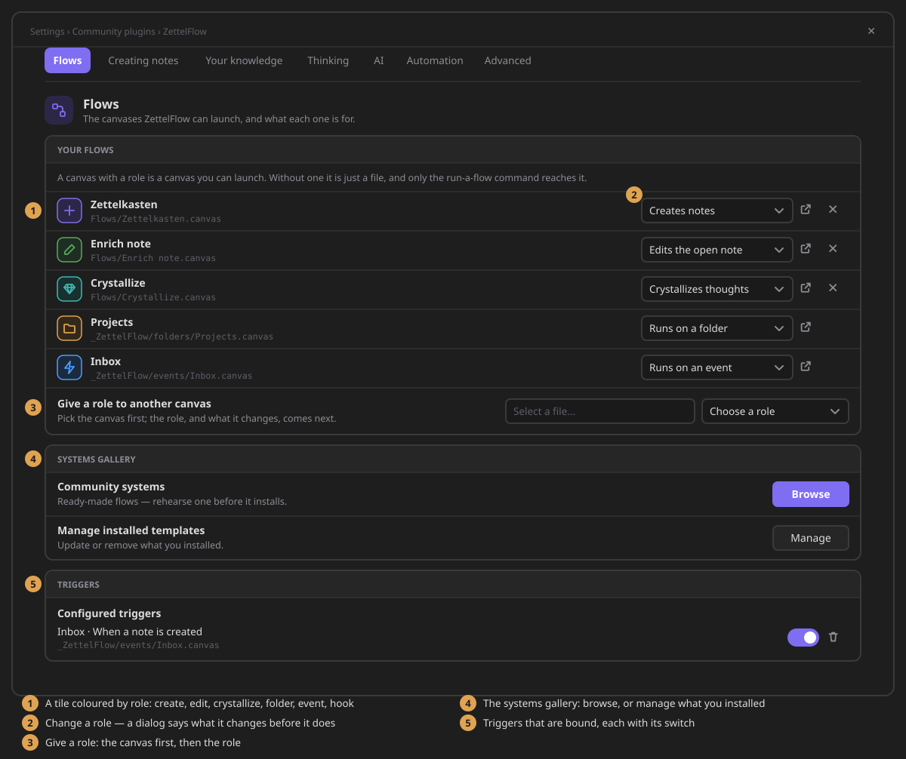
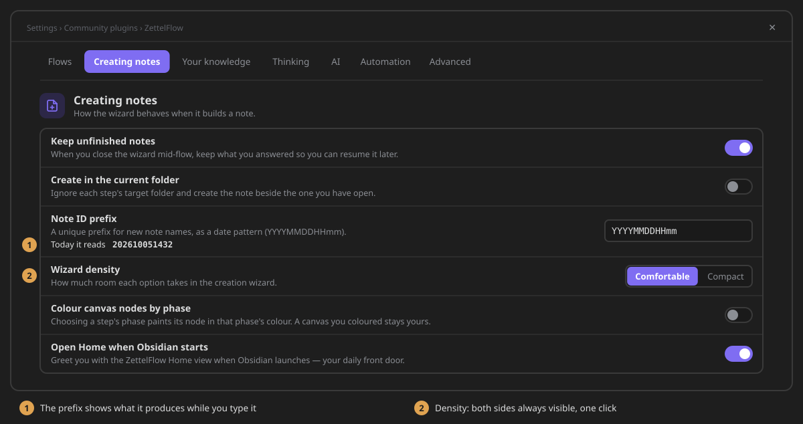
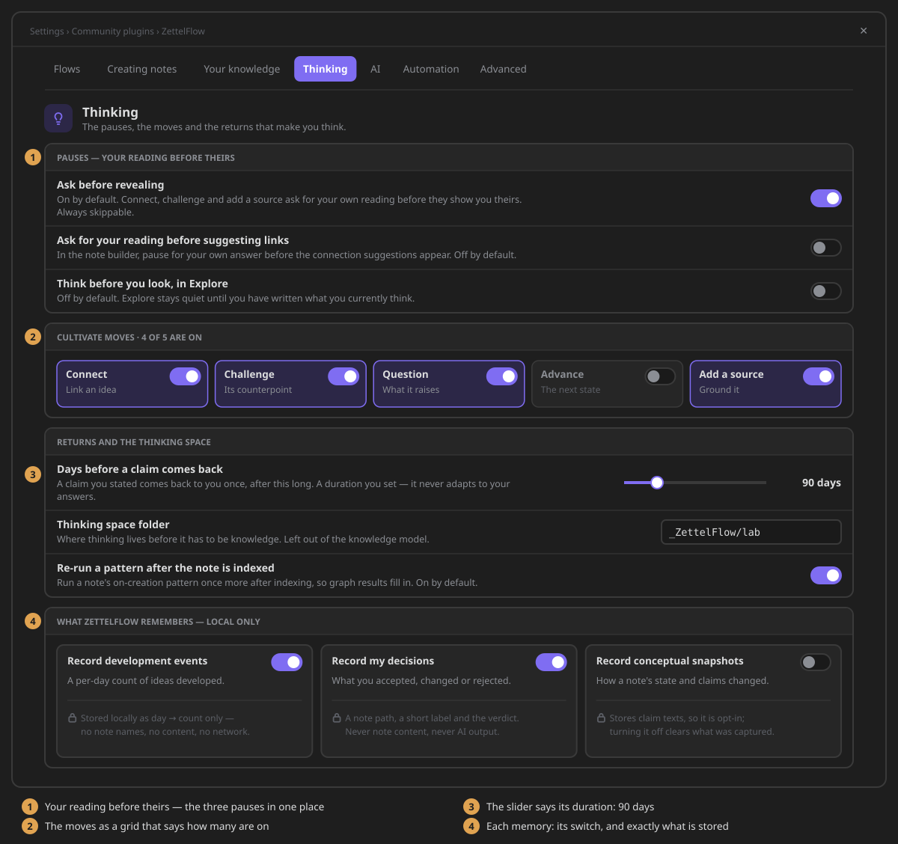
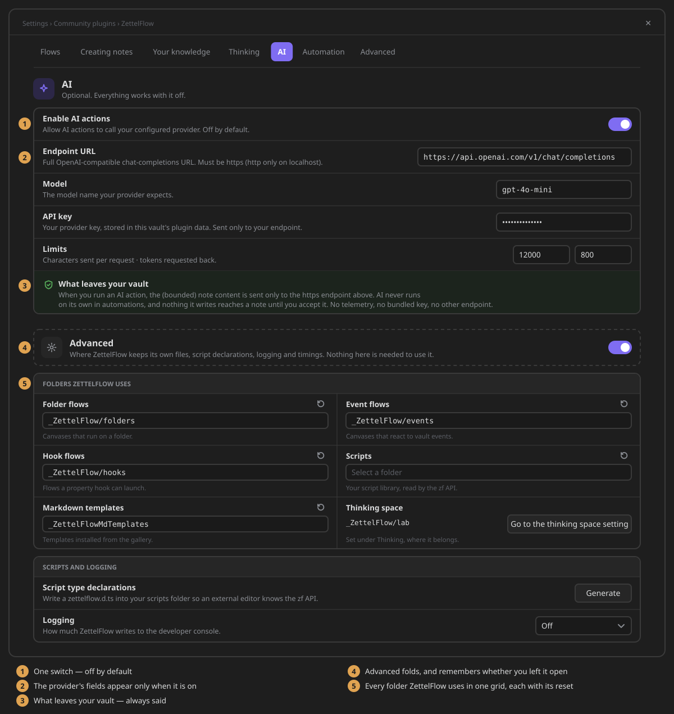

# Settings, section by section

Open **Settings → ZettelFlow**. The tab tells you who it is and what is on before it asks you
anything. After that it reads as **seven sections**, organised by what you are doing rather than by
when each feature was written. Every row is still found by Obsidian's own settings search.

## The top of the tab

- **The header** — the ZettelFlow mark and what it does in one line, followed by three small links:
  the documentation, what is new in the version you run, and how to support the project.
- **At a glance** — four cards that say what is on right now. Each one opens its section:
    - **Creates notes with** — the canvas your ribbon creates notes with, plus how many other flows
      have a role. It is orange when nothing creates notes yet.
    - **Thinking** — how many of the five Cultivate moves are on, and whether a move asks for your
      reading before it reveals its own.
    - **AI** — *Off*, or *On* with the model you configured and its endpoint's host.
    - **Property hooks** — how many run and how many are paused.

  The cards are derived from your settings, never stored, so they cannot drift from them.
- **The section bar** — one button per section. It stays at the top while you scroll, and marks the
  section you are reading. It keeps to one line: when the names do not fit, the sections you are not
  in show only their icon (their name is the tooltip).

## A fresh vault: three ways in

While no canvas creates notes, a **Start creating notes** card sits under the at-a-glance cards.
Pick one way in, and change it any time:

- **Install a ready system** — Zettelkasten, PARA, GTD, research… from the
  [systems gallery](../how-to-contribute/systems-gallery.md), rehearsed before anything is written.
- **Use a canvas I already have** — jumps to *Give a role to another canvas* under Flows, so one
  of your canvases can take the *Creates notes* role.
- **Just think first** — no setup at all: [Cultivate](cultivate.md) opens and you grow one idea.

The card goes away by itself once a canvas creates notes.

## Flows

*The canvases ZettelFlow can launch, and what each one is for.* A canvas with a role is a canvas
you can launch. Without one it is just a file. See [your flows and their roles](../architecture/flow-roles.md).

- **Your flows** — each canvas that has a role, as one row:
    - a tile coloured by its role: create uses the accent, edit green, folder orange, event blue,
      hook purple;
    - the canvas name and its path;
    - a dropdown to change the role. A confirmation says what will change before anything does;
    - *Open*, and for an exclusive role (*Creates notes*, *Edits the open note*), a way to drop
      the role.
- **Give a role to another canvas** — pick the canvas first; the role, and what it changes, come
  next.
- **Systems gallery** — *Browse* the community systems, or *Manage* the ones you installed.
- **Triggers** — the triggers bound to your event flows, each with its own switch. The folder event
  flows live in is set under Advanced, with the other folders.

## Creating notes

*How the wizard behaves when it builds a note.*

| Setting | What it does | Default |
|---|---|---|
| **Keep unfinished notes** | Close the wizard mid-flow and resume later. Stored locally with your plugin settings. | On |
| **Create in the current folder** | Ignore each step's target folder and create the note beside the one you have open. | Off |
| **Note ID prefix** | A unique prefix for new note names, as a date pattern. It previews as you type: *Today it reads 202610051432*. An empty pattern means no prefix. | Empty |
| **Wizard density** | *Comfortable* or *Compact*: how much room each option takes. | Comfortable |
| **Colour canvas nodes by phase** | Choosing a step's phase paints its node in that phase's colour. A canvas you coloured stays yours. | Off |
| **Open Home when Obsidian starts** | Greets you with [ZettelFlow Home](zettelflow-home.md). | On for new installs |

## Your knowledge

*What counts as knowledge, and how ZettelFlow reads it.*

- **Kept out of the thinking system** — the excluded folders, shown as removable chips with a
  folder search to add one. Notes under them never enter the graph, Health, discovery, Cultivate or
  Home. ZettelFlow's own folders are always left out. More in [knowledge scope](knowledge-scope.md).
- **Lifecycle properties** — the frontmatter keys for a note's *state*, its *created* date and its
  *last reviewed* date, side by side. The defaults are `state`, `created` and `last-reviewed`.
  They are plain properties, so there is no lock-in.
- **Typed links** — *Parse inline relations* also reads `key:: [[note]]` fields in note bodies.
  It is on by default on desktop and off on mobile.

## Thinking

*The pauses, the moves and the returns that make you think.*

- **Pauses — your reading before theirs.** Three switches in one place:
    - **Ask before revealing** (on): Connect, Challenge and Add a source ask for your own reading
      before they show you theirs.
    - **Ask for your reading before suggesting links** (off): the same pause in the note builder.
    - **Think before you look, in Explore** (off): Explore stays quiet until you have written what
      you currently think.
- **Cultivate moves.** Five tiles (Connect, Challenge, Question, Advance, Add a source), each with
  its switch. The card heading says how many are on.
- **Returns and the thinking space:**
    - **Days before a claim comes back** — a [claim you stated](claim-returns.md) comes back once,
      after this long. The slider says its value (7–365 days, default 90). It is a duration you set,
      never a repetition algorithm.
    - **Thinking space folder** — where [Think](../architecture/thought-lab.md) keeps your thoughts,
      outside the knowledge model. The default is `_ZettelFlow/lab`.
    - **Re-run a pattern after the note is indexed** (on) — so graph results fill in on the first
      pass.
- **What ZettelFlow remembers — local only.** Three tiles, each with its switch and a lock line
  that says exactly what is stored:

| Tile | Stores | Default |
|---|---|---|
| **Record development events** | A count per day, and nothing else: no note names, no content. It feeds [Practice](practice.md). | On |
| **Record my decisions** | A note path, a short label and your verdict. Never note content, never AI output. | On |
| **Record conceptual snapshots** | A note's lifecycle state and claim texts over time. Because it stores note content it is opt-in, and turning it off clears what was captured. | Off |

Nothing in this card ever leaves your vault.

## AI

*Optional. Everything works with it off.*

- **Enable AI actions** is one switch, off by default.
- Once it is on, the provider's fields appear:
    - **Endpoint URL** — any OpenAI-compatible chat-completions URL. It must be https; http is
      allowed only on localhost.
    - **Model**.
    - **API key** — stored in this vault's plugin data and sent only to your endpoint.
    - **Limits** — characters sent per request (12000) and tokens requested back (800).
- Whatever the switch says, a callout states **what leaves your vault**: only the bounded note
  content of an action you run, only to your endpoint. AI never runs on its own in automations, and
  nothing it writes reaches a note until you accept it.

Step by step: [AI provider setup](ai-provider-setup.md).

## Automation

*Scripts that run when a property changes.*

The **Property hooks** card has its actions on the right: the native properties pane, *Property
types*, and *Add hook*. *Add hook* is the primary action. Each hook reads as one line:
- what the hook is for, with *when `status` changes* under it;
- the property's type;
- a *Paused* badge when the hook is off;
- Obsidian's own switch, and *Edit*.

See the [worked examples](../vault-hooks/property-hooks/examples.md).

## Advanced

*Where ZettelFlow keeps its own files, script declarations, logging and timings. Nothing here is
needed to use it.* The section starts folded behind the switch on its own head, because nobody
should meet a log level on their first day. It remembers whether you left it open.

- **Folders ZettelFlow uses** — one grid, one cell per folder. Each cell has a folder search and a
  reset to its default:
    - *Folder flows* (`_ZettelFlow/folders`);
    - *Event flows* (`_ZettelFlow/events`);
    - *Hook flows* (`_ZettelFlow/hooks`);
    - *Scripts*;
    - *Markdown templates* (`_ZettelFlowMdTemplates`).

  The three flow folders refuse a folder that is the same as, or inside, another one: a canvas
  cannot be two things at once. A path is checked and saved when you leave the field, press Enter or
  pick a suggestion, never on a keystroke on the way there. The *Thinking space* cell shows its
  folder as read-only text (cut short with the whole path on hover), and its arrow takes you to the
  one place it is edited — the field itself under Thinking, ready to type.
- **Script type declarations** — writes `zettelflow.d.ts` into your scripts folder, so an external
  editor knows the zf API.
- **Logging** — *Off*, *Errors only*, *Warnings*, *Information*, *Debugging* or *Everything*.
- **Timings from this vault** — a small table of what ran, how long it took and over how many
  notes. It is read each time the tab is drawn.

The tab ends on one line: the version, the documentation, where to report a problem, and how to
support the project.

## For contributors

- **One native tab, built from declarations.** The tab is Obsidian 1.13's declarative settings
  (`getSettingDefinitions`): groups with headings, classes and `visible` predicates, plus `render`
  rows for the shell and the tiles. That is why Obsidian's settings search finds every row, and why
  a custom window would cost review score and be one more thing to learn.
- **No search box of our own.** Obsidian searches settings natively, and every row exposes its name
  and description to it. A second search would be a worse copy of the platform's.
- **No launchers and no documentation index.** The surfaces open from the menu button and the
  command palette; the docs are this site. A settings panel that launches and documents is a menu
  and an index wearing a panel's clothes, and it cost nine rows (#439). The one exception is the
  start card, shown only while nothing creates notes.
- **The renderer is the real one.** Re-renders run each row's old cleanup, then `clear()`, then
  `render` again, and finish with `setChildrenInPlace(groups)`. The sticky bar therefore stays inside
  its own row (`display: contents`), the hooks' React root is kept across `update()`, and the row
  styles are written against `.setting-group`. `test/support/settingsRenderer.ts` mimics that order,
  so it stays tested (#659).
- **Settings live in a window of their own** (Obsidian 1.14). Ask the element for its animation
  frame (`el.win.requestAnimationFrame`): the main window's never fires while it is hidden behind
  settings, which froze the section bar's marker (`test/architecture/popoutFrames.test.ts`). And
  never name a field `navEl` on a settings tab — that is the tab's own entry in Obsidian's sidebar.

_README vocabulary for this page: **Settings you can read**._
