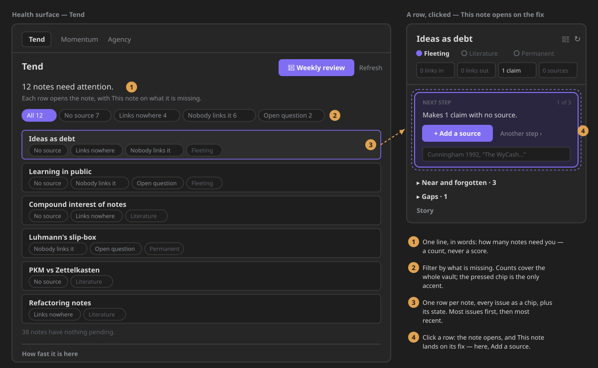

# Health › Tend

**Tend** is the first mode of the Health surface. It answers one question: *which notes need me,
and what is each one missing?* Every note appears **once**, with everything it lacks as chips, and
clicking a row opens the note **and** [This note](this-note.md) in the right sidebar, already on the
fix.



It replaced the old *Health* mode (#644, epic #639). That mode diagnosed and never helped: it said
*37 orphans*, could list the same note three times (in the summary, as unreferenced debt and as an
orphan), and its *Connect now* button only opened the note. Tend closes the loop.

## Opening it

- **Ribbon menu** › *Health* opens the Health surface on Tend.
- **Command palette** — *Show health*. The older *Show slip-box health* and *Show knowledge
  dashboard* commands still work and land here; their ids did not change.
- A workspace saved on the old `health` mode switches to Tend in place.

## What a row says

Each row is one note: its name, one chip per issue in this order, and a chip with its lifecycle
state.

| Chip | It means | It is the same answer as… |
|---|---|---|
| **No source** | the note makes a claim and cites nothing | the next move *add a source* |
| **Links nowhere** | the note links to no other note | the next move *connect* |
| **Nobody links it** | no other note links to it | the *unreferenced* debt category |
| **Open question** | it asks a `question` nothing has answered yet | the *open question* debt category |

Tend defines none of these itself: it reads `suggestNextMoves()` and the knowledge-debt categories
as they are. So when a row says *No source*, the next-step card in This note is guaranteed to offer
*Add a source*. One consequence: a note whose only link points to itself counts as linked, because
both of those functions count it.

Rows are ordered by **number of issues** (most first), then **most recently changed**, then path.
The list shows the first 200 and says *+N more notes* below; the counts always describe the whole
vault. Under the list, a faint line says how many notes have nothing pending.

Nothing here is a grade (§XII): no score, no percentage, no colour for an issue. The only accent is
the filter you pressed.

## Filtering

The chips above the list — *All* and one per issue that some note has, each with its count — filter
the rows. Empty chips are not drawn. The filter is not remembered: Tend opens on *All*.

## Where a row takes you

Clicking a row (or pressing Enter on it) opens the note in the main area and This note in the right
sidebar, landed on the fix for the row's **first issue**, or for the filter's issue when a filter is
on:

| Issue | This note opens on |
|---|---|
| No source | the next-step card, on *Add a source* |
| Links nowhere | the next-step card, on *Connect* |
| Nobody links it | *Near and forgotten* — the notes to link it from |
| Open question | *Gaps*, where the question is listed |

This is the hand-over contract `openNoteCompanion(app, { path, focus, move })` described on the
[This note](this-note.md) page.

## The header, the pass and the timings

- **Weekly review** is the header's one primary action: it reads what this list shows and writes the
  note that summarises it ([second-brain review](second-brain-review.md)). **Refresh** sits beside it.
- **Reading notes: N of M — Stop.** When the inline-relation enrichment pass is running, its progress
  and a *Stop* button sit right under the lede. Stopping leaves the model consistent.
- **How fast it is here** — the timings from your last launch — is at the bottom, as facts with no
  grade. It is moving to Settings › Advanced (#645).

## States

| State | When | What you see |
|---|---|---|
| Indexing | the knowledge index is still building | one line, no list |
| Error | the vault could not be read | one line; the error is logged |
| Clear | no note has any issue | *No note needs attention.*; no chips, no list; the weekly review stays |
| Ready | at least one note needs you | the lede (*12 notes need attention.*), the chips and the list |

Tend refreshes itself shortly after the vault changes, and keeps the list you are looking at when
nothing changed.

## What left, and where it went

| The old Health mode had… | Now |
|---|---|
| A summary line (*scanned · orphans · dead ends*) | Tend's lede and chip counts |
| Connectivity and *today* panels | Home shows what to process, open questions and gaps; contradictions are in This note's *In tension* and Cultivate |
| The knowledge-debt score and its bar | gone from the screen — a score of your vault is a grade (§XII). Its categories are two of Tend's chips |
| Knowledge balance percentages | gone; its one actionable nudge (*add sources*) is the *No source* chip |
| Separate orphan and dead-end lists | one row per note, with *Links nowhere* / *Nobody links it* chips |
| *Unexamined ideas* | Home's *re-engage* recommendation |
| *Connect now* (only opened the note) | a row opens the note **and** This note on the fix |

Every one of those projections is still available to scripts through [`zf.knowledge`](../api/ZettelFlowAPI.md)
(`debt`, `balance`, `dashboard`, `health` …), and Tend's own list is `zf.knowledge.tend()`.

## Architecture

```
deriveTend(model)                      (pure State projection, once per model revision)
  ← suggestNextMoves(model, path)        no source · links nowhere
  ← computeKnowledgeDebt(model)          nobody links it · open question
  → { rows, counts, clear }              ordered; tendFocus(row, filter) → where a row lands

TendRenderer (Health surface, mode "tend")
  debounced resolved/rename/delete → recompute (skipped when the revision did not move)
  header: weekly review (primary) + refresh · lede · pass row · chips · ≤200 rows · clear line · timings
  row click → openLinkText(path) + openNoteCompanion(app, { path, focus, move })
```

Performance budget: `analysis.tend.10k` — the list over 10,000 notes, uncached
([budgets](performance-budgets.md)).
