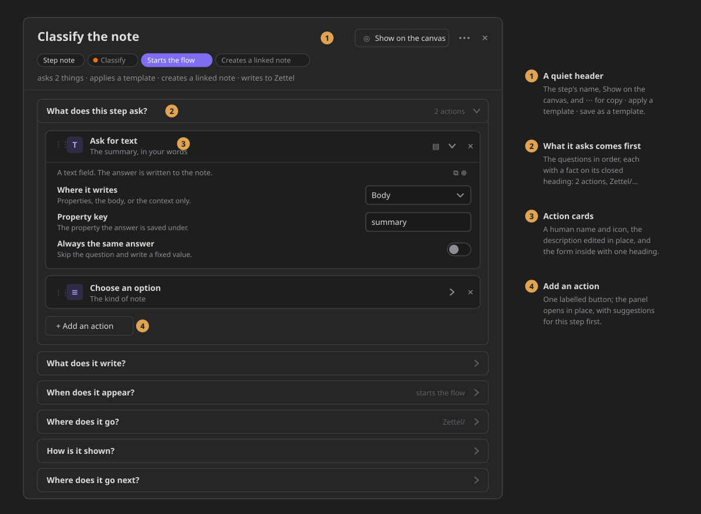
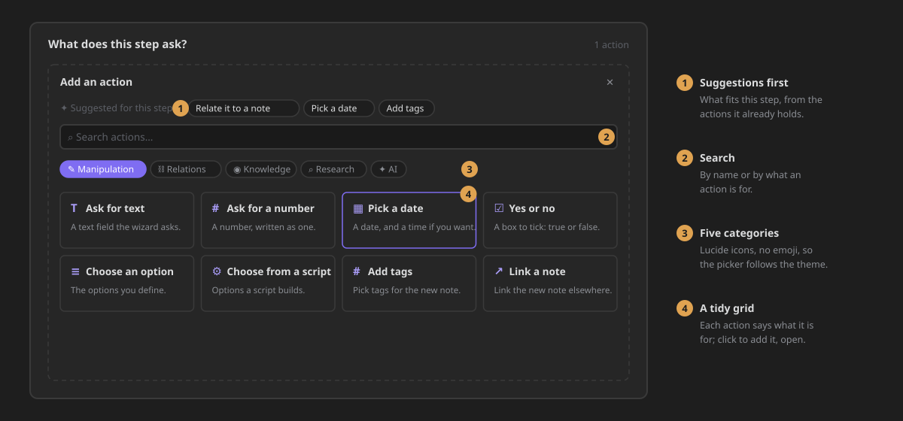
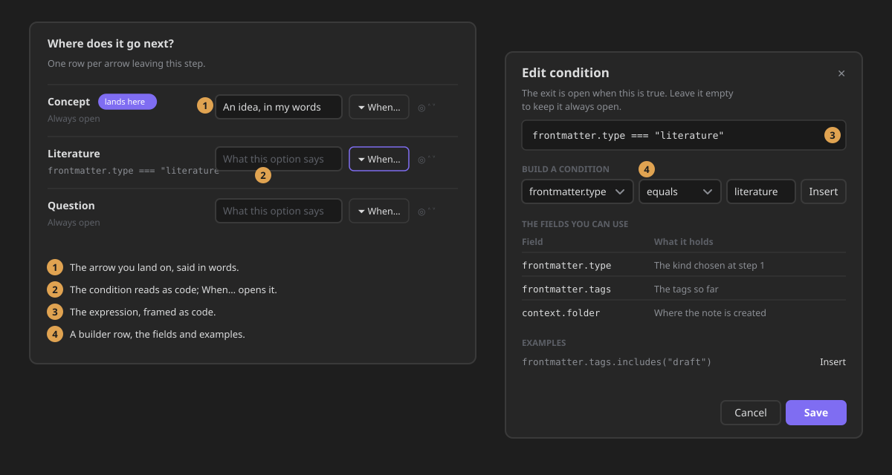

# Configure a step: the step editor

A flow's **steps** are configured in the **step editor**. It tells you what the step asks, what it
writes, when it appears, where its note goes, how it is shown and where the flow goes next. Open it
from the canvas: select a step and press **Edit step** in the selection toolbar, or right-click it.
A step note also opens it from its file menu (**Edit step**).

**A note on the canvas becomes a step from its node.** Right-click a file node on a flow canvas:
a plain note offers **Make this note a step**, and a note that already is one offers **Edit step**,
**Copy** and **Remove step configuration** (and **Paste** when a step is on the clipboard). The
note's markdown stays its template; the step is kept in its frontmatter beside it. These items only
appear on a flow canvas — never on a plain canvas or in the file explorer.

## The header

- **The step's name** is the heading: its option label, else its file name.
- **Show on the canvas** selects the step's node and centres it. It appears when the step is on an
  open canvas.
- **⋯** holds the rest, named: **Copy this step**, **Apply a template…** and **Save as a
  template**. Applying a template shows what it will change before it changes anything.

Under the name, a row of chips says what the step **is**: a step note, an inline box or a group;
its phase, with the colour the canvas paints it; whether it starts the flow, runs on an event,
pauses for you, can be skipped or creates a linked note. One line says what it **does**, for
example *asks 2 things · applies a template · writes to Zettel*.

## The questions

The settings answer six questions, in this order. Each one is a card you open and close. A closed
card still says what it holds on its heading: *2 actions*, *starts the flow*, *Zettel/*.

| Question | Holds |
|---|---|
| **What does this step ask?** | the step's actions, as cards (always open) |
| **What does it write?** | the note body template, then the linked note (always open) |
| **When does it appear?** | starts the flow · runs on an event · pause before this step · can be skipped |
| **Where does it go?** | the target folder |
| **How is it shown?** | the option label · the knowledge phase · the line that explains the options |
| **Where does it go next?** | one row per arrow leaving the step |

A question with nothing to configure for this kind of step is left out rather than shown empty.

## The actions

Each action is a **card**:

- a **handle** to drag it into another order;
- its icon and its **name**, which says what it does: *Ask for text*, *Pick a date*, *Choose an
  option*, *Add tags*, *Link a note*;
- the **description** you give it, edited right on the card;
- **documentation**, **open** and **remove**.

Open a card and the action's own form appears under it: one line saying what the action does, its
settings, and two quiet buttons to **copy the action** or **save it as a template**.

**Add an action** opens a panel in place:

1. **Suggested for this step**: actions that go well with the ones it already holds.
2. **Search**, by name or by what an action is for.
3. **Five categories** (manipulation, relations, knowledge, research, AI), each with its icon.
4. **The grid**: every action with what it is for. Click one to add it. Saved action templates are
   in the grid too, marked **Template**.

A copied action can be pasted into another step with **Paste the copied action**.

## Where it goes next

On a canvas, **Where does it go next?** lists one row per arrow leaving the step:

- the **destination**, with **lands here** on the one the wizard starts on;
- **when it opens**: *Always open*, or the condition, shown as code;
- **what the option says** in the wizard;
- **When…** opens the condition editor; the other buttons mark the arrow you land on and change the
  order.

The **condition editor** explains itself in one line, frames the expression as code, and helps you
write it: a builder row (field · operator · value → **Insert**), the fields you can use and what
each holds, and examples you insert with one click. **Cancel** and **Save** sit at the bottom, the
primary one on the right.

## Words you will see

| In the editor | What it means |
|---|---|
| **Starts the flow** | the wizard offers this step first (it used to read *root toggle*) |
| **Can be skipped** | the wizard shows *Skip this step* (was *optional toggle*) |
| **Explains the options** | a line the wizard shows above this step's options (was *children header*) |
| **Option label** | what the option reads in the wizard; empty uses the file name |
| **Where it writes** | properties, the body, or only the context the next steps read |
| **Property key** | the property the answer is saved under |
| **Always the same answer** | skip the question and write a fixed value |

## How to verify

| Command | Proves |
|---|---|
| `npx jest test/zettelkasten/stepEditorSurfaces` | the header and its menu, *asks* first with the cards, the body before the linked note, the action cards' names and controls, the add button, one heading level inside a form, the human setting names |
| `npx jest test/zettelkasten/stepGroups` | every handler has a home; each group's heading fact |
| `npx jest test/styles` | theme variables only, the 4-pixel grid, the shared chip shape |

In a vault:

1. Open a flow canvas, select an inline box and press **Edit step**. The heading is the step's
   name. **Show on the canvas** and **⋯** sit beside it, and **⋯** lists *Copy this step*, *Apply a
   template…* and *Save as a template*.
2. **What does this step ask?** is the first card, open, with *N actions* on its heading.
3. Each action reads as its human name (*Ask for text*, not *prompt*). Type in its description;
   close and reopen the editor; the description is kept.
4. Open a card: one line about the action, then its settings. There is no second title.
5. Press **Add an action**: suggestions (once the step holds an action), search, five categories
   with icons, a grid. Click a tile: the panel closes and the new card appears; the heading count
   goes up by one.
6. **What does it write?** starts with *Note body*, then *Also create a linked note*. Turn it on: the
   linked note's fields appear under it, indented.
7. **When does it appear?** reads *Starts the flow* and *Can be skipped*.
8. On a step with arrows, **Where does it go next?** shows one row per arrow, the condition in
   monospace, and **When…** opens the condition editor with its intro, builder, fields and examples.
9. Negative: an empty step shows *This step asks nothing yet…* and no empty card; closing the editor
   without changes leaves the step's settings exactly as they were.
