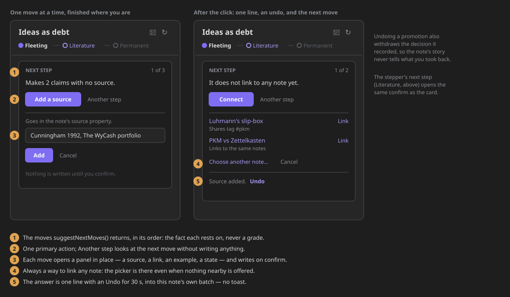
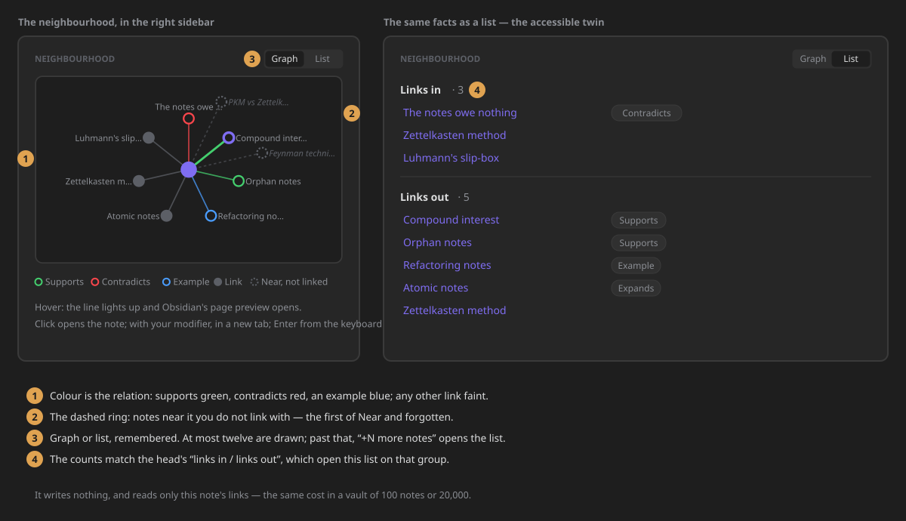
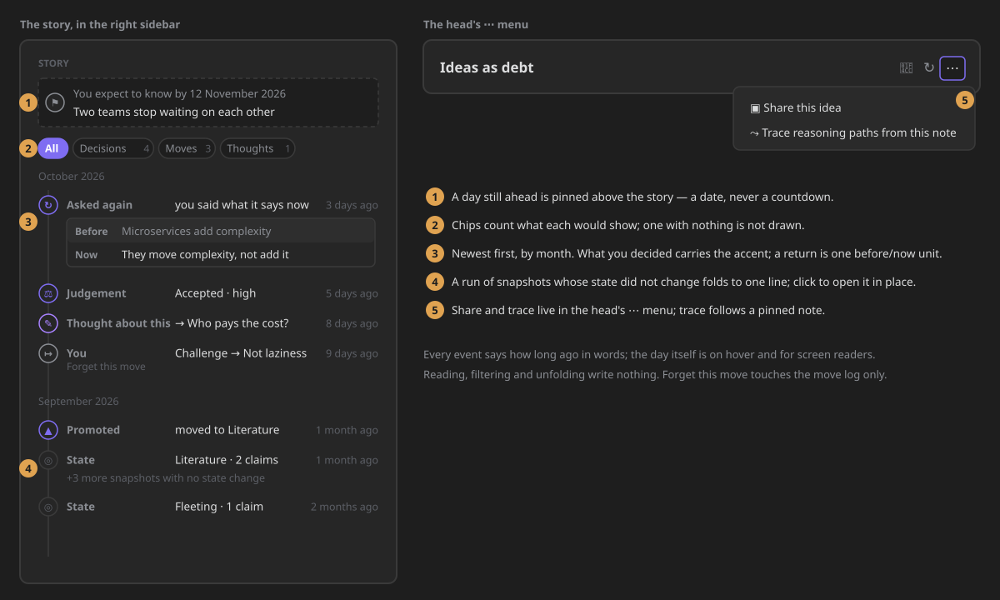

# This note

**This note** is the note you are reading, seen from the right sidebar: where it stands, what
surrounds it, and how it got here. It docks beside the editor and follows the active note, the way
Backlinks and Outline do, so the answer to *"what about this note?"* is always one glance away.

## Opening it

- **Ribbon menu** — the ZettelFlow ribbon button › **This note**. It opens in the right sidebar.
- **Command palette** — **"Show this note in the sidebar"** (`open-note-companion`).
- **Every command that opened the old Timeline mode** still works and lands here:
  *Show evolution timeline*, *Show notes history*, *Show evidence map* and
  *Resurface related notes*. Their ids did not change, so existing hotkeys keep working.
- **From Health › [Tend](slipbox-health-dashboard.md)** — a row opens its note *and* This note,
  landed on what the row said was missing: the next-step card on *Add a source* or *Connect*,
  *Near and forgotten* for a note nobody links, *Gaps* for an open question.

There is only ever one. Opening it again reveals the one you have, wherever you put it. If you
drag it into the main area it stays there.

## Following, and pinning

The companion **follows the active note**. Open a canvas, an image or a PDF and it says it has no
note to show, offering the last note it showed.

**📌 Pin** keeps it on one note while you open others. Click the pin again, or **Follow the active
note** in the banner, to go back to following. A pin survives a restart; a renamed note keeps its
pin; deleting the pinned note unpins it. Anything that opens This note **on a named note** — a
Tend row, a deep link — moves a pin to that note rather than ignoring it: you asked for that note by
name.

It redraws only when something it shows has moved — the note, the pin, the knowledge model, or the
decisions and moves its story reads. A save elsewhere in the vault does not take a half-typed source
or an open section from you; **↻ Refresh** always redraws. An inline answer (*Linked X · Undo*)
belongs to the note it was made on, leaves when you switch notes, and goes after thirty seconds even
if nothing else redraws.

**↻ Refresh** is the only refresh in the view. It also refreshes itself shortly after the vault
changes.

## The head

- **The title**, with the full path on hover. It stays in view while the rest scrolls.
- **The lifecycle stepper** — *fleeting → literature → permanent*, extended to *developing* and
  *evergreen* once a note has reached them. The current step carries the accent. A note that never
  stated a state reads *No state yet*, not *fleeting*. The stepper is read-only: moving a note on is
  a decision, and it has its own place.
- **Four counts** — links in, links out, claims, and distinct sources. They are facts, never a
  grade: there is no score, no band and no percentage, and a zero is drawn faint, never in a
  warning colour ([cognitive agency](cognitive-agency.md), constitution §XII). Each count opens
  where it is read: *links in* and *links out* open the **Neighbourhood**'s list on that group;
  *claims* and *sources* open the **Gaps** section, where the claims without a source are listed.
  A link counts when it is to another note: never to the note itself, to a note that does not
  exist yet, or to an attachment — the same rule the neighbourhood uses, so the two always agree.

## Next step

Under the head, one card says the note's **next step** and lets you finish it where you are.

The moves come from `suggestNextMoves()`, in its order, unchanged: **add a source**, **connect**,
**mark an example**, **move it on**. The card shows one at a time — *1 of 3*, with **Another step**
to look at the next — and says the fact the move rests on (*Makes 2 claims with no source*), never
how good the note is. When nothing is pending it says so once: *Nothing is pending — what remains is
to think with it.*

The primary action opens a small panel, and nothing is written until you confirm:

| Move | What you do | What is written, and where |
|---|---|---|
| **Add a source** | type a citation, a URL or a `[[note]]` | appended to the note's `source` property — or `sources`, if that is the key it uses. Existing entries are kept, including links to notes that do not exist yet. |
| **Connect** | pick one of up to four nearby notes, or **Choose another note…** | `[[that note]]` appended to the note's body |
| **Mark an example** | pick one of its links — *Links out* or *Links in* | `example: [[that note]]` in its properties. If `example:` already holds plain text, that value is left untouched and an inline `example:: [[that note]]` goes in the body instead. |
| **Move it on** | confirm *Move to Literature* | the lifecycle state property, set to the state Cultivate would propose; recorded in the note's story as your decision |

The stepper's proposed step opens the same confirm. From *permanent* the card does not propose a
move (the note is developed enough); from *developing* it proposes *evergreen*, which the stepper
only draws once a note is there — so that one is offered by the card alone.

Every write goes **into the companion's note** — the pinned one, if it is pinned — in a batch of its
own, through the write record. The card answers on one line, *Linked to B. Undo*, for thirty seconds;
there is no toast. Undoing a promotion also withdraws the decision it recorded, so the story never
tells something you took back. If the step is still open after the write (a source that points to a
note that does not exist yet does not count), the card says so; otherwise it moves on to the next
open move.

A hand-over can land here: `openNoteCompanion(app, { path, focus: "next", move: "connect" })` opens the
card on that move with its panel open — or on the first move, if the note no longer has that one.

## Neighbourhood

Under the next step, the note's **neighbourhood**: the notes it links to and the notes that link to
it, drawn as a small graph with the note in the centre.

- **Colour is the relation.** A note that supports it is drawn in the theme's green, one that
  contradicts it in its red, an example in its blue. A plain link — and every other relation type
  (*expands*, *inspired by*, *question*, *implements*) — is drawn faint, and named in the list.
- **Order is meaning.** Neighbours go round clockwise from twelve o'clock: contradicts, supports,
  example, other relations, plain links; within each, notes linked both ways first, then by title.
- **The dashed ring** holds up to three notes that are near it but not linked — the first of
  *Near and forgotten*, so the graph and the section never disagree.
- **Hubs.** At most twelve neighbours are drawn; past that, **+N more notes** opens the list, which
  holds them all.
- **Hover** shows Obsidian's page preview and lights the node's line; **click** opens the note
  (with your modifier, in a new tab); every node is reachable with the keyboard, opens with
  **Enter**, and is named for a screen reader (*Rival, Contradicts, links to this note*).

**Graph | List** switches to the same facts as two lists — *Links in · N* and *Links out · N* — with
a chip naming any relation that is not a plain link. The counts are exactly the head's. Your choice
is remembered (it is a setting, so it survives closing the pane and restarting).

The neighbourhood writes nothing. It reads only the note's own links, so it costs what the note's
links cost — about a fifth of a millisecond for an 80-link hub — whatever the size of the vault
(the `analysis.neighbourhood.*` [performance budgets](performance-budgets.md)). Notes outside the
[knowledge scope](knowledge-scope.md) are not in the model, so they never appear here.

## What surrounds it

One list of sections, each with a title and a count, collapsible, in a fixed order:

| Section | What it lists | Computed by |
|---|---|---|
| **In tension** | notes that contradict it | the [evidence map](evidence-map.md) |
| **Supports** | notes that support it, and the sourced evidence (claim · source) | the evidence map |
| **Gaps** | its unsourced claims and open questions | the evidence map |
| **Near and forgotten** | nearby notes you have not revisited and do not link with, with the reason | [connection resurfacing](connection-resurfacing.md) |

Sections with nothing in them are not drawn as empty boxes: they are said once, on one quiet line
(*No supports · nothing near and forgotten*). What you expand or collapse stays that way while the
view is open, across notes.

**Insert link** on a *Near and forgotten* row writes `[[that note]]` **into this note** — the
companion's note, even when it is pinned and you are editing another one — through the write record,
and answers inline: *Linked X. Undo* for thirty seconds. There is no toast.

These sections show whether or not snapshots are recorded: neither stores claim texts, so the
history's opt-in does not reach them.

## Story

Below the sections — or at the top of the right column, when the pane is wide — is how the note got
here, told as **one rail, newest first**. It reads the companion's note, so a pinned companion tells
the pinned note's story.

- **Months.** Events sit under a heading for their month (*October 2026* / *octubre de 2026*), newest
  month first. A month with nothing in it has no heading.
- **One icon per kind.** Snapshot, judgement, move, thought, return, promotion and a passed horizon
  each have their own icon. What you **decided** — a judgement, a return, a promotion — carries the
  accent; a thought the theme's purple; a snapshot is faint. Nothing else changes colour.
- **When.** Every event says how long ago in words (*today*, *yesterday*, *3 days ago*, *2 months
  ago*), with the day itself on hover and for screen readers.
- **Chips.** *All · Decisions · Moves · Thoughts*, each with how many it would show. A chip with
  nothing to show is not drawn, and with no chip but *All* there is no chip row. The filter goes back
  to *All* when the companion moves to another note.
- **Unchanged snapshots fold.** A run of snapshots in the same month whose state did not change shows
  its newest one and *+N more snapshots with no state change*; click it to see them in place. A
  snapshot shows its state and how many claims it had; the claim texts are inside it, on demand.
- **Before and now.** A claim you were asked about again is one bordered unit: *Before* (what it
  said) and *Now* (what it says), plus the verdict. A *Before* that was not kept is simply absent;
  a withdrawal has no *Now*.
- **The day you expect to know by.** A [wager](wagers.md)'s day, while it is today or later, is
  pinned **above** the rail as one quiet card with the **date** — no countdown, no colour that warms
  as it approaches, under every filter (#572). Once the day has passed it sits in the rail at its date.
- **Highlights.** A passage you highlighted in the [Reader](reader.md) is a thought about the note,
  so it is in the story under *Thoughts*, labelled *Highlight*, with the passage quoted under your
  note.
- **Empty and not kept.** A note with no story yet explains how one starts — *the first time you
  decide something about it, make a move on it, or write a thought about it*. With snapshot recording
  off, one line at the top says the sentences themselves are not being kept; moves, thoughts, verdicts
  and promotions still show.
- **Forget this move** stays on each move. It removes the move from the move log and changes nothing
  else — never the note.

The story writes nothing: reading, filtering and unfolding touch no file. The grouping, folding,
filtering and pinning are one pure function, `projectStory(events, { now, filter, expanded })`, in
the State layer.

## The ⋯ menu

The head's **⋯** offers what you can do *with* this note:

- **Share this idea** — the before→after [idea card](evolution-timeline.md#shareable-idea-card-387),
  offered once the story has at least one event.
- **Trace reasoning paths from this note** — the [reasoning paths](concept-navigation.md#reasoning-paths) from the
  companion's note. A pinned companion traces the **pinned** note, not whichever editor has the
  cursor (the palette command still traces the active note).

## Narrow and wide

The layout follows the width of its own pane, not the window. Docked at sidebar width it is one
column. From about 37.5rem of pane width — a wide sidebar, or the view dragged into the main area —
the story moves into a second column and starts at its top, beside the sections.

## For contributors: opening it from code

`openNoteCompanion(app, { path?, focus?, move? })`
(`architecture/components/core/noteCompanion/openNoteCompanion.ts`) is the only opener. It reveals
the existing view or creates one with `ensureSideLeaf(…, "right")`.

| Field | Meaning |
|---|---|
| `path` | show this note (a pinned companion moves its pin to it) |
| `focus` | one-shot landing: `"next"` opens the next-step card (on `move`, if given); `"nearby"` and `"gaps"` expand, scroll to and highlight that section (the quiet line when it is empty); `"links-in"` and `"links-out"` switch the neighbourhood to its list and scroll to that group |
| `move` | the next move to preselect with `focus: "next"` |

`focus` and `move` are used once on arrival and never persisted; only `{ path, pinned }` of a pinned
companion survive a restart. The view is a host for **blocks** (`noteCompanion/blocks/`): head,
next step, neighbourhood, sections and story, each rendering from one `CompanionModel` built per
refresh from the State-layer projections `noteVitals`, `lifecycleStepper`, `companionSections` and
`noteNeighbourhood`; the graph's geometry is the pure `layoutNeighbourhood`. A block adds to the
head's ⋯ menu through `menuItems()`, read when the menu opens.

### Rules the real app enforces

The jest DOM has no layout, popout windows or Page-preview internals, so these are held by tests
that read the code (`realApp.structural.test.ts`) and by a stricter fake DOM:

- **SVG classes go as an array** to `createSvg`: Obsidian adds `cls` as one `classList` token.
- **A hover preview's target needs `isShown()`**: graph nodes get their own, so each node anchors
  its own popover.
- **Scrolling goes through `ctx.scrollTo(el)`**, which scrolls the view's own container to just under
  the sticky head. `scrollIntoView` is never used: it also scrolls Obsidian's panes.
- **Writes take turns** (`companionWrites.ts`): insert link, the next-step moves and their undos run
  one at a time, and `FileService.appendTo` is atomic (`vault.process`). While one is in flight the
  view is `aria-busy` and the other write buttons wait.
- **A view first shown late renders then**: Obsidian calls `onResize()` when a hidden sidebar tab or
  a collapsed sidebar is shown, and a render skipped while hidden is caught up there.

## What moved here

This view replaces the **Timeline** mode of the Health surface (#640, epic #639). A workspace that
still holds a Health leaf on that mode opens Health on its first mode and This note in the right
sidebar. The *Contradicts* and *Not revisited* panels that the mode used to mount, each with its own
heading and refresh button, are now the sections above. The daily spark button went with them.
