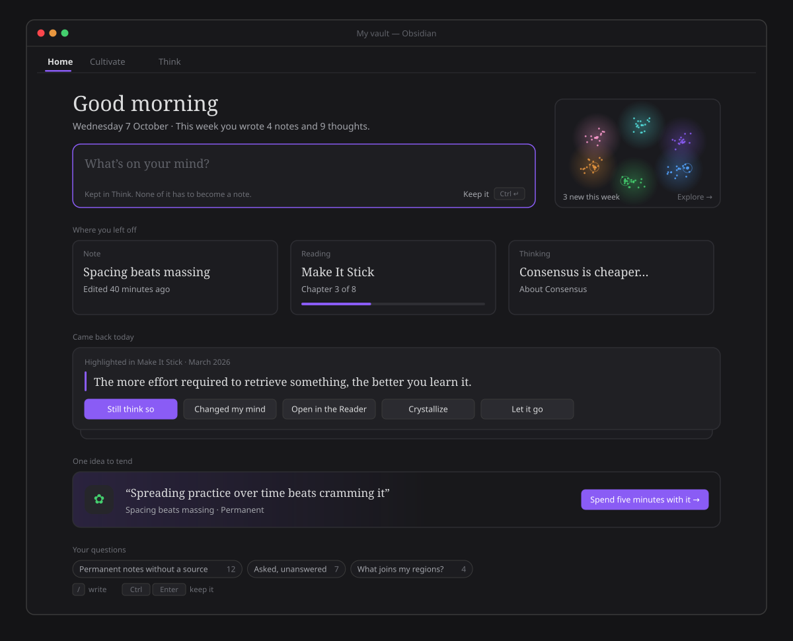
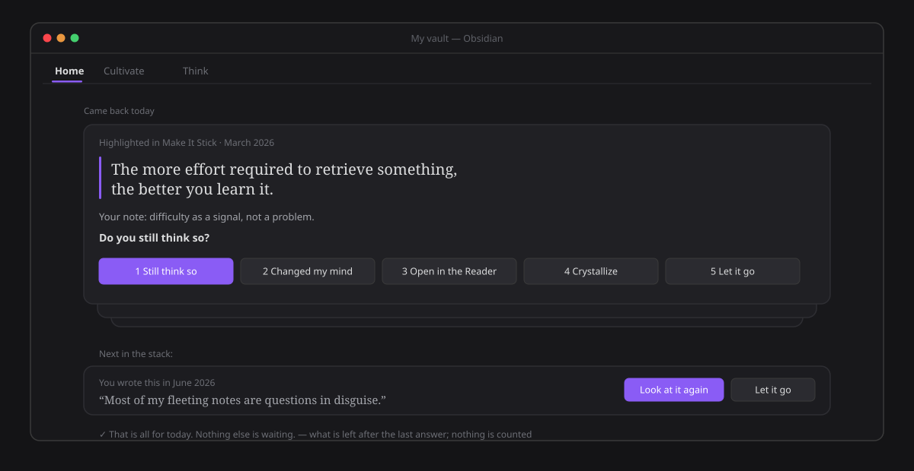

# ZettelFlow Home

**Home** is the place you land when Obsidian opens: a calm page that greets you, lets you write
straight away, and shows where you left off and what came back today. It is one of three modes of
the Home surface — **Home**, **[Cultivate](cultivate.md)** and **[Think](../architecture/thought-lab.md)**
— and since epic #701 the three are one family: the same mode bar, the same composer, the same
cards, serif for ideas, and every colour from your theme.

## Opening it

Click **Home** in the ZettelFlow ribbon menu, or run **Show home**. With *Open Home when Obsidian
starts* on (the default for new installs, in **Settings → ZettelFlow**), it is the first thing you
see. It updates itself as the vault changes — there is no Refresh button.

## What it shows, from the top

- **A greeting for the moment of day** — *Good morning*, *Good afternoon*, *Good evening*, *Still up* —
  the date, and **one plain fact**: *This week you wrote 4 notes and 9 thoughts.* A fact, never a
  counter of days and never a score (§XII).
- **Think's composer**, right there: *What's on your mind?* **Ctrl/Cmd+Enter** (or *Keep it*) keeps
  it in Think — a thought, never a note, and no dialog to open first. Nothing has to become a note.
- **A glimpse of your vault** — a small canvas drawn from the same data as the
  [graph](ask-your-graph.md): your regions as soft nebulae in Explore's colours, the notes of this
  week pulsing. Click it to open **Explore**. It draws only while it is on screen and holds still
  under reduced motion.
- **Where you left off** — three cards: the **last note** you had open, the **reading in progress**
  (a note path, a saved reading or a PDF/EPUB from your [Library](library.md), with how far you got)
  and the **last thought** you wrote in Think. Each opens where you were.
- **Came back today** — one quiet stack: what you marked in the [Reader](reader.md) and is due a
  second look ([highlights review](highlights-review.md)), then one [claim of yours](claim-returns.md)
  or a [wager](wagers.md) whose day has come. The top card is **answered in place**; the next ones
  peek out from behind it; the last answer leaves *That is all for today.* *Let it go* lasts the day
  and records no judgement. On a day nothing came back, the section is not there at all.
- **One idea to tend** — a single invitation instead of a list: the idea [Cultivate](cultivate.md)
  would offer first, quoting what it claims. *Spend five minutes with it* opens Cultivate on it.
- **Your questions** — the [saved queries](ask-your-graph.md) you pinned, each a chip with its live
  count that asks it again in Explore.
- **An unfinished note** — when a wizard was left mid-flow, one line offers to pick it back up.

On an **empty vault**, Home offers **three ways in** instead of an empty page: write a first note with
a flow, read something you already have (the Library), or just think in the box above. While the
index is being built, the greeting and the composer are already there.

## What left Home, and where it went (#703)

Home used to be a dashboard: a *you've been thinking for N days* counter, a *what to do next* list,
three hero tiles, a 3D teaser and nine sections behind *Show everything*. Each kept its door
somewhere better:

| Was on Home | Now |
|---|---|
| Thinking-days counter | Gone — a count of days is a score (§XII); the plain fact of the week replaced it |
| What to do next | *One idea to tend* |
| Asked, unanswered | Explore's suggested question **Asked, unanswered** |
| Gaps and their *not related* | Cultivate's **Connect it** move, beside *Link* — the verdict is recorded the same way |
| New ideas · main concepts · deserves a review | Explore's suggested questions and [Health › Tend](slipbox-health-dashboard.md) |
| 3D-graph teaser | The vault glimpse |
| Saved readings | *Where you left off* (the reading in progress) and the Reader's chooser |
| Quick capture (a dialog) | The composer, on the page |
| Refresh | Home updates itself |

## Principles

- **Read-only, except what you write.** The composer writes a thought to Think; answering what came
  back writes what the [review](highlights-review.md) and the [return](claim-returns.md) always wrote.
  Home itself writes nothing to your notes.
- **Never keeps score.** No streaks, no counts of days, no "you are behind" (§XII).
- **Offline, AI never involved.** Everything on Home is read from your vault and the plugin's data.

## Architecture

`HomeModeRenderer` composes the page from the State barrel (`dueClaims`, `selectCultivationTarget`,
`runGraphQuery`, `build3DGraph`) and Think's store (`ThoughtStore.countSince`, `latest`,
`dueHighlights`). The shared shapes live in `architecture/components/core/family/` (the page, the
eyebrow, the keyboard hints and the composer); the stack is `CameBackStack` over the pure
`cameBackOrder`; the glimpse is `HomeGlimpse` over the pure `glimpseOf`/`drawGlimpse`, gated by a
performance budget (`view.home.glimpse.frame.10k`, under 2 ms a frame).
