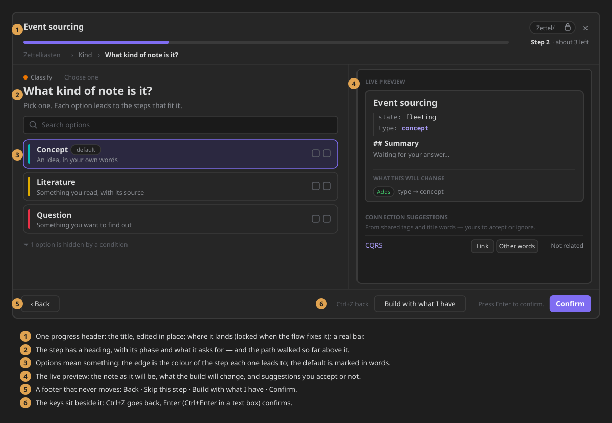

# Get started in 5 minutes

ZettelFlow is an Obsidian plugin. You need **Obsidian 1.13.1 or newer**, on desktop or mobile.

## 1 · Install

1. In Obsidian, open **Settings → Community plugins** and turn community plugins on if you have not yet.
2. Click **Browse**, search for **ZettelFlow**, then **Install** and **Enable**.
3. A ZettelFlow button appears in the ribbon. Everything starts there.

## 2 · Pick one way in

There are three ways in. None of them needs the others, and you can switch between them at any time.

=== "Start from your own idea"

    No Canvas, no setup — it works in an empty vault.

    1. Click the ZettelFlow ribbon button (or run *Open ZettelFlow* from the command palette).
    2. On the welcome screen, click **Start with my own idea** and choose a note, or capture one.
    3. State your question, inspect the material, write a response or a gap, and **Save progress**.

    Then open **This note** from the ribbon menu: the note you are reading gets a companion in the right
    sidebar with its state, what argues with it, what it is missing and the one next step.

    → [Cultivate an idea](development/cultivate.md) · [This note](development/this-note.md)

=== "Install a ready-made system"

    Zettelkasten, PARA, GTD, research, writing, decisions… complete flows you can try before
    anything is written to your vault.

    1. Ribbon menu → **Community**.
    2. Pick a system (you can filter by difficulty) and open it to see its steps.
    3. **Try it** to walk the system without creating anything, then **Install system**.

    → [Install a ready-made system](how-to-contribute/systems-gallery.md)

=== "Draw your own note flow"

    

    1. Create a `.canvas` file (for example `flows/daily-note.canvas`).
    2. In **Settings → ZettelFlow → Flows**, *Give a role to another canvas*: pick it and choose **Creates notes**.
    3. Add a note file to the canvas, right-click it → **Create managed step**, and turn on **Starts the flow**.
    4. In **What does this step ask?**, add actions (*Ask for text*, *Choose an option*, *Add tags*…) and draw arrows to the next steps.
    5. Ribbon button → **Create note**: your first wizard run.

    

    → [Create a note: the wizard](development/new-note-wizard.md) ·
    [Configure a step](development/step-editor.md) ·
    [Build your own note flow](architecture/flow-roles.md) · [Actions](actions/Prompt.md)

## 3 · Your settings, at a glance

Open **Settings → ZettelFlow**. The top of the tab says what is on right now. In a fresh vault, a
start card offers the same three ways in, so you never meet an empty page.

→ [Settings, section by section](development/settings-panel.md)

## 4 · Where to next

- **[Why ZettelFlow](why.md)** — what it is for, and how it sits next to Templater, QuickAdd and Dataview.
- **[Showcase](showcase.md)** — the whole product, one illustration at a time.
- **[Everything it does](reference/capabilities.md)** — every capability and where to find it.
- **[FAQ](faq.md)** — mobile, offline, AI, privacy, undo, big vaults.

Stuck? Ask in [GitHub Discussions](https://github.com/RafaelGB/Obsidian-ZettelFlow/discussions).
