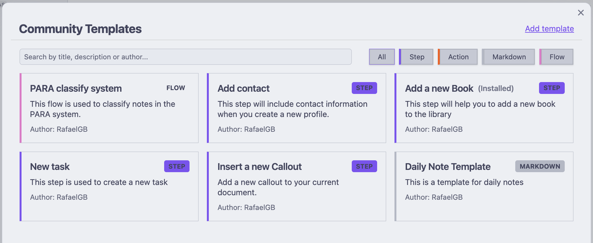

# ZettelFlow Community Resources Guide

## Introduction to Community Resources
ZettelFlow allows the community to share templates, flows, and actions to help users enhance their note-taking experience. The Community section provides pre-built resources that you can easily import and use in your own Obsidian vault.

## Types of Community Resources
ZettelFlow offers five main types of community resources:

### 1. Flows
Flows are complete workflows designed to guide you through specific note-taking processes. These are particularly valuable because:

- Ready to use: No technical knowledge required
- Time-saving: No need to build workflows from scratch
- Best practice: Created by experienced users
- Versatile: Available for many different note-taking scenarios

### 2. Steps
Steps are individual components that can be added to your existing workflows. They represent a single action or decision point in a note creation process.

### 3. Actions
Actions are specific functions that can be performed within a step, such as adding a date, selecting options, or running scripts.

### 4. Markdown
Markdown templates provide reusable text content that can be incorporated into your notes.

### 5. Systems (one-click)
Systems are whole **knowledge methodologies** shipped as a single [`.zftemplate`](../architecture/zftemplate-schema.md) bundle — a canvas plus its step notes. Unlike a flow (which you copy to the clipboard and paste onto a canvas), a system installs in **one click**: pick a folder and ZettelFlow writes the canvas and every step, then opens the canvas ready to run. Systems compose the cognitive capabilities — on creation a note is related, cross-checked, link-suggested and maturity-scored against your own graph — so you start from a real workflow, not a blank canvas.

Shipped systems:

- **Academic research** — two entry points on one canvas: a literature note mined for claims, matched to candidate sources, cross-checked for contradictions and scored on creation; and a permanent note that lands already related, link-suggested and scored.
- **Zettelkasten v2** — three independent note types on one canvas (fleeting, literature, permanent), each its own entry point, where the permanent note carries the on-creation pattern (find related · find contradictions · suggest links · calculate maturity). This **supersedes the older "Zettelkasten Inbox" flow**, which remains available for back-compat.
- **PARA v2** — Tiago Forte's PARA as four entry points (Project, Area, Resource, Archive); each lands a note in its PARA folder, tags it by category and connects it with find related. This **supersedes the older "PARA classify system" flow**, which remains available for back-compat.
- **GTD** — Getting Things Done as three entry points (Inbox capture, Next action, Project), moving a thought from capture through clarify to a context-tagged next action.

To install a system: open the Community Templates browser, select the **Systems** tab, click a system to preview it, choose an install folder and press **Install system**.

## How to Access Community Resources
1. Open Obsidian and make sure ZettelFlow is installed
2. Click on the ZettelFlow section in Community plugin
3. Select "Community Templates" Browser from the menu
4. Browse the available resources by type

## Using Community Flows
Flows are the most valuable community resource for beginners. Here's how to use them:

1. **Browse**: In the Community Templates section, select the "Flows" tab to see available workflows
2. **Preview**: Click on a flow to see its preview, description, and structure
3. **Install**: Click the "Copy to Clipboard" button to add it to your clipboard
4. **Use**: There is and icon in the bottom of your zettelFlow canvas to paste the flow into your current workflow at the position that you select.

When you open the flow preview, you'll see:
- A visual representation of the workflow
- Description and purpose of the flow
- Author information
- List of nodes (steps) in the flow
- Connections between nodes

Remember that flows are the easiest way to get started with ZettelFlow! They provide complete, ready-to-use workflows that require minimal setup and technical knowledge.