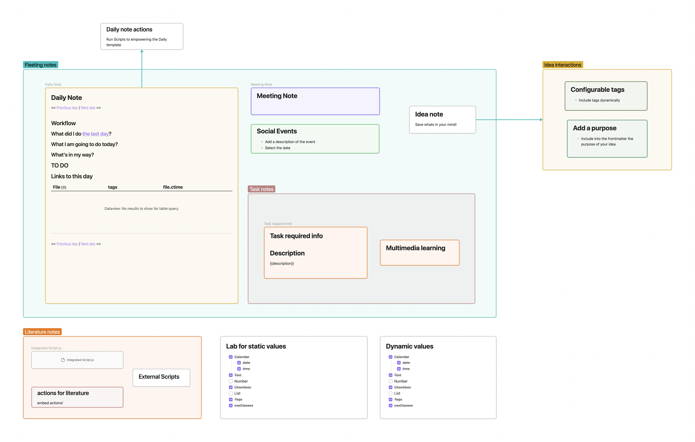

# Welcome to ZettelFlow
> **Note:** This Documentation is still a work in progress. If you have any questions, please feel free to open a issue or disccusion.

ZettelFlow is a dynamic template engine based on Zettelkasten method. It is designed to minimize the friction between your thoughts and the final output. It is a tool that helps you to write and organize your thoughts.

## Our canvas example
To understand the concept of ZettelFLow, you can use the following configuration as an example:

With the native Obsidian canvas, you can construct a workflow for your ideas. Use groups or edges to organize your thoughts. The plugin will use this canvas to generate a UI when you want to create a new note.

## How to start
1. Create a `.canvas` file where you want (A new folder for the next steps is recommended).
2. Go to plugin configuration page and set the `.canvas` file path.
3. Starts to create template files and add them to the `.canvas` file 
4. Convert your template files or embed notes into `steps` (See [examples here](https://github.com/RafaelGB/Obsidian-ZettelFlow/tree/main/WorkFlow%20Test)) by right-clicking on the element and selecting `ZettelFlow: Convert to step/edit the step` (*On mobile, long press on the file and select the option*).

## How to use
The plugin offers a ribon Icon to open the note builder UI. (*You can also configure a hotkey to open it.*)

The UI will show you the steps you can select to generate a new note.

When you complete all the steps, the plugin will generate a new note with the content of the template files and merge their properties.

> **Note:** You can configure a shortcut to open the note builder UI.

## How it works
With your `.canvas` file, the plugin creates a workflow that will be used to generate new notes. The workflow is a directed graph where the nodes are the template files and the edges are the steps

### Interconnected steps
The steps are interconnected by:
- **Edges**: The edges are the arrows between the steps in the canvas. With the direction of the arrow, you can configure the order of the steps. The plugin will use the edges to generate the UI.
- **Groups**: The groups are the boxes in the canvas.You can anidate groups to create a hierarchy of steps (including another groups)

## Step configuration
The initial step will be a selection of all the nodes marked as `root`.

### Basic configuration
- **Root toggle**: If it's enabled, it will be shown as the first step in the UI.
- **Target folder search**: The folder where the new note will be created (the note builder will use **the last step** with this property informed).
- **Optional toggle**: If the step is an action, a Skip button will be shown in the UI when this option is enabled.

### Actions
By default the steps starts with no actions. If you want to add one, there is a dropdown menu to select the action type and a button to add it.

A step can have multiple actions, making the configuration more flexible. The order is not important fot the final note, but it will be the order shown in the UI of the note builder.

#### action properties
There are basic properties that all the actions have:
- **type**: The action type.
- **description**: The description of the action. It will be shown in the UI of the note builder and in the action step configuration.

Depending on the action type, there are other properties that can be configured. See the action type documentation for more information.

#### action types
They will be shown as a list of options to select from. The options are:

- **[Prompt](./actions/Prompt.md)**: A simple input field to add a custom value to the built-in note template.
- **[Checkbox](./actions/Checkbox.md)**: A checkbox to select a boolean value. The value will be added to the note as a property.
- **[Number](./actions/Number.md)**: A number input to save a number as a property in the built-in note template.
- **[Selector](./actions/Selector.md)**: A list of options to select from. The options are the values of the property defined in the file.
- **[Calendar](./actions/Calendar.md)**: A calendar to select a date. The date will be added to the note as a property.
- **[Backlink](./actions/Backlink.md)**: Insert the wikilink of the built-in note template in the heading note that you have configured.
- **[Tags](./actions/Tags.md)**: Add tags to the built-in note template as property.
- **[CssClasses](./actions/CssClasses.md)**: Add a css class to the built-in note template as property.
- **[Script](./steps/Script.md)**: Executes a JavaScript script when the workflow is run. Configure the script with the code editor displayed in the settings of the action.