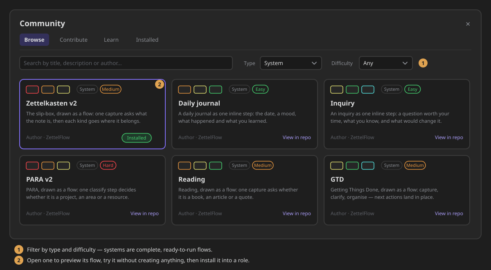

{ .zf-hero__logo }

# ZettelFlow

Draw your note workflow on a Canvas once — then think with every note it makes.

[Get started](get-started.md){ .md-button .md-button--primary }
[See it in action](showcase.md){ .md-button }

[Why ZettelFlow?](why.md) · [FAQ](faq.md)
{: .zf-hero__links }

{ .zf-hero__image }

**Most plugins help you _write_. ZettelFlow helps you _think_.** It turns a native Obsidian Canvas into a
guided note-creation wizard, then sits beside every note it makes: where the note stands, what argues
with it, what it is missing, and the one next step. Offline, AI optional, and nothing is written to
your vault that you did not decide.

New here? The [README](https://github.com/RafaelGB/Obsidian-ZettelFlow#readme) is the front door — it
opens with the handful of things ZettelFlow *asks you to do*. This site is the **map**.

---

## What you get

-   

    **This note, beside every note**

    Where the note stands, four plain counts, what argues with it, and the one next step — finished in place.

    [:octicons-arrow-right-24: This note](development/this-note.md)

-   

    **Cultivate an idea**

    A guided thinking session: connect, challenge, question, advance — one real move at a time.

    [:octicons-arrow-right-24: Cultivate](development/cultivate.md)

-   

    **Explore your graph**

    Click to narrow your vault with facets, read the answer, and fly the 3D graph.

    [:octicons-arrow-right-24: Explore your graph](development/ask-your-graph.md)

-   

    **Read your notes like a book**

    A path through a note and its neighbours, chapter by chapter — highlights into Think that [come back for a second look](development/highlights-review.md), and an end you can save or export.

    [:octicons-arrow-right-24: The Reader](development/reader.md)

-   

    **Dashboards for your vault**

    Chart any Obsidian Base — a local Grafana with no `dataviewjs`.

    [:octicons-arrow-right-24: Base dashboards](development/base-dashboards.md)

-   

    **Ready-made systems**

    Zettelkasten, PARA, GTD, research, writing — installed in one click, rehearsed first.

    [:octicons-arrow-right-24: Systems gallery](how-to-contribute/systems-gallery.md)

---

## Three ways in

=== "Start from your own idea"

    No setup, no Canvas, no AI.

    1. Install ZettelFlow from **Settings → Community plugins**.
    2. Click the ZettelFlow ribbon icon and choose **Start with my own idea**.
    3. State your question, look at what your vault already says, and write a provisional response.

    → [Cultivate and purpose-led work](development/cultivate.md)

=== "Install a ready-made system"

    A complete workflow in one click.

    1. Run **Browse systems** from the ribbon menu.
    2. Pick a system — each shows its flow and difficulty — and **rehearse** it before installing.
    3. Install it into a role (*create*, *edit*, *event*) and create your first note.

    → [Systems gallery](how-to-contribute/systems-gallery.md)

=== "Build your own Canvas flow"

    Full control over every step.

    1. Create a `.canvas` file and give it the *Creates notes* role in **Settings → ZettelFlow → Flows**.
    2. On the canvas, press **Create a step** (the Z in the bottom bar), and turn on **Starts the flow**.
    3. Add steps, connect them with arrows, and run the wizard from the ribbon.

    → [Get started](get-started.md) · [Actions](actions/Prompt.md) · [Conditional edges](architecture/conditional-edges.md)

---

## How it works

| Concept | What it is |
|---|---|
| **Canvas** | A native Obsidian `.canvas` file: each node is a step, arrows set the order. |
| **Step** | A note on the canvas with a target folder, a body template and actions. |
| **Action** | An interactive part of the wizard — prompt, calendar, selector, tags, script… |
| **Conditional edge** | An arrow labelled `if: <expression>` that is skipped when false. |

---

## The map — where each area lives

For the **complete, ranked** list of every capability, see [Everything it does](reference/capabilities.md).

- **Start** — [Why ZettelFlow](why.md) · [Get started](get-started.md) · [FAQ](faq.md) · [AI provider setup](development/ai-provider-setup.md) · [Capabilities & privacy](development/capabilities-and-privacy.md)
- **Think & cultivate** — [Think](architecture/thought-lab.md) · [Cultivate](development/cultivate.md) · [A thought you can be wrong about](development/wagers.md) · [Two things far apart](architecture/collision.md) · [The return of a claim](development/claim-returns.md)
- **One note** — [This note](development/this-note.md) · [The Reader](development/reader.md) · [Evolution timeline](development/evolution-timeline.md) · [Evidence map](development/evidence-map.md)
- **Explore** — [Explore your graph](development/ask-your-graph.md) · [The graph lens](development/graph-3d.md) · [Living knowledge map](development/living-knowledge-map.md)
- **Review** — [Health › Tend](development/slipbox-health-dashboard.md) · [Practice](development/practice.md) · [Second-brain review](development/second-brain-review.md)
- **Build flows** — [Flow roles](architecture/flow-roles.md) · [Conditional edges](architecture/conditional-edges.md) · [Actions](actions/Prompt.md)
- **Automate & script** — [Property hooks](vault-hooks/property-hooks/overview.md) · [Folder automation](vault-hooks/OnCreate.md) · [Scripting](architecture/scripting.md) · [API reference](api/ZettelFlowAPI.md)
- **For developers** — [Architecture overview](architecture/overview.md) · [Contributing](development/contributing-and-conventions.md)

---

## Resources

- [GitHub repository](https://github.com/RafaelGB/Obsidian-ZettelFlow) · [Bug reports & feature requests](https://github.com/RafaelGB/Obsidian-ZettelFlow/issues) · [Discussions](https://github.com/RafaelGB/Obsidian-ZettelFlow/discussions)
- [Changelog / releases](https://github.com/RafaelGB/Obsidian-ZettelFlow/releases) · [Manifesto](manifesto.md) · [Project roadmap](development/project-health-and-roadmap.md)
