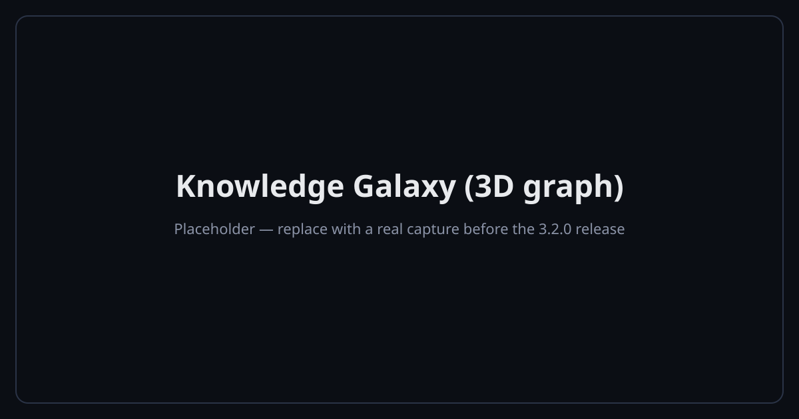
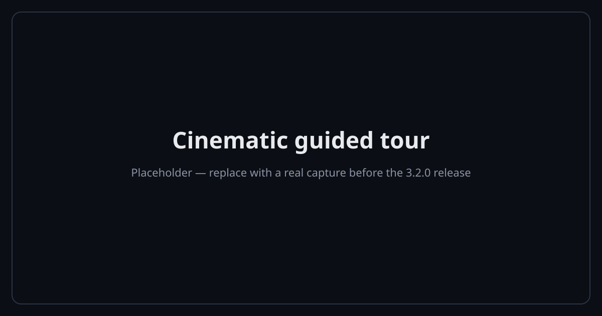
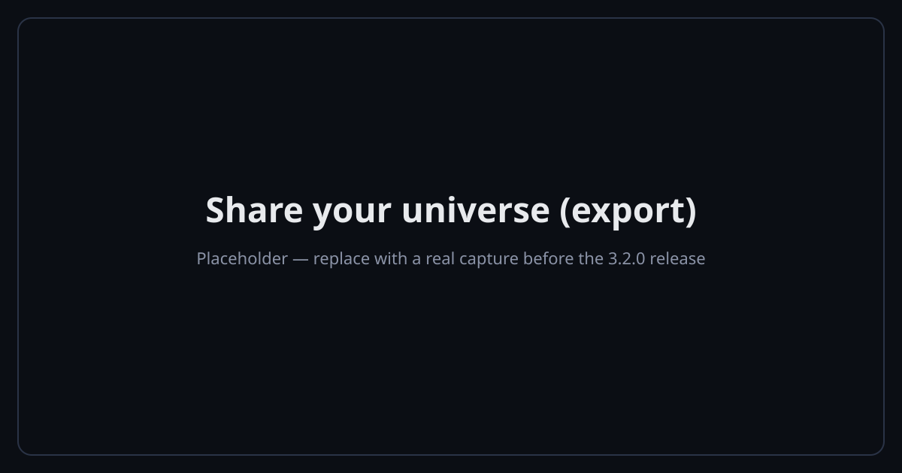
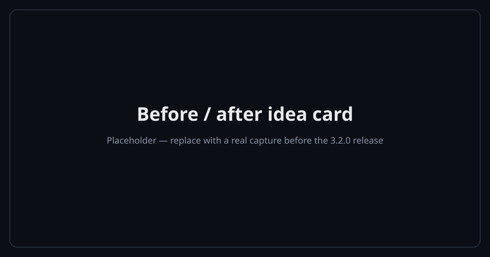
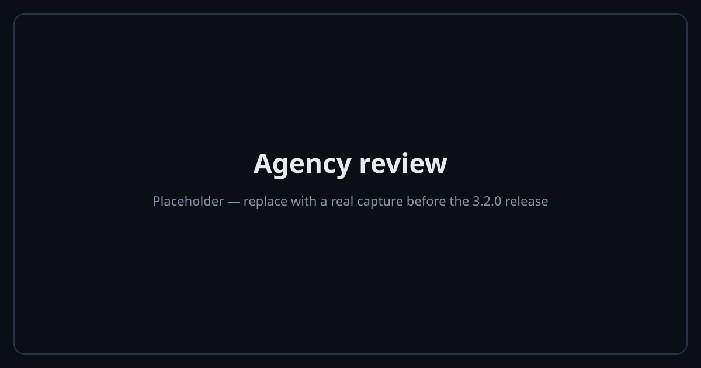

# Showcase — the living graph

ZettelFlow doesn't just *store* your notes; it makes your knowledge **evolve**, and lets you *see* it.
This page is the tour: the immersive graph, the cinematic fly-through, and the ways to share what your
thinking looks like — all **offline**, and all **without AI** if you want.

> The captures below are placeholders while the 3.2.0 features settle; they're replaced with real
> screenshots/GIFs before release.

## Knowledge Galaxy — see the shape of your thinking

The 3D graph (**Graph surface → 3D**) renders your slip-box as an immersive **Knowledge Galaxy**: a
starfield backdrop, notes sized by connectivity with cluster-hued glow halos, links coloured by relation
type, and a discovery lens that lights up orphans, dead-ends and contradictions in space. It respects
reduced-motion and Lite mode, and falls back to a navigable list on mobile.

→ Details: [3D knowledge graph](development/graph-3d.md).

## Cinematic tour — sit back and watch

One click flies the camera on a **cinematic tour** through your hubs and most-recent notes — a graph
*showcase*, perfect for a demo or a video. Any drag, click or key cancels it; it honours reduced-motion.

## Share your universe — export the graph

**Share your universe** captures the current view as a **PNG**, or records the time-lapse growth as a
short **WebM** clip — saved to your vault through the Vault API. No server, no upload.

## Before / after — how an idea grew

From the Evolution timeline, **Share this idea** paints a **before→after image** of a note — first vs
current state, claims gained, links, decisions and days — built only from already-recorded data.

## Agency review — see how much you're still deciding

The **Health → Agency** tab lists your recorded decisions newest-first with a compact header: the
cognitive agency index and the accept/modify/reject breakdown, plus a one-line plain-language reading.
It's a description of your verdict mix — **never a grade** — computed locally and never transmitted.

→ Details: [Cognitive agency](development/cognitive-agency.md).

## Works offline, works with AI off

ZettelFlow is built to keep working — and keep your notes yours — with no server and no account:

- **No telemetry, no backend, no uploads.** The plugin transmits no personal data or vault contents.
- **AI is optional and off by default.** The graph, the tour, export, the idea card, health, discovery
  and Cultivate are all **fully offline, deterministic, and never need AI**. When you *do* enable AI, only
  length-bounded note content goes to the single **https** endpoint *you* configure — and nothing the
  model writes reaches a note until you **accept** it (every completion is a proposal you accept, edit or
  reject).
- **The only network paths are opt-in:** the AI provider above, and the read-only **community browser**
  (GitHub-raw `GET`s when you open it). Both are off until you choose them.

Full detail: [Capabilities & privacy](development/capabilities-and-privacy.md) and the
[manifesto](manifesto.md).

## Share your system

Built a workflow you love? The community gallery is **fully static** — no backend, no account. Share your
`.zftemplate` system through GitHub and it appears in everyone's in-app browser.

→ [Systems gallery](how-to-contribute/systems-gallery.md).
