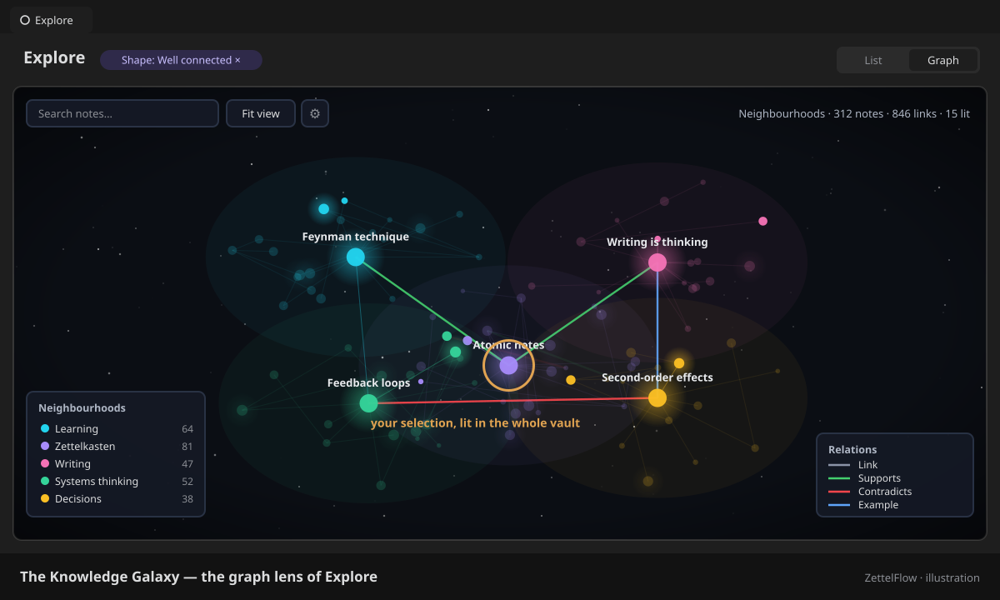
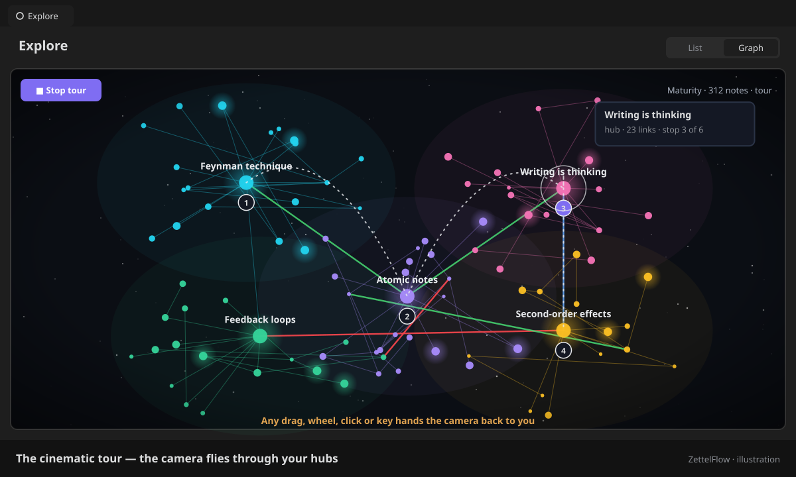
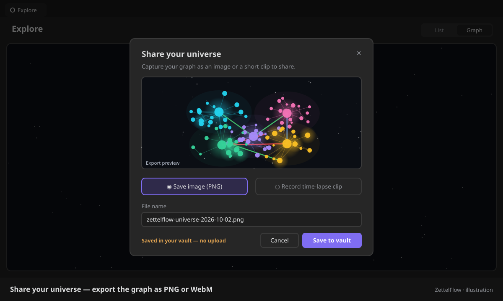
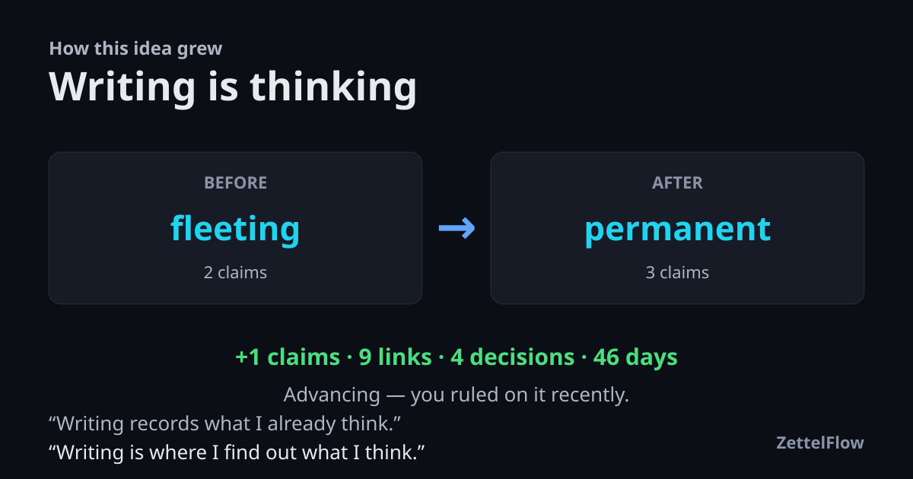
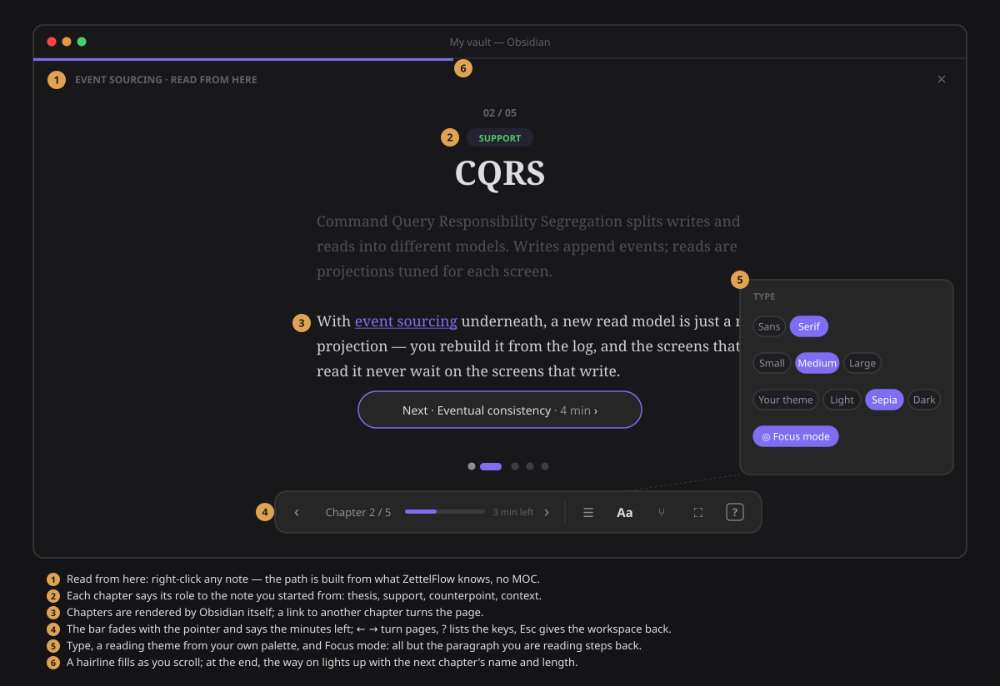
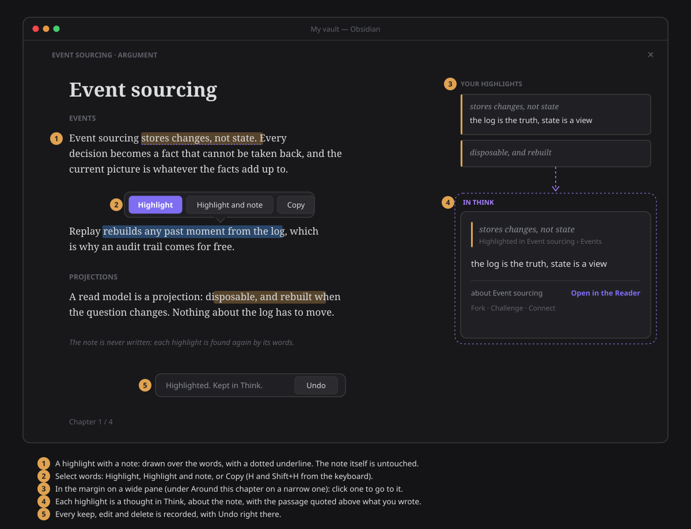
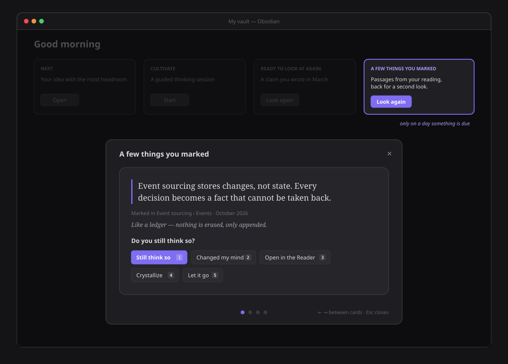
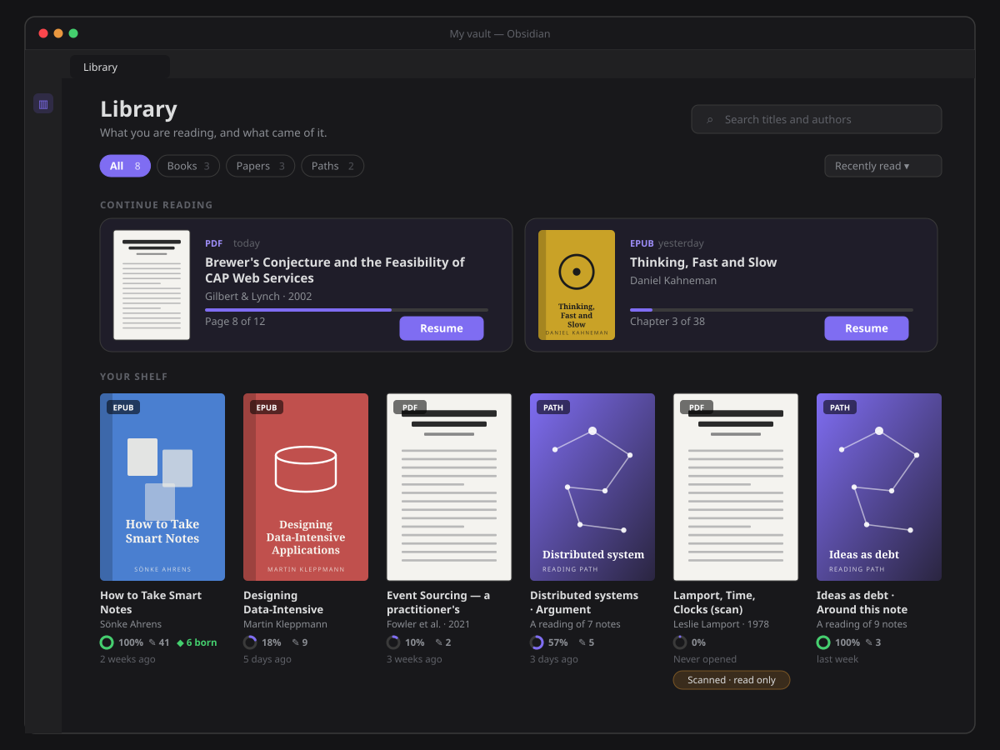
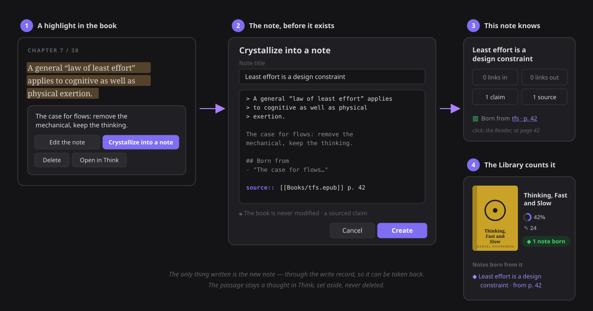
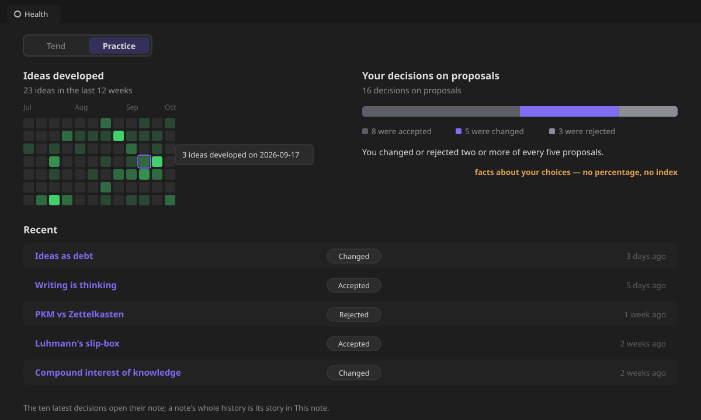

# Showcase

ZettelFlow doesn't just *store* your notes. It gives you somewhere to think before an idea is a note,
a way to grow one idea at a time, a query you build by clicking, and a living graph of the whole
thing. This page is the tour. Everything on it works **offline**, and all of it works **with AI
switched off**.

> The images are illustrations of the interface, drawn to stay true as it evolves. Labels and
> layout match the plugin; the notes in them are examples.

## Think — before it has to be knowledge

**Think** (a mode of **Home**) is a place for what isn't knowledge yet. Write what you are thinking;
none of it is a note and none of it has to become one. **Fork** a thought to let a variant go its own
way, **challenge** it with something that argues back, **connect** two of them, or set one aside —
nothing reminds you. A thought can be *about* a note, and that note's history remembers it.

When you want a push, **Two things far apart** puts two of your notes with nothing in common side by
side and asks what they could share. It never offers an answer: you write it in the composer, as a
thought about both.

→ Details: [the thinking space](architecture/thought-lab.md) and [two things far apart](architecture/collision.md).

## Cultivate — grow one idea, one move at a time

**Cultivate** picks one idea and offers five moves — **connect**, **challenge**, **question**,
**advance**, **add a source**. The moves that would show you an answer ask for *your* guess first:
*before you look, what is the strongest argument against this idea?* Only then does ZettelFlow show
what your own notes say. The **notes by stage** card is the filter: click a stage to cultivate from it.

→ Details: [Cultivate](development/cultivate.md).

## Explore — clicking is the query

**Explore** narrows your vault by clicking. Every facet — state, shape, folder, what links to it —
shows how many notes it would leave, each choice becomes a chip you can flip or remove, and the query
text is simply what your clicks produced. The answer says how many notes match and why; from there,
copy them as links, **make a map of content**, or save the selection for Home.

→ Details: [Ask your graph](development/ask-your-graph.md).

## Knowledge Galaxy — see the shape of your thinking

Switch Explore's lens from **List** to **Graph** and your selection appears **in context**: the whole
vault drawn as an immersive **Knowledge Galaxy**, your selected notes lit and everything else dimmed.
A starfield backdrop, notes sized by connectivity with neighbourhood-hued glow halos, links coloured
by relation type, and lenses that light up orphans, dead ends, contradictions, bridges and gaps in
space. It respects reduced motion and Lite mode, and falls back to a navigable list on mobile.

→ Details: [3D knowledge graph](development/graph-3d.md) — the graph lens.

## Cinematic tour — sit back and watch

From the graph's options (**⚙ → Share**), one click flies the camera on a **cinematic tour** through
your hubs and most recent notes — perfect for a demo or a video. Any drag, wheel, click or key hands
the camera back to you; it honours reduced motion.

## Share your universe — export the graph

**Share your universe** captures the graph as a **PNG**, or records the time-lapse growth as a short
**WebM** clip. A preview shows exactly what you will get, you choose the file name, and it is saved to
your vault through the Vault API. No server, no upload.

## Before / after — how an idea grew

From a note's history, **Share this idea** paints a **before → after card**: the first and the
current state, claims gained, links, decisions and days — and, when you have revisited it, the claim
as it was and as it is now. It is built only from what was already recorded.

## This note — the companion beside every note

**This note** docks in the right sidebar and follows the note you are reading: where it stands on
its lifecycle, four plain counts, the **one next step** you can finish right there (add a source,
connect, mark an example, move it on — each with an Undo), its **neighbourhood** as a small graph,
what argues with it and what it is missing, and its **story** — every decision, move and thought,
month by month. Pin it to one note while you work in another. **Health › Tend** hands you notes that
need attention, already open on their fix.

→ Details: [This note](development/this-note.md) and [Tend](development/slipbox-health-dashboard.md).

## The Reader — read your notes like a book

Right-click a note and choose **Read from here**. The **Reader** takes the window and walks a path
through the note and its neighbours, one chapter at a time, each tagged with its role — thesis,
support, counterpoint. Pick the way through it (around this note, the argument, the story of an
idea, the essentials, its region), peek at a link without leaving, take a detour and come back.
No MOC, no setup, and nothing is written to the notes you read. **Esc** gives your workspace back.

Select a sentence, as on a Kindle, to **highlight** it — with a note in the margin if you like. Each
highlight is a thought in Think, about the note, with the passage quoted; the note is never
touched. At the **end of the path**, save it by name, export it as one document with your
highlights as an appendix, or cultivate its thesis.

A few days later, **what you marked comes back** — a tile on Home, only on a day something is due,
and a few cards set in the Reader's type, each asking one thing: *do you still think so?* Keep it,
write what you think now (the note's story shows the pair, *before* and *now*), make it a note that
cites the passage, or let it go. Fixed intervals, no counts, no streaks.

→ Details: [A few things you marked](development/highlights-review.md).

→ Details: [The Reader](development/reader.md).

## Your Library — the sources your ideas come from

**Ribbon menu → Library.** The PDFs and EPUBs already in your vault, and the reading paths you saved,
share one shelf. Each has its cover — the book's own, the paper's first page, a constellation for a
path — and says what came of it: how far you are, what you highlighted, and the **notes born from
it**. *Continue reading* leads, and a scanned PDF says it is **read only** before you open it.
Nothing is imported, nothing leaves the vault, and no source file is ever modified.

Open a paper and its pages reflow into the Reader's column, in your type — or keep the layout with
**Page view**; open a book and its chapters are rebuilt from the EPUB, safely, with its own
contents. Highlight as in a note: each passage is a thought in Think that remembers its page. Then
**Crystallize into a note**: the note quotes the passage, cites `[[book.epub]] p. 42`, counts as
sourced, and This note says where it was born.

→ Details: [Your library](development/library.md).

## Practice — what you have been doing

**Health › Practice** shows twelve weeks of ideas developed, a cell a day; how you answered
proposals — accepted, changed or rejected — as one bar and one plain sentence; and your latest
decisions, each opening its note. It is facts, **never a grade**: no percentage, no index, computed
locally and never transmitted.

→ Details: [Practice](development/practice.md) and [Cognitive agency](development/cognitive-agency.md).

## Dashboards for your vault

Point an Obsidian **Base** at a folder and compose stat, chart, table, heatmap, calendar and task
panels over the same filtered notes — a local Grafana, with no `dataviewjs`.

→ Details: [Base dashboards](development/base-dashboards.md).

## Works offline, works with AI off

ZettelFlow is built to keep working — and keep your notes yours — with no server and no account:

- **No telemetry, no backend, no uploads.** The plugin transmits no personal data or vault contents.
- **AI is optional and off by default.** Think, Cultivate, Explore, the graph, the tour, export, the
  idea card and health are all **fully offline, deterministic, and never need AI**. When you *do*
  enable AI, only length-bounded note content goes to the single **https** endpoint *you* configure —
  and nothing the model writes reaches a note until you **accept** it (every completion is a proposal
  you accept, edit or reject).
- **The only network paths are opt-in:** the AI provider above, and the read-only **community browser**
  (GitHub-raw `GET`s when you open it). Both are off until you choose them.

Full detail: [Capabilities & privacy](development/capabilities-and-privacy.md) and the
[manifesto](manifesto.md).

## Share your system

Built a workflow you love? The community gallery is **fully static** — no backend, no account. Share your
`.zftemplate` system through GitHub and it appears in everyone's in-app browser.

→ [Systems gallery](how-to-contribute/systems-gallery.md).
