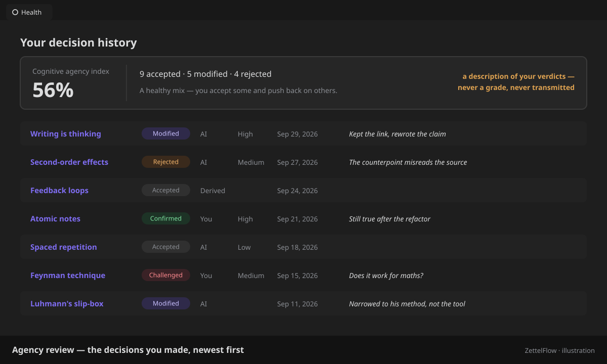

# Showcase

ZettelFlow doesn't just *store* your notes. It gives you somewhere to think before an idea is a note,
a way to grow one idea at a time, a query you build by clicking, and a living graph of the whole
thing. This page is the tour. Everything on it works **offline**, and all of it works **with AI
switched off**.

> The images are illustrations of the interface, drawn to stay true as it evolves. Labels and
> layout match the plugin; the notes in them are examples.

## Think — before it has to be knowledge

**Think** (a mode of **Home**) is a place for what isn't knowledge yet. Write what you are thinking;
none of it is a note and none of it has to become one. **Fork** a thought to let a variant go its own
way, **challenge** it with something that argues back, **connect** two of them, or set one aside —
nothing reminds you. A thought can be *about* a note, and that note's history remembers it.

When you want a push, **Two things far apart** puts two of your notes with nothing in common side by
side and asks what they could share. It never offers an answer: you write it in the composer, as a
thought about both.

→ Details: [the thinking space](architecture/thought-lab.md) and [two things far apart](architecture/collision.md).

## Cultivate — grow one idea, one move at a time

**Cultivate** picks one idea and offers five moves — **connect**, **challenge**, **question**,
**advance**, **add a source**. The moves that would show you an answer ask for *your* guess first:
*before you look, what is the strongest argument against this idea?* Only then does ZettelFlow show
what your own notes say. The **notes by stage** card is the filter: click a stage to cultivate from it.

→ Details: [Cultivate](development/cultivate.md).

## Explore — clicking is the query

**Explore** narrows your vault by clicking. Every facet — state, shape, folder, what links to it —
shows how many notes it would leave, each choice becomes a chip you can flip or remove, and the query
text is simply what your clicks produced. The answer says how many notes match and why; from there,
copy them as links, **make a map of content**, or save the selection for Home.

→ Details: [Ask your graph](development/ask-your-graph.md).

## Knowledge Galaxy — see the shape of your thinking

Switch Explore's lens from **List** to **Graph** and your selection appears **in context**: the whole
vault drawn as an immersive **Knowledge Galaxy**, your selected notes lit and everything else dimmed.
A starfield backdrop, notes sized by connectivity with neighbourhood-hued glow halos, links coloured
by relation type, and lenses that light up orphans, dead ends, contradictions, bridges and gaps in
space. It respects reduced motion and Lite mode, and falls back to a navigable list on mobile.

→ Details: [3D knowledge graph](development/graph-3d.md) — the graph lens.

## Cinematic tour — sit back and watch

From the graph's options (**⚙ → Share**), one click flies the camera on a **cinematic tour** through
your hubs and most recent notes — perfect for a demo or a video. Any drag, wheel, click or key hands
the camera back to you; it honours reduced motion.

## Share your universe — export the graph

**Share your universe** captures the graph as a **PNG**, or records the time-lapse growth as a short
**WebM** clip. A preview shows exactly what you will get, you choose the file name, and it is saved to
your vault through the Vault API. No server, no upload.

## Before / after — how an idea grew

From a note's history, **Share this idea** paints a **before → after card**: the first and the
current state, claims gained, links, decisions and days — and, when you have revisited it, the claim
as it was and as it is now. It is built only from what was already recorded.

## Agency review — see how much you're still deciding

On the **Health** surface, the agency review lists your recorded decisions newest first — the note,
your verdict, where the proposal came from, your confidence and your rationale — under a compact
header: the cognitive agency index, the accepted/modified/rejected breakdown and a one-line reading.
It describes your verdict mix; it is **never a grade**, and it is computed locally and never
transmitted.

→ Details: [Cognitive agency](development/cognitive-agency.md).

## Dashboards for your vault

Point an Obsidian **Base** at a folder and compose stat, chart, table, heatmap, calendar and task
panels over the same filtered notes — a local Grafana, with no `dataviewjs`.

→ Details: [Base dashboards](development/base-dashboards.md).

## Works offline, works with AI off

ZettelFlow is built to keep working — and keep your notes yours — with no server and no account:

- **No telemetry, no backend, no uploads.** The plugin transmits no personal data or vault contents.
- **AI is optional and off by default.** Think, Cultivate, Explore, the graph, the tour, export, the
  idea card and health are all **fully offline, deterministic, and never need AI**. When you *do*
  enable AI, only length-bounded note content goes to the single **https** endpoint *you* configure —
  and nothing the model writes reaches a note until you **accept** it (every completion is a proposal
  you accept, edit or reject).
- **The only network paths are opt-in:** the AI provider above, and the read-only **community browser**
  (GitHub-raw `GET`s when you open it). Both are off until you choose them.

Full detail: [Capabilities & privacy](development/capabilities-and-privacy.md) and the
[manifesto](manifesto.md).

## Share your system

Built a workflow you love? The community gallery is **fully static** — no backend, no account. Share your
`.zftemplate` system through GitHub and it appears in everyone's in-app browser.

→ [Systems gallery](how-to-contribute/systems-gallery.md).
