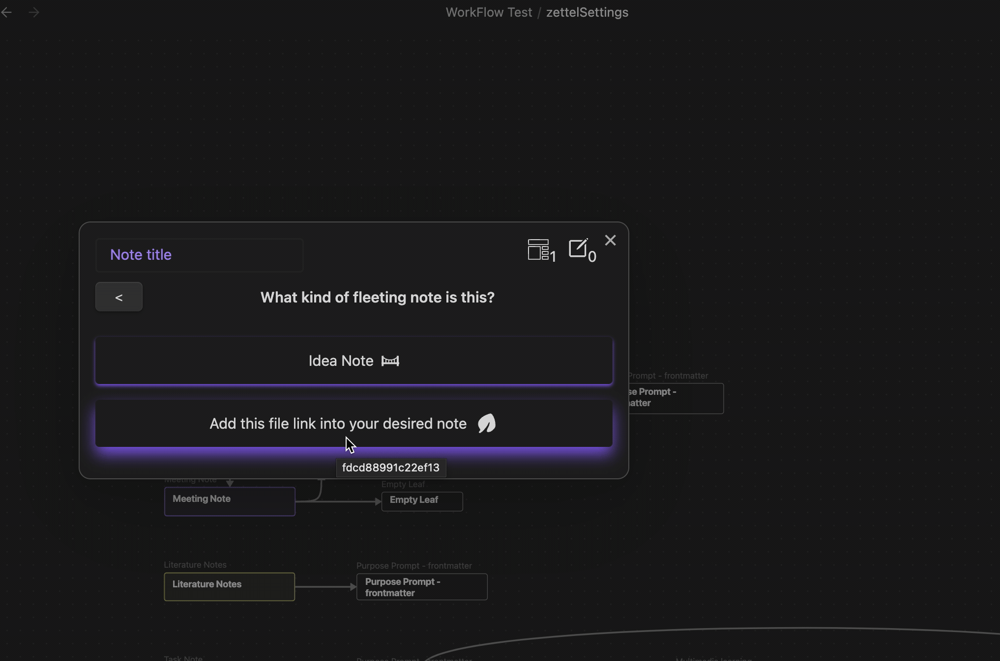

# Backlink Action
Insert the backlink of the built-in note template into the note you have configured.

## Options
- Pattern: The pattern to be used to insert the backlink. (Default: `[[{{title}}]]`)
- Enable default backlink. When enabled, the component will be disabled and the template will use the default values you have configured in the settings.
  - Default file: Select the default file to be used.
  - Default file heading: Select the default heading to be used.

## Component
The component is disabled by default. To enable it, you must set the `Enable default backlink` option to `false`.

When you select the target file, the input of heading will be enabled with the possible headings of the file.

The pattern will be `{{wikilink}}` by default. Once the file and heading are selected, a preview markdown will be shown with the pattern applied.

