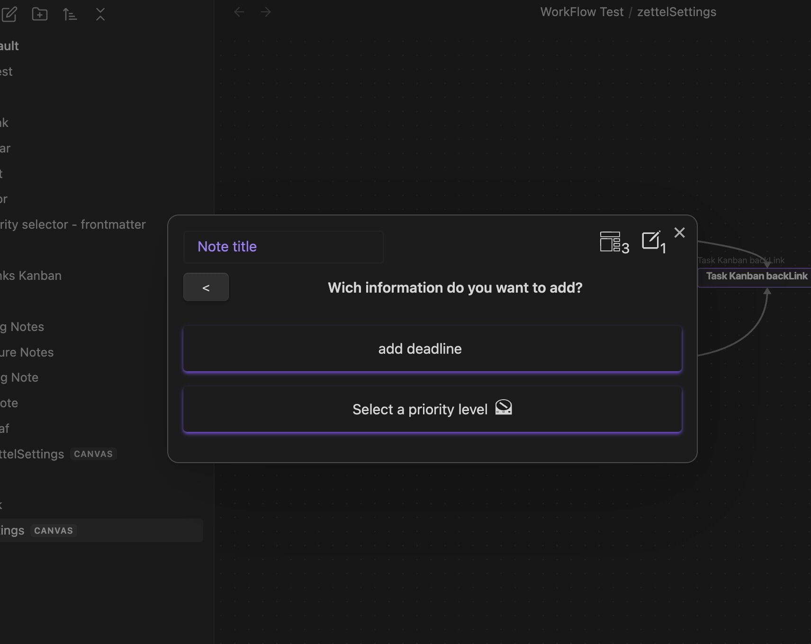

# Selector Action
Create some options to select one of them and add it into the built-in note template as property.

## Options
- zone: The zone where the property will be added. (Frontmatter or Body)
- Key: The key of the property to be added.
- Label: An explanatory label for the property.
- Options: The options to select one of them.
  - Value: the value that will be inserted into the property.
  - Description: An explanatory description for the option.

## Component
The component is a dropdown with the options you have defined. Select one of them and press `Confirm` to continue.

